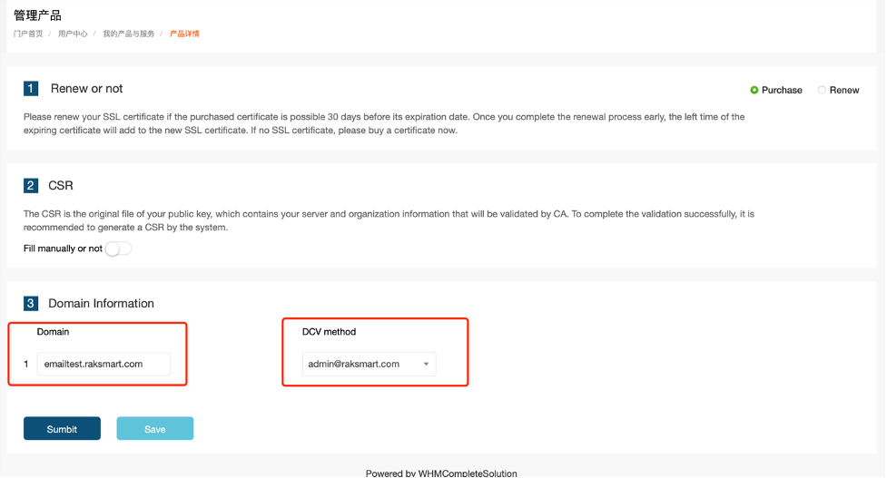
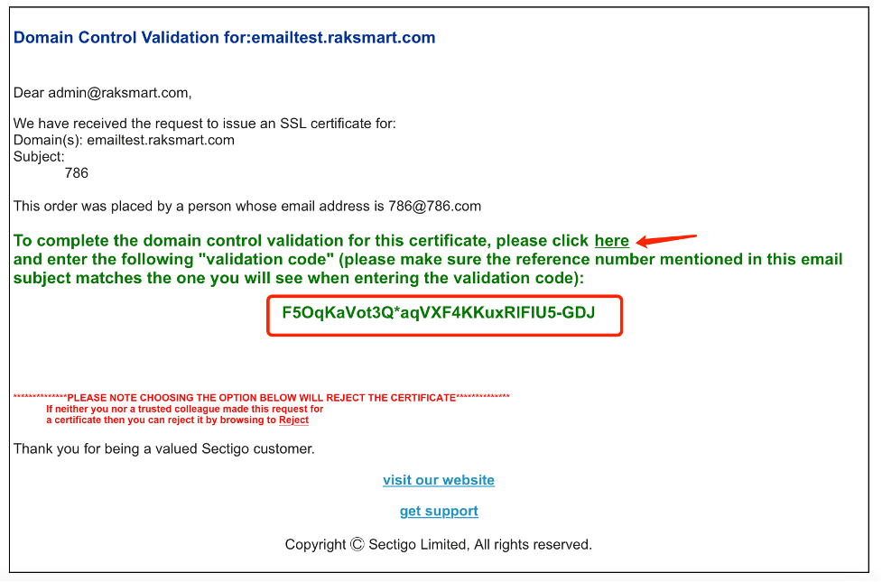
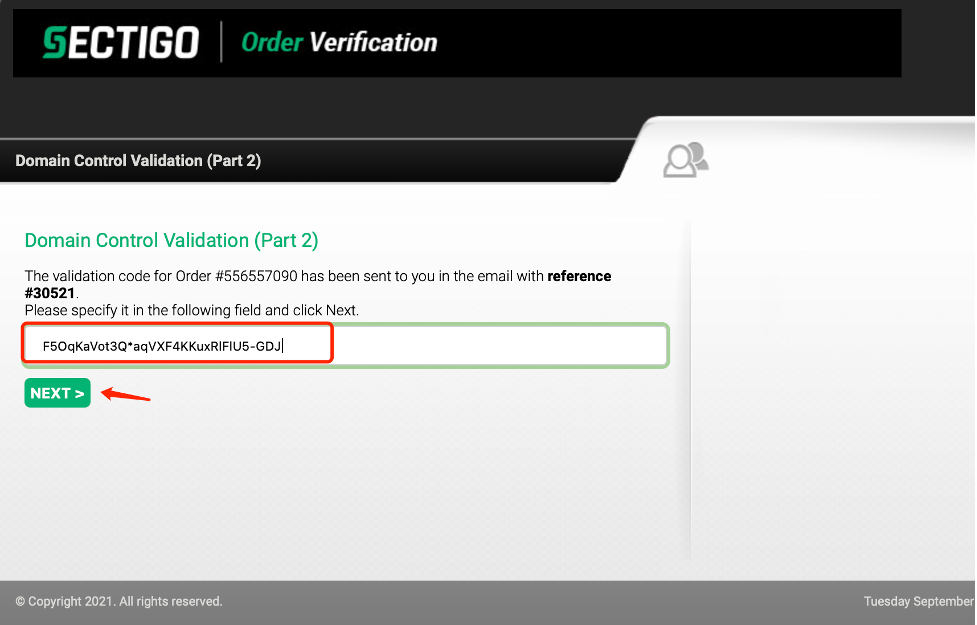
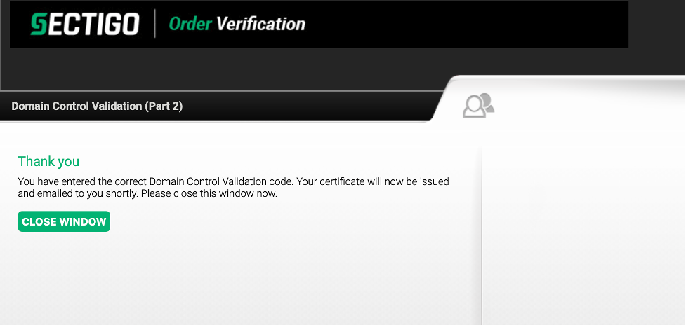
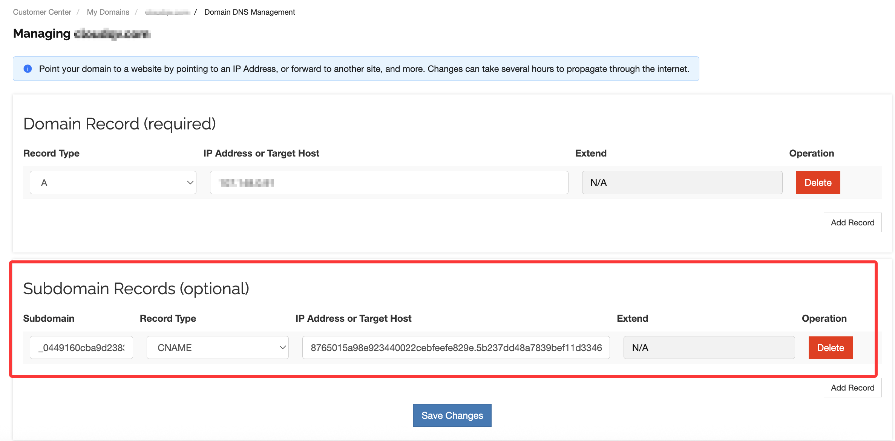
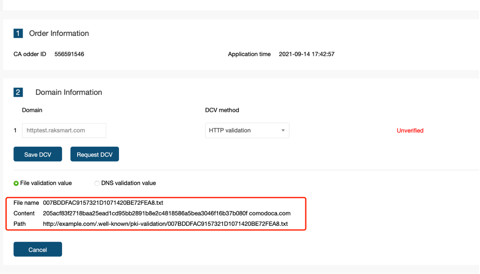
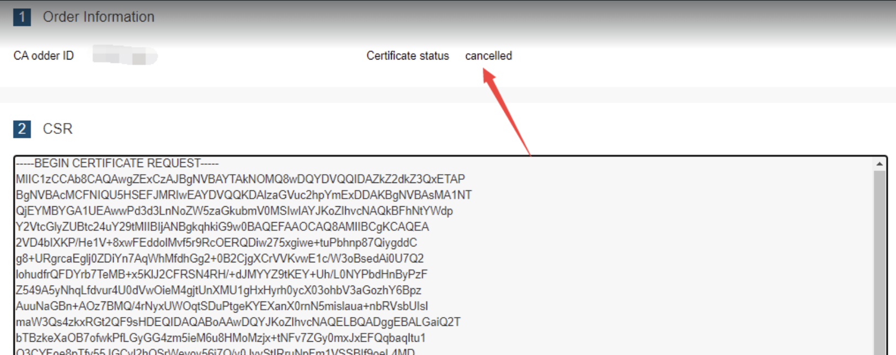

# SSL证书验证方式指南

## 一、概述

在 SSL 证书申请过程中，**域名控制权验证（DCV）**用于证明您对域名拥有管理权限。完成 DCV 后，证书通常会在约 30 分钟内签发。

| 验证方式 | 适用场景 |  |
| --- | --- | --- |
| **邮件验证** | 域名邮箱可接收邮件 | 几分钟内 |
| **DNS验证** | 可管理域名DNS解析 | 解析生效后 |
| **HTTP/HTTPS验证** | 可访问网站根目录 | 文件上传后 |

> ⚠️ **重要提示**：邮箱认证接收邮件的邮箱必须是**客户域名邮箱**或**WHOIS查询到的域名注册邮箱**。所有验证操作需客户自行处理。

---

## 二、通用填写规则

### 2.1 域名填写规范

在申请SSL证书时，**Domain信息不能填写IP**，只能是域名格式 `xxx.xxx.xxx`。

| 证书类型 | 域名填写格式 | 示例 |
| --- | --- | --- |
| **单域名证书** | 直接输入需要绑定的域名 | `yourdomain.com` 或 `sub.yourdomain.com` |
| **通配符证书** | `*.yourdomain.com` | `*.example.com` |
| **多域名SAN证书** | 输入一个主域名即可，其它域名在提交证书时输入 | `example.com` |

### 2.2 常见填写错误

**错误1：填写IP地址**

- 现象：Save后Submit时出现报错
- 原因：SSL证书只能绑定域名，不能绑定IP
- 解决：修改为正确的域名格式

**错误2：通配符证书填写具体域名**

- 现象：提交时提示格式错误
- 原因：通配符证书必须填写 `*.domain.com` 格式
- 解决：修改为通配符格式

---

## 三、邮件验证方式

### 3.1 操作步骤

**步骤1：选择验证方式**

1. 在证书申请页面填写Domain信息
2. 选择DCV method “admin@emailtest.raksmart.c”
3. 点击Save保存
4. 点击Submit提交

**步骤2：确认提交**

- 提交成功后，页面会跳转到确认页面

**步骤3：查收邮件并验证**

1. 登录您的邮箱，查收来自证书颁发机构的验证邮件
2. 邮件中包含验证码（Code）和验证链接
3. 点击邮件中的 **"here" 链接**，打开验证页面
4. 在验证页面输入邮件中的验证码，点击 **Next** 完成验证

### 3.2 验证完成

- 页面显示验证成功
- 证书状态更新为验证通过

---

## 四、DNS验证方式

### 4.1 操作步骤

**步骤1：选择验证方式**

1. 填写Domain信息
2. 选择DCV method为 **"**DNS validation**"**
3. 点击Save保存
4. 点击Submit提交

**步骤2：获取验证信息**
提交后，系统会生成DNS验证记录，包含：

| 字段 | 说明 | 示例 |
| --- | --- | --- |
| **Host** | 主机记录 | `_dnsauth.yourdomain.com` |
| **Type** | 记录类型 | `CNAME` |
| **Value** | 记录值 | `_dnsauth.yourdomain.com.xxx.xxx.com` |

**步骤3：在DNS管理中添加记录**

1. 登录您的域名DNS管理后台
2. 找到需要验证的域名，在子域名里填写验证值
3. 按照系统提供的信息填写：

**步骤3.1：验证DNS解析生效**

添加DNS记录后，可通过DNS检测工具确认解析是否已生效：

访问 [DNS查询\_DNS解析记录查询](https://www.racent.com/dns-check) ，输入您的域名和主机记录，查询解析状态。若显示已生效，系统将自动完成证书验证。

---

## 五、HTTP/HTTPS验证方式

### 5.1 操作步骤

**步骤1：选择验证方式**

1. 填写Domain信息
2. 选择DCV method为 **"**HTTP validation**"**
3. 点击Save保存
4. 点击Submit提交

**步骤2：获取验证文件信息**
系统会生成一个验证文件，需要在网站根目录创建：

| 项目 | 内容示例 |
| --- | --- |
| **文件路径** | `/.well-known/pki-validation/文件名.txt` |
| **文件内容** | `验证码 颁发机构域名` |
| **验证URL** | `<http://yourdomain.com/.well-known/pki-validation/文件名.txt`> |

**步骤3：在网站根目录创建验证文件**

**Linux/Apache/Nginx 环境操作示例：**

`# 进入网站根目录（根据实际情况调整路径）
cd /var/www/html`

`# 创建所需目录
mkdir -p .well-known/pki-validation`

`# 进入目录
cd .well-known/pki-validation`

`# 创建验证文件并写入内容
echo "205acf83f2718baa25ead1cd95bb2891b8e2c4818586a5bea3046f16b37b080f comodoca.com" > 007BDDFAC9157321D1071420BE72FEA8.txt`

`# 设置文件权限（确保可访问）
chmod 644 007BDDFAC9157321D1071420BE72FEA8.txt`

`# 重启Web服务（可选，使配置生效）
/etc/init.d/apache2 restart`

`# 或
systemctl restart nginx`

**Windows/IIS 环境操作：**

1. 在网站根目录下创建文件夹 `.well-known`
2. 在 `.well-known` 下创建文件夹 `pki-validation`
3. 在 `pki-validation` 文件夹中创建文本文件，文件名如 `007BDDFAC9157321D1071420BE72FEA8.txt`
4. 用记事本打开文件，粘贴系统提供的内容
5. 保存文件

**步骤4：测试文件是否可访问**
在浏览器中访问验证URL：

- ✅ **正常情况**：浏览器显示文件内容
- ❌ **异常情况**：404 Not Found 或无法访问

### 5.2 验证完成

- 文件可正常访问后，系统会自动检测并完成验证

**证书验证生效时间：以上验证方式完成后，SSL证书通常在30分钟左右完成签发生效。**

---

## 六、常见问题

### 6.1 申请后一直未签发怎么办？

如果证书长时间处于"申请中(Pending)"状态，可尝试以下操作：

1. 访问证书状态检查工具：**Sectigo Order Status Checker**
2. 选择已购买的证书订单
3. 在DCV验证信息页面，找到两项验证配置
4. **先修改为其他选项**，点击 **Save your changes**
5. **再改回原选项**，再次点击 **Save your changes**
6. 如果配置无误，一般会即时生效

### 6.2 证书申请过程中填写错误怎么办？

- **申请中（Pending）状态**：无法更换域名，需等待签发或取消后重新申请
- **已签发（Issued）状态**：可在后台点击 **Replace** 更换域名

### 6.3 误点了取消按钮怎么办？

**取消状态（Cancelled）说明：**

- 取消状态无法恢复
- 无法进行任何操作
- 需要重新购买证书

---

## 七、技术支持

如遇到验证问题，可通过以下方式联系我们：

- **提交工单**：后台右上角点击"提交工单"
