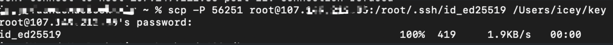
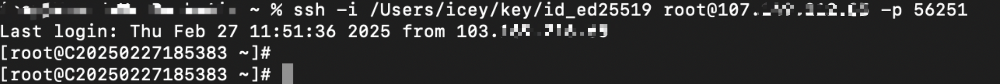
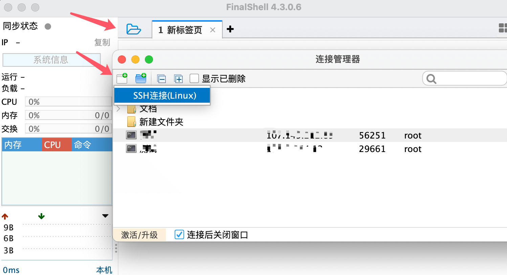
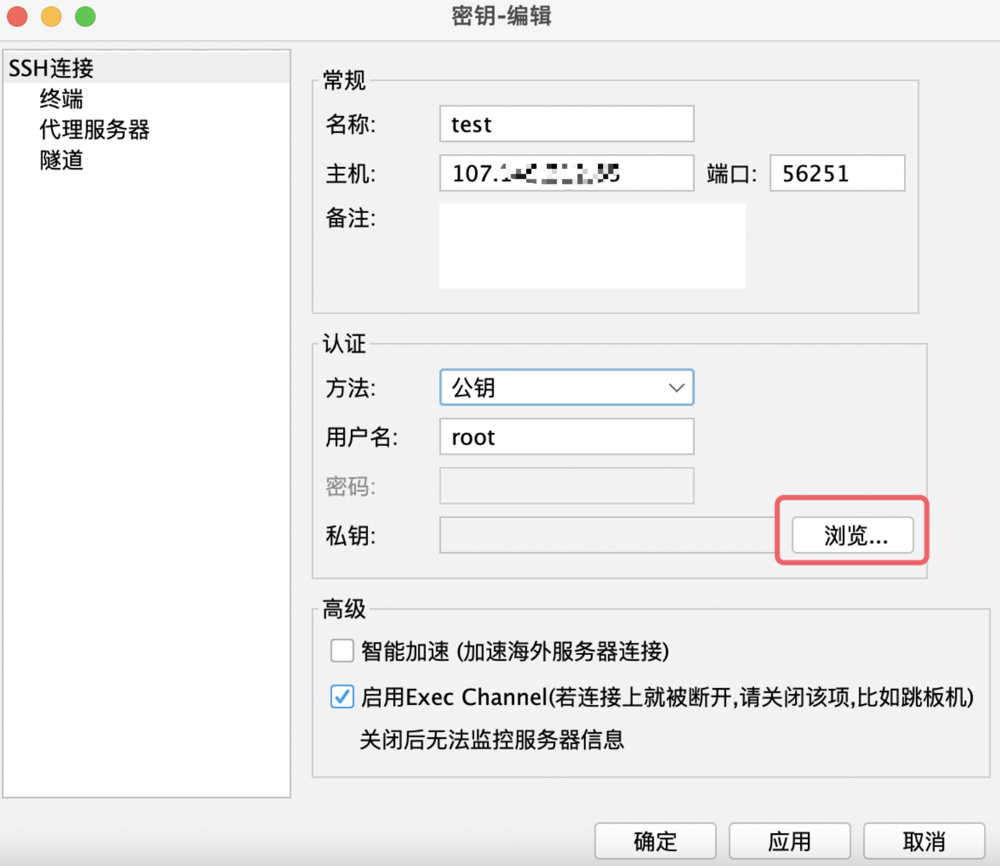
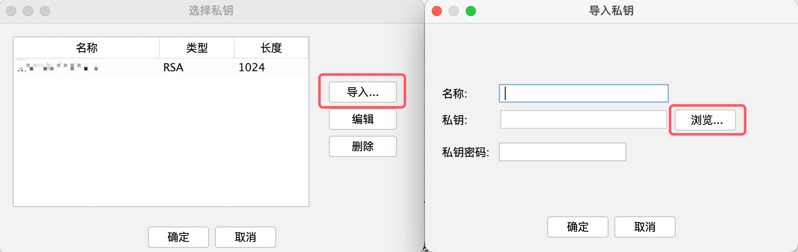
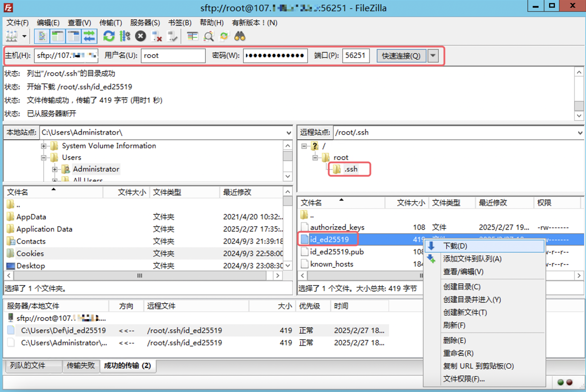
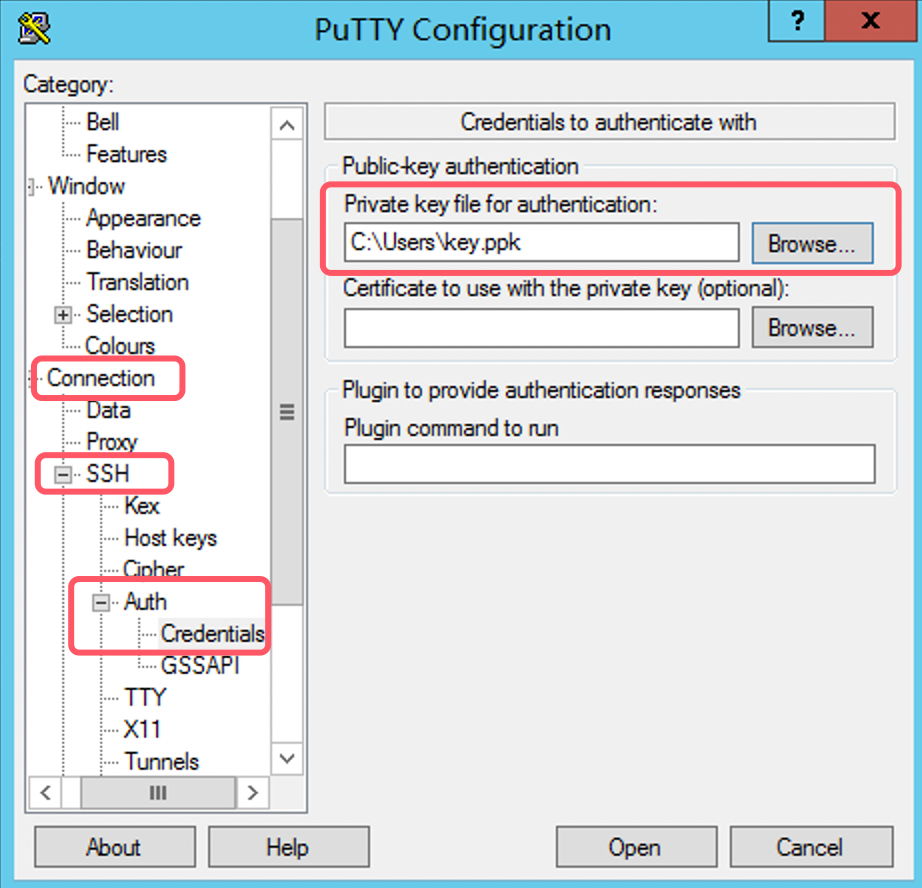
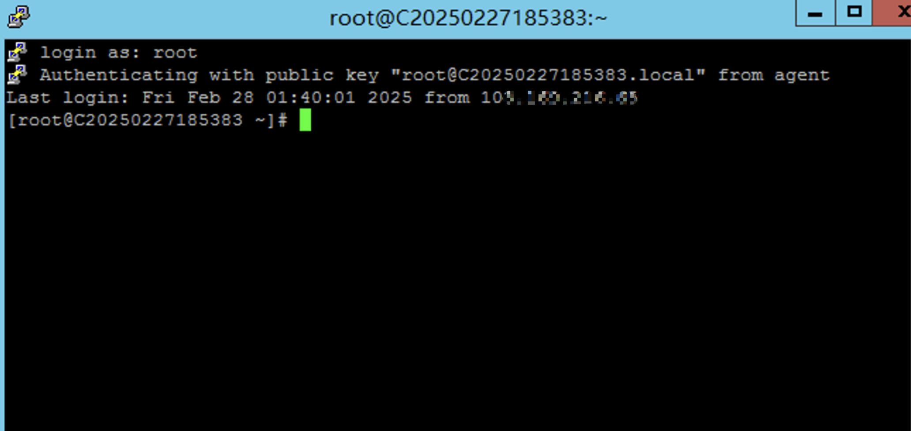
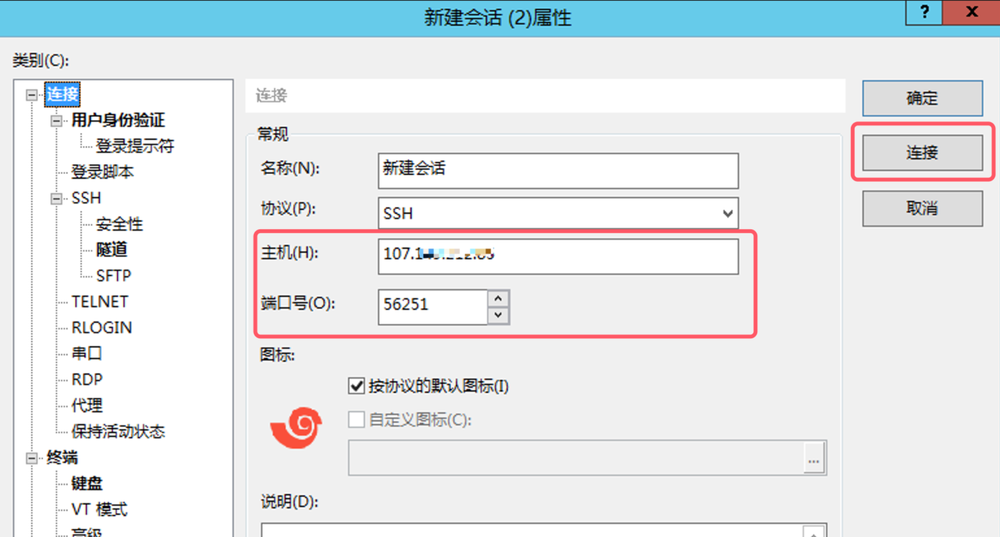
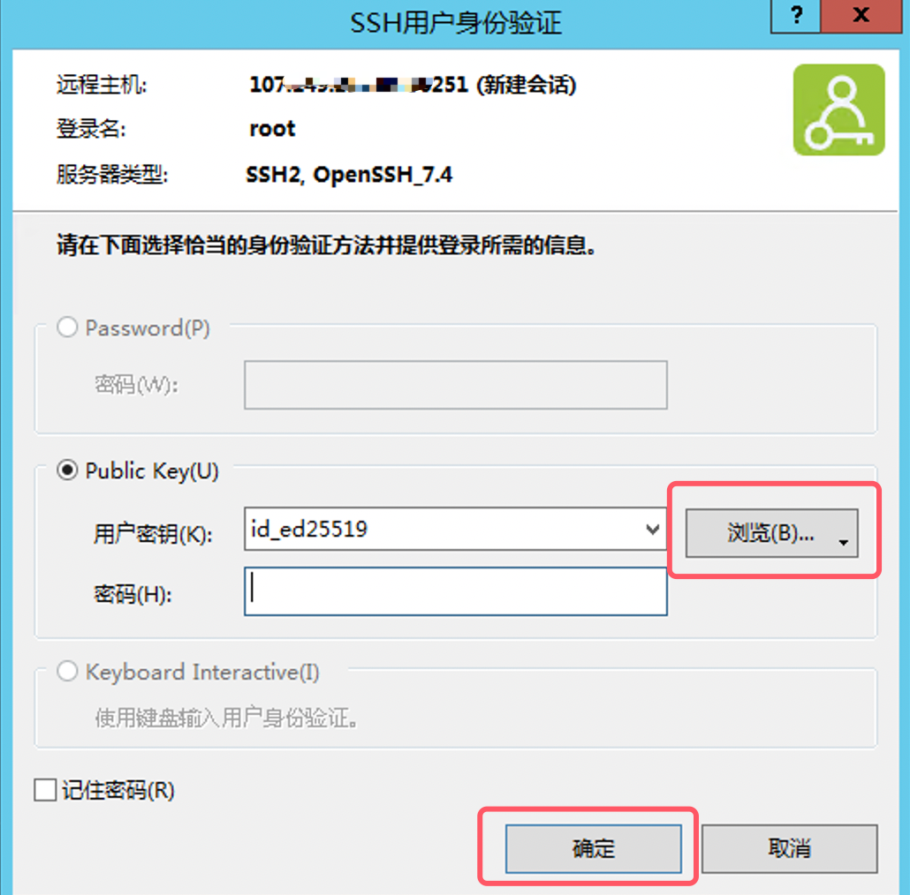

# 如何使用私钥进行远程登录

**本文介绍如何使用不同的系统和远程工具通过私钥进行远程登录**

## 配置 SSH 服务允许使用密钥登录

在 **远程服务器** 上，确保 SSH 配置允许密钥认证：

1. 编辑 `/etc/ssh/sshd_config` 文件：

#sudo vi /etc/ssh/sshd\_config

    2. 确保以下行存在，并且没有被注释（没有 `#`）：

PubkeyAuthentication yes

AuthorizedKeysFile .ssh/authorized\_keys

PasswordAuthentication no # 如果你希望禁用密码登录

## 一、mac终端登录方式

## 1. 从远程服务器下载私钥

1.1 使用 SCP 命令下载私钥

假设远程服务器的 **IP 地址** 是 `192.168.1.100`，用户名是 `root`，且私钥文件位于远程服务器上的 `/root/.ssh/id_ed25519`。你可以使用 **SCP（Secure Copy Protocol）** 从远程服务器下载私钥到 **Mac** 上。

在 **Mac 终端** 上执行以下命令：

#scp root@192.168.1.100:/root/.ssh/id\_ed25519 ~/.ssh/id\_ed25519

- **`root@192.168.1.100`：远程服务器的用户名和 IP 地址。**
- **/root/.ssh/id\_ed25519：远程服务器上私钥的路径。**
- **`~/.ssh/id_ed25519`：本地 Mac 计算机上存储私钥的路径。**

**如果你想指定远程服务的端口，使用 `-P`（大写 `P`）加端口号。**

#scp -P 56251 root@192.168.1.100:/root/.ssh/id\_ed25519 ~/.ssh/id\_ed25519

1.2 输入密码

在执行上述命令时，系统会要求你输入 **远程服务器的密码**。输入密码后，私钥会被安全地复制到本地 `~/.ssh/` 目录下。

**示例：**

****

## 2.确保私钥权限正确

2.1 SSH 需要私钥文件具有特定的权限，确保私钥的权限为 **600**，即只有文件的拥有者可以读取和写入。

在 **Mac 终端** 上运行以下命令：

#chmod 600 ~/.ssh/id\_ed25519

## 3. 使用私钥登录到远程服务器

3.1 使用 `ssh` 命令连接

现在你已经将 **私钥** 下载到 **Mac** 本地，并设置了正确的权限，可以使用 **SSH** 连接到远程服务器。

运行以下命令：

#ssh -i ~/.ssh/id\_ed25519 root@192.168.1.100

- **`-i ~/.ssh/id_ed25519`：指定私钥文件。**
- **`root@192.168.1.100`：远程服务器的用户名和 IP 地址。**
- **如果需要指定远程服务器的 SSH 端口，后面加 `-p 56251`。**

**示例：**

如果私钥没有设置 **密码短语**（passphrase），SSH 会直接登录。如果设置了密码短语，系统会提示你输入 **密码短语**。

## 二、FinalShell工具登录方式

1. 选择“连接管理” - “SSH连接”

2. 名称 - 主机（IP）- 端口 - 认证方式（公钥）- 用户名 - 私钥（浏览）

3.导入私钥：导入下载到客户端的私钥即可。

## 三、windows系统

## 1. 将私钥下载到 Windows 系统

使用 SCP 或 FileZilla 下载私钥：

- 如果你有 SSH 访问权限，可以使用 SCP 或 FileZilla 工具将私钥从远程服务器下载到 Windows。
- 例如，使用 `FileZilla` 工具下载密钥到本地：

## 四、Putty连接方式

## 1.下载并安装 PuTTY 和 PuTTYgen：

1.1 打开PuTTYGen,载入刚下载的id\_rsa私钥文件并保存

1.2 最后点击 S**ave private key**，生成私钥文件。

## 2.配置会话：

打开 PuTTY

2.1 在 **Host Name (or IP address)** 中输入服务器的 IP 地址。

2.2 在 **Port** 中输入 SSH 端口（如 `56251`）。

2.3 在 **Connection type** 中选择 **SSH**。

## 3. 加载私钥：

3.1 在左侧菜单中，依次展开 **Connection > SSH > Auth**。

3.2 在 **Private key file for authentication** 中，点击 **Browse**，选择你保存的 `.ppk` 文件（如 `id_ed25519.ppk`）。

## 4. 连接服务器：

4.1 点击 **Open**，启动连接。

4.2 输入用户名（如 `root`），然后按回车。

4.3 如果一切正常，你应该会成功登录到服务器。

## 五、xshell连接方式

## 打开 Xshell：

1. **创建新会话**：

点击菜单栏的 **文件 > 新建**，打开新建会话窗口。

2. **配置连接信息**：

在 **连接** 选项卡中：

- **名称**：输入会话名称。
- **协议**：选择 **SSH**。
- **主机**：输入服务器的 IP 地址（如 `107.149.212.85`）。
- **端口号**：输入 SSH 端口（如 `56251`）。

3. **配置身份验证**

- **用户密钥**：点击 **浏览**，选择你下载到本地的私钥文件（如 `id_ed25519`）。
- 如果私钥有密码，在 **密码** 中输入私钥的密码。

