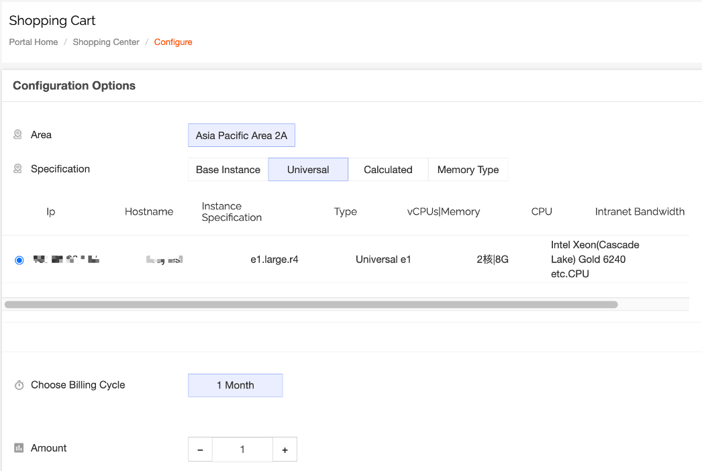
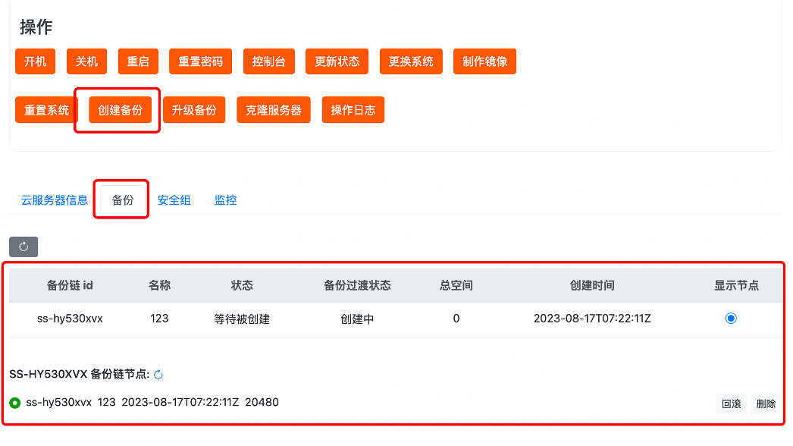
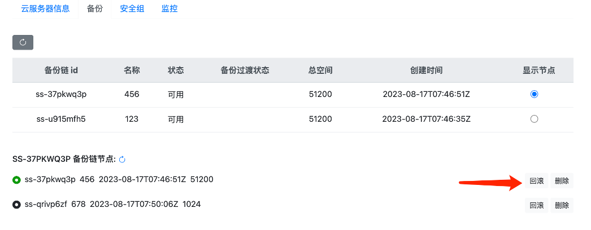
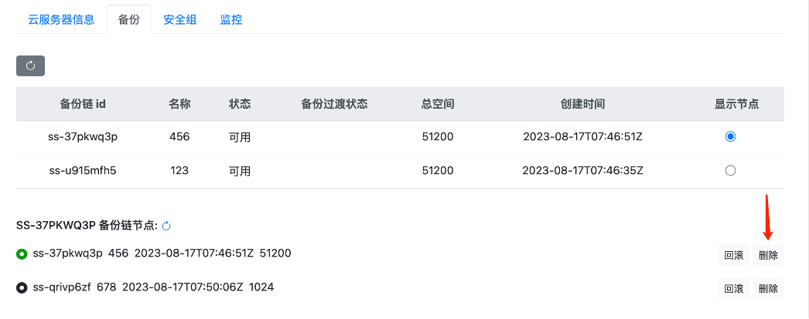
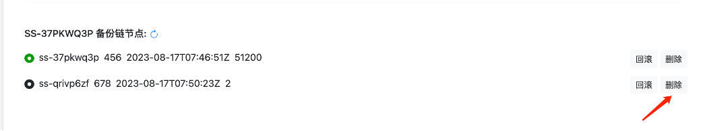
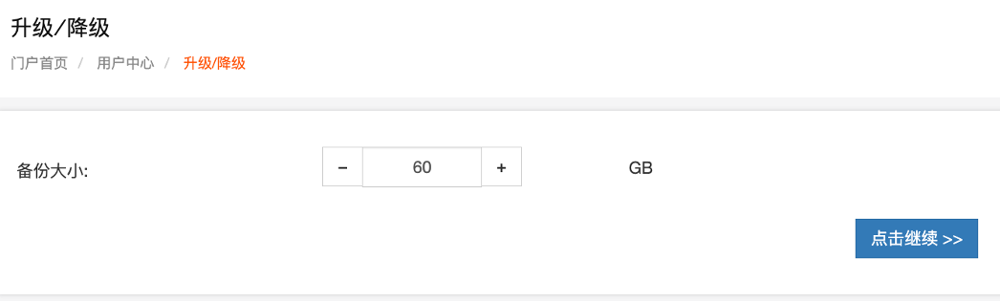

# 云原生备份使用操作

**备份**是用于捕捉硬盘在某一个时刻的状态，未来可以随时恢复到这个状态。 在某些时候，例如误操作或者应用逻辑的 bug，可能会导致业务数据的丢失，这时就需要通过备份功能，从历史备份点恢复数据。

备份须知

当你对正在运行的云服务器或者已经绑定的硬盘做在线备份时，需要注意以下几点：

- 备份只能捕获在备份任务开始时已经写入磁盘的数据，不包括当时位于缓存内的数据。
- 为了保证数据的完整性，需要在创建备份前暂停所有文件的写操作，直到备份进入”捕获完成”的状态。也可停止云服务器或解绑硬盘后，进行离线备份。

若是首次创建备份，需要先购买备份，购买时对应服务器的规格购买即可。

## 一．创建备份

1.输入备份名称，点击**提交**，开始创建。创建成功后，生成备份记录，如下图所示。

二．备份回滚

1.选择要回滚的备份点，点击确认，开始回滚并应用备份，待回滚完成即可。

## 三．删除备份

您可以删除整个备份链，也可以删除某一个备份点。

1.若是删除全量备份点

点击确认，删除整条备份链。

2.若是删除增量备份点

单击**确认**，删除该增量备份点及其所有子节点（若有）。

四.升级备份

如果备份的容量不够，可以对备份容量大小进行升级

对备份的容量大小进行升级

