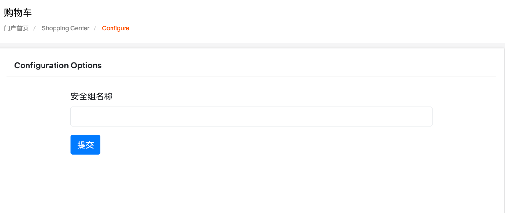
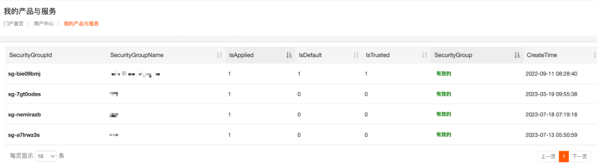
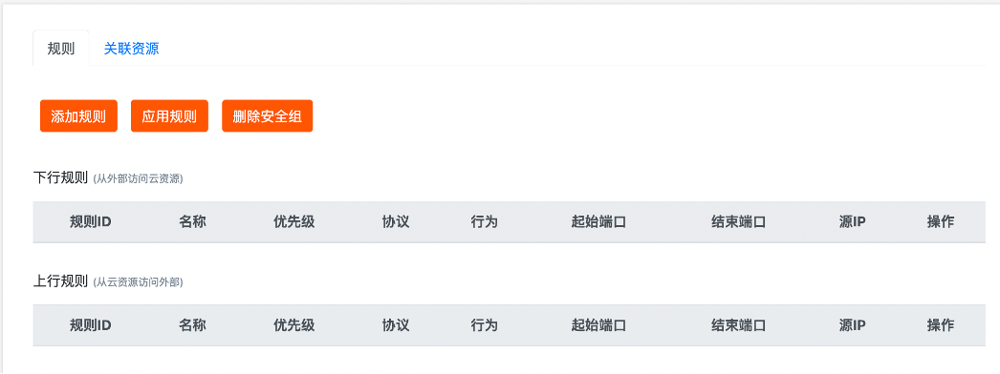
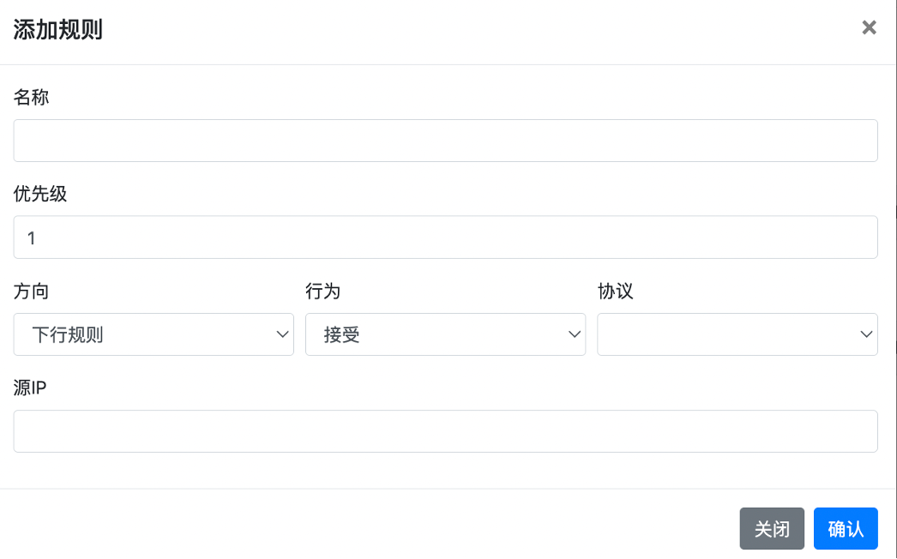
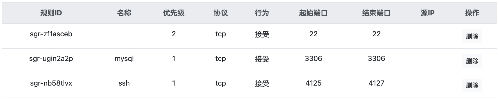
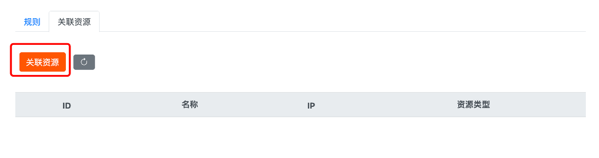

# 云原生安全组设置

添加安全组规则

创建安全组后，您需要添加安全组规则才能使安全组发挥作用。您可以通过添加安全组规则，允许或禁止安全组内的云服务器实例对公网或私网的访问。

同类型规则间依赖优先级决定最终执行的规则。当云服务器加入了多个安全组时，多个安全组会从高到低依次匹配规则。最终生效的安全组规则如下。

- 如果两条安全组规则只有授权策略不同：目前是随机生效。
- 如果两条安全组规则只有优先级不同：优先级高的规则生效。

1. 在没有添加安全组前，需要在购买服务里 – 云原生 – 点击安全组进行添加

2.设置安全组的名称，点击提交后，在产品服务里 – 云原生 – 点击安全组就可以看到

3.点击进入即可设置安全组规则

4.输入安全组规则的相关信息，如优先级，协议类型，规则方向等，如下表所示。

|  |  |
| --- | --- |
| **名称** | **描述** |
| 名称 | 安全组规则的名称 |
| 优先级 | 优先级数值越小，优先级越高，取值范围为 0~100 |
| 方向 | **上行规则**：  指的是从云资源访问外部。上行规则和端口默认放行。为保证安全，对于 Windows 云服务器系统判定了一些高危端口，默认将其加入了安全组并禁止。对于 Windows 云服务器，系统默认限制了以下上行端口。   - 协议 TCP：端口 3389/1433/445/135/139 - 协议 UDP：端口 1434/445/135/137/138 - Windows 云服务器向外发起远程桌面连接，您需要在安全组中放行规则 tcp 上行 3389 端口。   Windows 云服务器向外发起 SQL Server 连接，您需要在安全组中放行规则 tcp 上行 1433 端口  **下行规则**：  指从外部访问云资源。未配置的下行规则和端口默认拒绝访问。  TCP 端口 445/5554/9996 是病毒震荡波所使用的端口，可能会被 IDC 屏蔽，为保证资源正常访问，建议使用其他端口。 |
| 行为 | **允许**：放行该端口相应的访问请求  **拒绝**：直接丢弃数据包，不会返回任何回应信息。  说明  如果两个安全组规则其他都相同只有行为不同，则拒绝生效，允许不生效。 |
| 协议 | 协议类型包括：   - ALL：支持全部协议类型。 - TCP：支持 TCP 协议。 - UDP：支持 UDP 协议。 - ICMP：支持 ICMP 协议。 - GRE：支持 GRE 协议。 - ESP：支持 ESP 协议。 - AH：支持 AH 协议。 - IPIP：支持 IPIP 协议。 - VRRP：支持 VRRP 协议。 \*IPV6：支持 ICP6 协议。 - IPV6-ICMP：仅支持 ICMP（IPV6） 协议。 - IPENCAP：支持 IPENCAP 协议。 |
| 端口范围 | 协议类型为自定义TCP或自定义UDP时，可手动设置起始端口和结束端口访问。 |
| IP | 在下行规则中需要填写源 IP，在上行规则中需要填写目标IP，例如 192.168.9.1/24 或 fe80::5054:a8ff:fe81:a71e/64 等，不填表示所有IP地址。 |

5.设置完后，关联需要的云服务器即可

