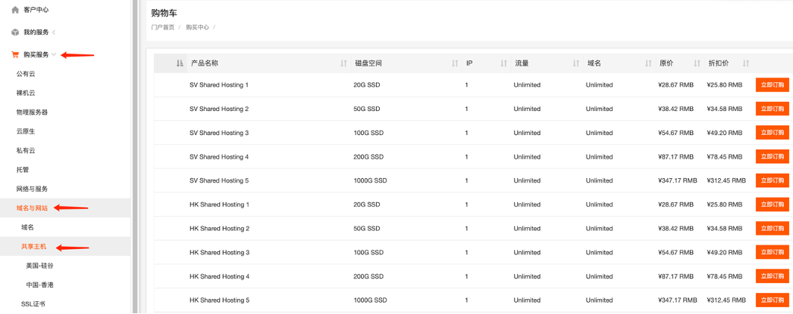
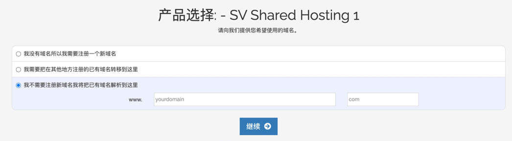
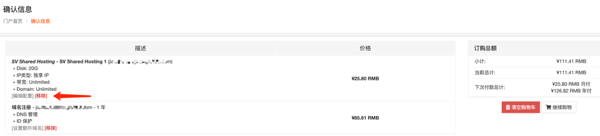
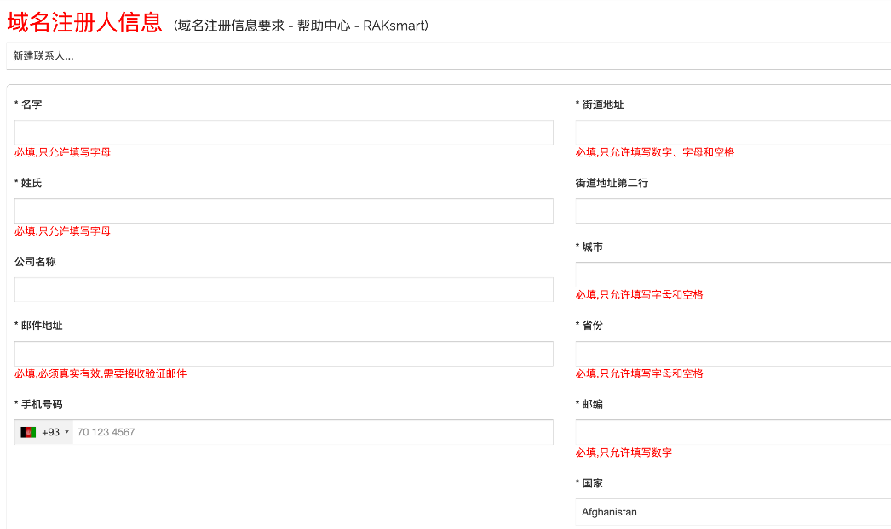
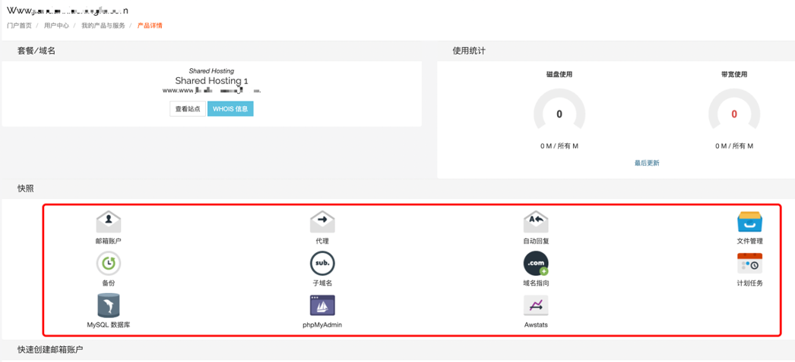

# 如何购买共享主机

1.购买服务-域名与网站-共享主机-根据需求选择配置和地区-立即订购

2.注册新域名/转移域名/或已有新域名解析三种选项

3.配置设置

主机名项目不能为空，需要将域名填写在此处，否则无法开通

4.确认信息

可以移除不需要的配置或者编辑配置信息

5.域名注册人信息，带有\*号标志是必填项，按照提示填写即可

填写内容只允许填写数字或者字母和空格

6.确认支付后等待开通成功

7.在快照里点击任意一项即可进入到面板进行操作

