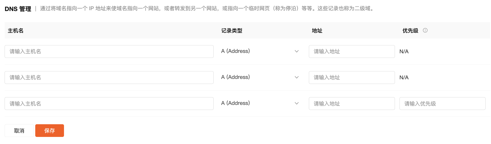
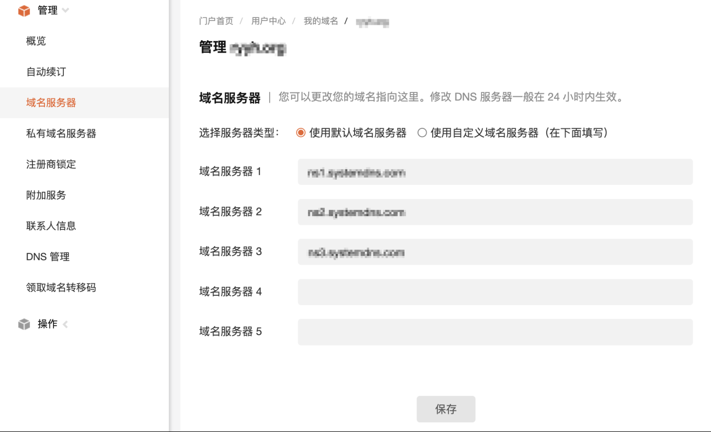
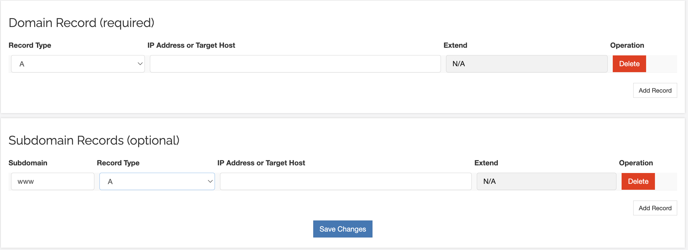

# DNS 解析管理

当域名完成开通流程后，为了实现域名与目标服务器、网络服务的关联，让用户能够通过域名顺利访问到对应的内容（如网站、应用服务等），需要在平台后台对域名进行 DNS 解析设置。

## 一、域名解析操作流程

域名解析包含两种类型，不同域名需对应采用适配的解析方式，保障解析准确生效。

操作入口：通过平台导航路径**产品管理****/ 域名与网站 / 域名**  可查看所有域名，右侧点击“**详情**”进入管理界面。

---

### 第一种解析方式

1. **验证说明**：域名开通后需验证，下单后留意查收验证邮件并完成验证，确保域名正常使用。（如没有收到注意下垃圾邮箱）
2. **一级域名解析**：主机名留空（无需填写内容 ），地址填写目标 IP（如 `192.168.1.1` ），完成一级域名（如 `example.com` ）到指定 IP 的解析。

- 如果主机名留空，保存报错，可将主机名填写 `@` 保存。

3. **二级域名解析**：主机名填写前缀（如 `www` ，即 `www.example.com` ），地址填写目标 IP，实现二级域名解析
4. **域名服务器： 使用默认的域名服务器**

****

---

### 第二种解析方式

1. **一级域名解析**：类型默认为 A ，地址填写目标 IP（如 `192.168.1.1` ），配置一级域名解析。
2. **二级域名解析**：主机名填写前缀（如 `www` ，即 `www.example.com` ），地址填写目标 IP 。

**以上**填写完成后，点击 **“保存”** 按钮，提交解析配置。配置完全生效时间24h-72h。

---

### 三、DNS 记录类型说明

1. **A 记录 ：**把域名指向一个 **IPv4 地址**

   - 例：`example.com → 192.168.1.10`
2. **AAAA 记录：**把域名指向一个 **IPv6 地址**

   - 例：`example.com → 2001:db8::1`
3. **CNAME 记录 ：**把一个域名 **别名** 指向另一个域名

   - 常用于 `www.example.com` → `example.com`
   - 注意：CNAME 不能和 A 记录共存
4. **Forward ：**把访问域名的请求 **转发** 到另一个网址（浏览器地址栏会显示跳转后的地址）

   - 例：将 `old-site.com` 转发到 `https://new-site.com/special-page`。
   - **Stealth Forward**：隐形转发，访问时依然显示原始域名，但内容来自另一个地址（相当于在 iframe 里嵌套）
5. **TXT 记录 ：**存放文本信息，常用于验证域名所有权、设置邮件策略（SPF、DKIM）等

   - 例：Google / Microsoft 邮箱验证、`v=spf1 include:_spf.google.com ~all`
6. **MX 记录 ：**指定 **邮件服务器**，决定邮件要投递到哪里

   - 例：`example.com MX 10 mail.example.com`
7. **MXE** 记录：让邮件直接投递到某个邮件服务器 IP，而不需要复杂配置。其实就是帮你自动生成一条特殊的 MX 记录。
8. **SPF** 记录：SPF 是一种反垃圾邮件机制，属于 TXT 记录的一种。告诉其他邮件服务器“哪些 IP/域名有权限给我的域发邮件”。
9. **URL Redirect**：访问某个域名时，**重定向**到另一个网址（常见 301/302 跳转）。
10. **URL Frame**：把另一个网站“框架嵌入”当前域名页面里，看起来像是在本域下，但实际是加载另一个站点的内容。

---

## 四、注意事项

1. **解析记录准确性**：填写主机名、地址时严格遵循对应规则，错误配置会导致域名无法访问或解析异常。
2. **生效时间**：DNS 解析配置修改后，需等待全球 DNS 服务器同步，期间可能出现解析不稳定，可通过 `nslookup`、`ping` 命令验证解析结果（如 `nslookup example.com` 查看域名解析的 IP ）。
3. **域名服务器生效**：修改域名服务器后，旧解析记录会逐步失效，确保新服务器已配置对应解析规则，避免业务中断。
4. **验证邮件处理**：域名务必及时处理验证邮件，未验证可能导致域名被暂停解析，影响业务访问。
