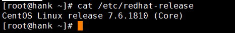
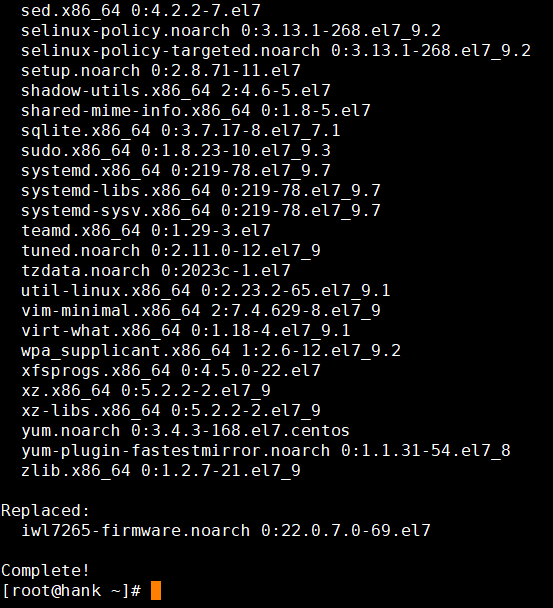
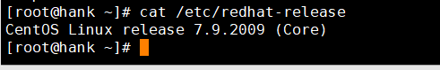

# CentOS 7.x系统升级到CentOS 7.9系统

1.打开终端或通过ssh登录到Linux系统中。

2.使用root权限登录系统。

3.查看目前系统的版本，使用以下命令

- cat /etc/ redhat-release

4.升级到CentOS 7.9版本操作系统，运行以下命令

- yum install update -y

"yum install <package\_name>": 这个命令用于安装指定名称的软件包,您需要将 "<package\_name>" 替换为要安装的实际软件包的名称,使用 "-y" 选项可以自动确认安装过程中的提示。 "yum update": 这个命令用于更新系统中已安装的所有软件包到最新版本

安装过程会比较长，您等待安装完成即可，最后提示Complete! 表示安装完成

5.使用命令：cat /etc/redhat-release 即可查看是否已升级为CentOS 7.9

