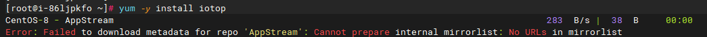
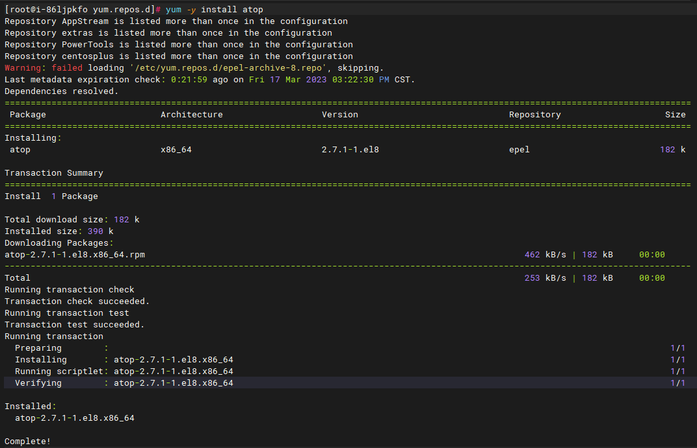

# CentOS 8 EOL如何切换源

Centos8于2021年年底停止了服务，在使用yum源安装时候，出现以下报错：

解决方法:

1、进入yum的repos目录

cd /etc/yum.repos.d/

2、修改所有的CentOS文件内容

sed -i 's/mirrorlist/#mirrorlist/g' /etc/yum.repos.d/CentOS-\*

sed -i 's|#baseurl=http://mirror.centos.org|baseurl=http://vault.centos.org|g' /etc/yum.repos.d/CentOS-\*

3、更新yum源为阿里镜像

yum clean all && yum makecache

yum -y install wget

wget -O /etc/yum.repos.d/CentOS-Base.repo <https://mirrors.aliyun.com/repo/Centos-vault-8.5.2111.repo>

yum -y install epel-release

切换为阿里源后测试可以正常使用yum下载想要使用的工具了。

