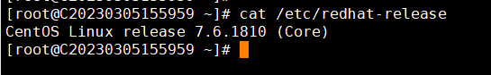
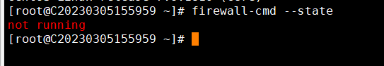
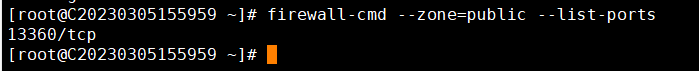
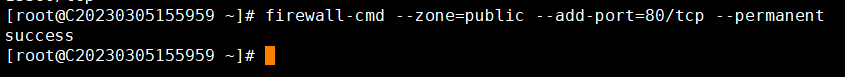
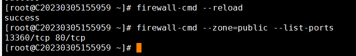

# CentOS7.x防火墙开/关和添加端口

CentOS7.X，系统默认防火墙是firewalld，以CentOS7.6示例

1. 1.查看防火墙状态
2. firewall-cmd –state

not running是未开启状态

2. 2.开启防火墙
3. systemctl start firewalld.service

running是运行状态

3.关闭防火墙 

systemctl stop firewalld.service

3. 4.重启防火墙
4. systemctl restart firewalld.service

5.查看防火墙所有开放的端口 firewall-cmd --zone=public --list-ports

如上图所示，只开放了13360端口，该端口为远程端口号

5. 6.开放端口

firewall-cmd --zone=public --add-port=80/tcp --permanent  # 开放80端口

返回值为success即为开放成功

7.firewall-cmd --reload # 使配置立即生效

如上图所示，查看防火墙所有开放的端口。80端口以开启

8.firewall-cmd --zone=public --remove-port=80/tcp --permanent #关闭80端口

9.关闭80端口后，使配置生效后查看80端口已关闭
