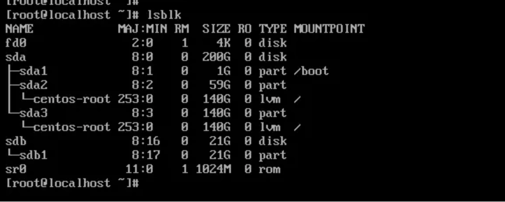

# Linux系统/etc/fstab 配置错误导致无法登录

遇到机器无法正常通信，通过后台的vnc窗口查看系统报错，无法正常进入到系统内

 

出现如下报错信息

（1）磁盘损坏，一般这种情况会有提示，是哪块盘或者分区有问题，可以使用fsck命令进行修复，然后重启即可。

 

（2）/etc/fstab 文件中某块盘有问题或者文件写的格式有问题，导致挂载失败。

 

1.具体是如何判断，我们可以按 ctrl+alt+delete重启，然后终端会打印启动日志，有问题的话，日志会长时间停留在该执行过程，如下图，看到是/dev/sdb2这个设备有问题，推测是挂载/dev/sdb2出现了问题，然后磁盘开机挂载基本上都会配置到/etc/fstab文件中，所以我们继续等待，准备进入系统，查看/etc/fstab文件

2.等待一会后，又出现了这个登录画面，终端打印的信息提示，输入root口令，然后我们就输入root口令，然后回车。

 

3.密码输入完成后，回车，进入到了系统，查看/etc/fstab文件，

 

4.查看/etc/fstab文件发现/dev/sdb2的挂载配置，然后查看挂载情况，发现没有挂载上，手动执行 mount -a 重新挂载，发现打印报错，提示/dev/sdb2 不存在

 

5.查看磁盘分区情况，看到只有/dev/sdb1，没有/dev/sdb2

 

6.因此，编辑/etc/fstab文件，将/dev/sdb2的配置注释掉。然后重启，这样这个问题就解决完成了。

 

以上方法如果无法正常进入到系统，可以尝试进入到救援模式下修改/etc/fstab
