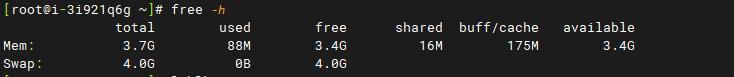
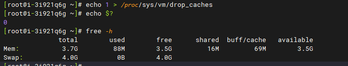
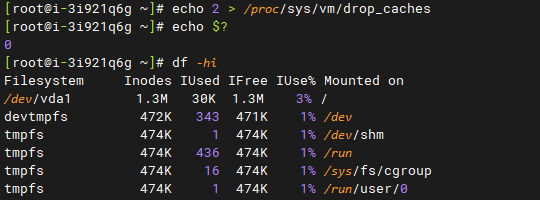
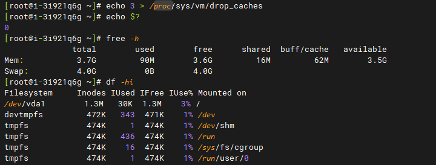

# Linux系统如何查看内存使用情况以及清理缓存

有时服务器卡顿，不一定是cpu使用率过高，也有可能是内存不够用了，可以参考下面的方法来查看，并及时清理。

1.查看服务器物理内存、交换分区使用情况的命令：free -h

- totel：机器总的物理内存；

- used：已使用的内存； 
- free：空闲的物理内存； 
- shared：被共享使用的物理内存； 
- buff/cache：可以理解为缓存； 
- available：还可以被应用程序使用的物理内存；available  = free + buffer + cache（这只是理想中的计算方式，实际中的数据往往有较大的误差）。

2.清理缓存命令：

echo 1 > /proc/sys/vm/drop\_caches       //释放pagecache页面缓存

echo 2 > /proc/sys/vm/drop\_caches       //释放dentries（目录缓存）和inodes缓存

echo 3 > /proc/sys/vm/drop\_caches       //释放pagecache,dentries 和 inodes缓存

注：echo $? #返回执行结果，返回值为0 代表执行成功. 

- echo 0 是不释放缓存
- echo 1 是释放pagecache页面缓存（清空最近放问过的文件页面缓存）
- ehco 2 是释放dentries（目录缓存）和inodes缓存（清空目录项缓存和文件节点缓存）
- echo 3 是释放 1 和 2 中说到的所有缓存
