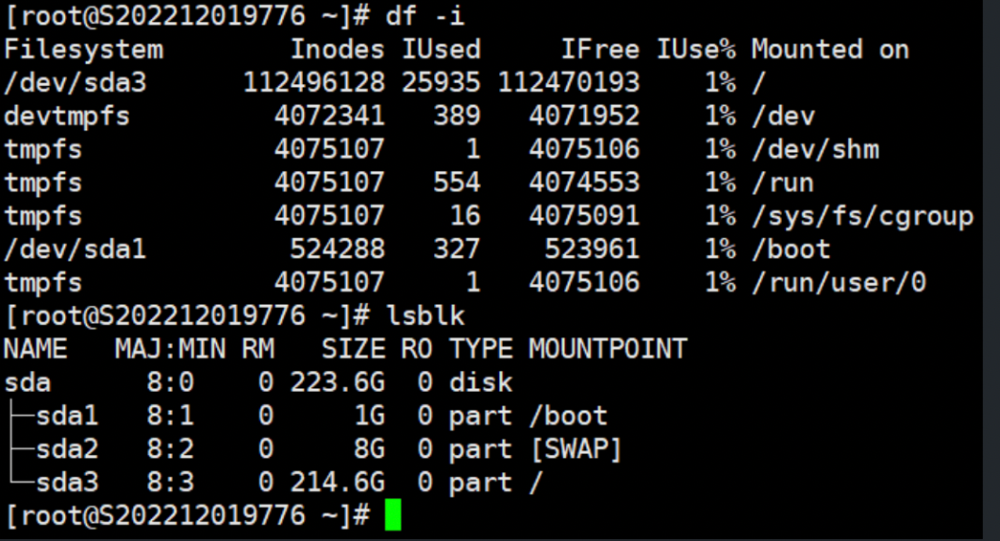
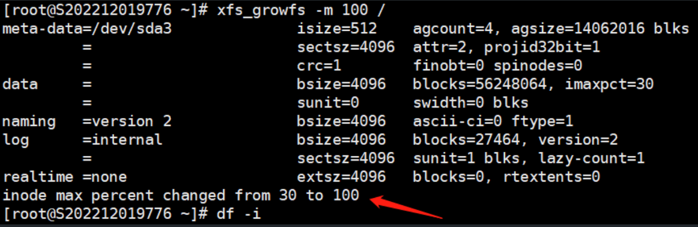
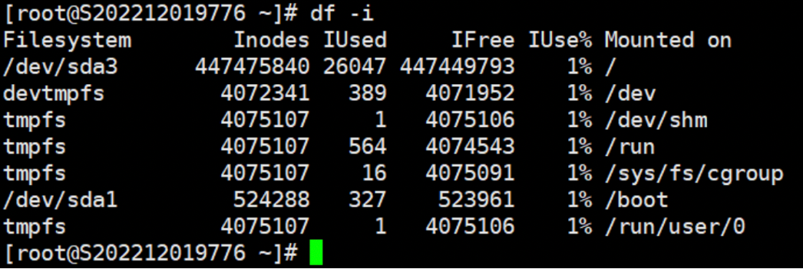

# Linux系统扩容inode可用空间

1．检查需要扩容的文件系统格式为XFS：`df -hT`

``

2．通过命令`df -i`查看inode信息

文件系统，inode可用，已用，剩余，已用%，挂载点

3．可以使用命令`xfs_info``挂载点`查看 XFS 卷详细信息

imaxpct 表示可用于分配inode的空间百分比，默认预留了 25% 的空间用于分配 inodes。

注：1TB以下的文件系统,默认值是25%,50TB以下的文件系统是5%,50TB以上的文件系统是1%

4．使用命令：`xfs_growfs -m %``挂载点`，更改inode空间的百分比。

注：**-m [maxpct]**：指定文件系统中可分配为 inode 的最大空间百分比的新值。

5．最后通过命令 `df -i`查看扩容好的Inode的空间

补充：如果是分区是ext4格式，非系统分区可以通过格式化手动指定大小

执行下面命令时需要先将分区卸载。

`mkfs.ext4 -i 8192 /dev/sda5`

注：8192代表8K一个inode，默认是16k一个inode。
