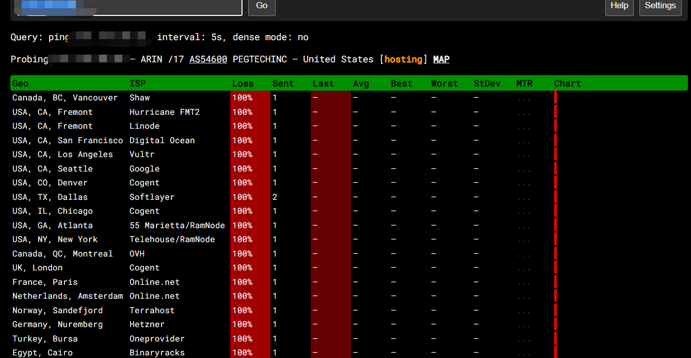

# linux系统如何设置开启/禁止ping

为了防止别人通过网络ping扫描找到并攻击机，可以在本机设置禁止停止ping命令

L inux默认是允许Ping响应的，系统是不允许Ping由2个原因决定的：

- 内核参数
- 防火墙

需要2个因素同时允许才能允许Ping ，2个因素有任意一个禁止Ping就无法Ping

一.内核禁Ping的设置方法

首先我们可以先查看一下IP是否正常通信，这里推荐ping.pe网站，输入IP测试连通性，可以查看到目标IP是允许Ping的。

临时禁Ping ：

echo 1 >/proc/sys/net/ipv4/ icmp\_echo\_ignore\_all     #设置临时禁止Ping

这个时候我们再查IP已经禁Ping了，如果这个时候我们再想测试IP连通性，我们可以对端口进行Ping测试

这里可以看到是可以连通的，因为是临时禁Ping ，所以机器重启后会修复Ping功能

永久禁Ping ：

#vi  /etc/sysctl.conf   #进入配置文件

在里面添加一行：net.ipv4.icmp \_echo\_ignore\_all= 1

如果已经有net.ipv4.icmp \_echo\_ignore\_all这一步了，直接修改=号码后面板的值即可能的。（0表示允许，1表示禁止）

## sysctl -p    #应用新配置

查看是否禁止ping

cat /proc/sys/net/ipv4/icmp\_echo\_ignore\_all

内容为1 禁止停止ping 内容为0 开启ping
