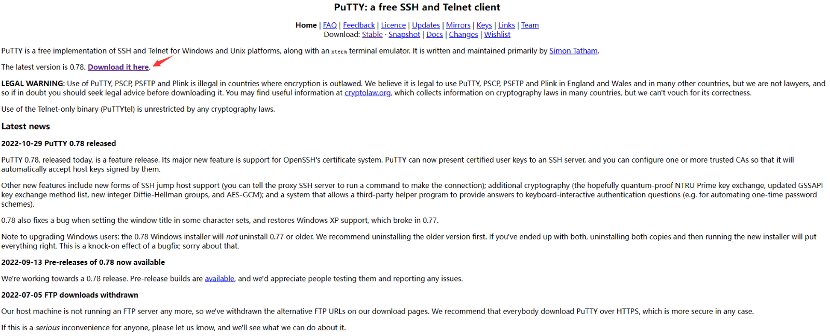
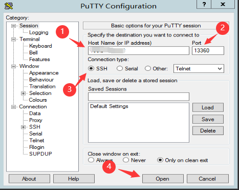

# 如何使用Putty工具远程linux系统

Putty软件简介

PuTTY是一个Telnet、SSH、rlogin、纯TCP以及串行接口连接软件。较早的版本仅支持Windows平台，在最近的版本中开始支持各类Unix平台，并打算移植至Mac OS X上。除了官方版本外，有许多第三方的团体或个人将PuTTY移植到其他平台上，像是以Symbian为基础的移动电话。PuTTY为一开放源代码软件，主要由Simon Tatham维护，使用MIT licence授权。随着Linux在服务器端应用的普及，Linux系统管理越来越依赖于远程。在各种远程登录工具中，Putty是出色的工具之一。Putty是一个免费的、Windows x86平台下的Telnet、SSH和rlogin客户端，但是功能丝毫不逊色于商业的Telnet类工具。

下载链接：[PuTTY：一个免费的SSH和Telnet客户端 (greenend.org.uk)](https://www.chiark.greenend.org.uk/~sgtatham/putty/)

点击上图红色箭头下载，跳转到下图界面，选择适合自己系统的链接下载。

点击上图红色箭头下载，下载安装完成后如下图图标所示：

1.连接步骤如下：

- 输入实例IP地址

- 实例远程端口号，Linux默认端口号为22，下图为随机设置的端口号

- 选择连接类型SSH

- 打开

- 点击Accept

2.输入用户名和密码，密码是不显示的可以复制粘贴

3.如下图所示成功远程实例

