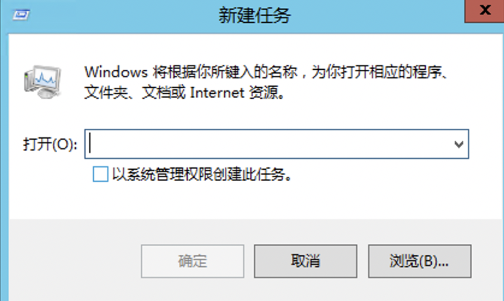

# Windows 2012系统卸载某些软件后无法进入系统桌面怎么办

#### 一.问题描述

针对Windows 2012操作系统，由于安装应用系统会用到.net framework 3.5，而2012自带的.net framework 4.5版本需要卸载，但是卸载之后可能会遇到黑屏、无法进入系统桌面的问题，只能调出任务管理器。

#### 二.可能原因

卸载.net framework 4.5后，系统由完整模式Full变为了核心模式Core，没有启用系统桌面。

#### 三.处理方法

恢复过程就是由核心模式切换到完整模式的过程，步骤如下：

1. 登录服务器。

2. 打开任务管理器。

3. 选择“文件 > 运行新任务”

系统打开“新建任务”窗口

4.在“打开”栏，输入“**cmd**”，然后按回车键。

5.在弹出的命令行窗口执行以下命令，将系统由核心模式切换到完整模式。

- **Dism /online /enable-feature /all /featurename:Server-Gui-Mgmt /featurename:Server-Gui-Shell /featurename:ServerCore-FullServer**

6.大概10分钟左右，系统会提示重启，在命令行输入“**Y**”重启系统。

再次登录系统后就可以正常显示桌面。
