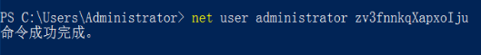
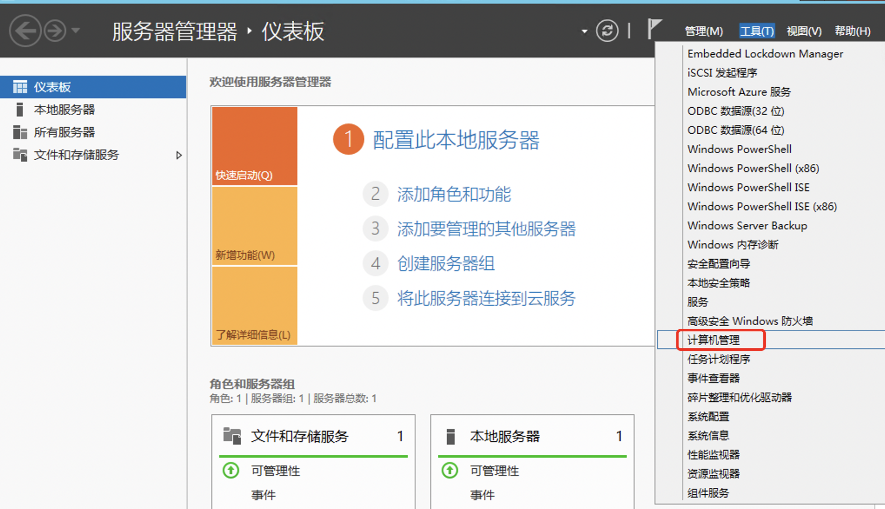
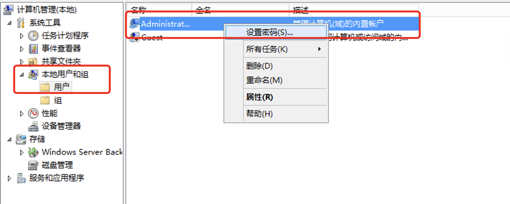
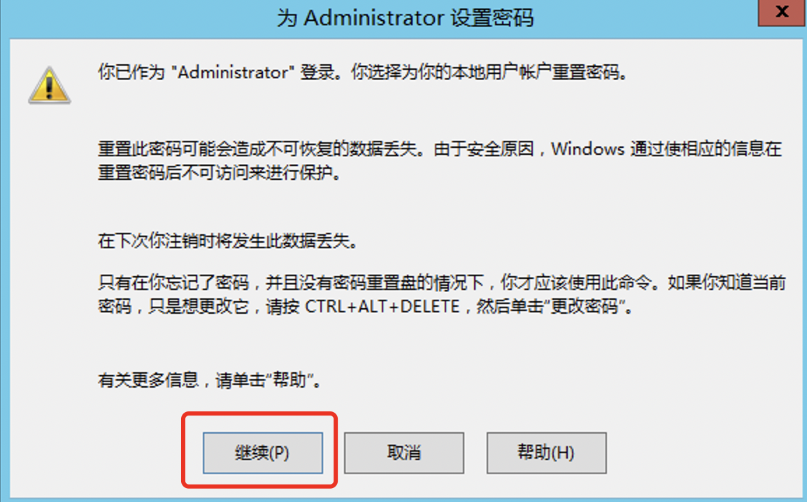
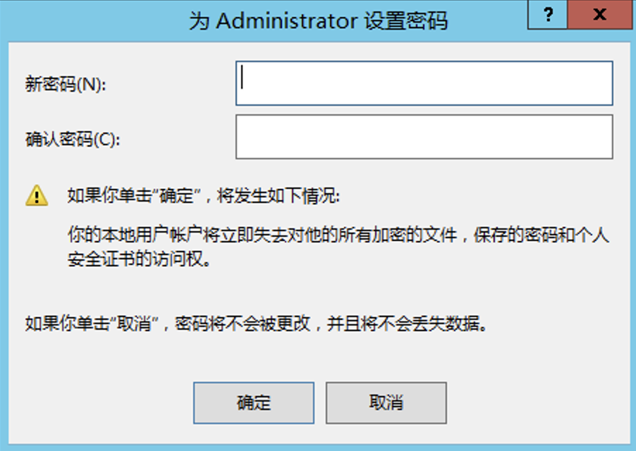

# Windows修改管理员密码

手动修改windows管理员密码的方式有两种：

一.命令行修改

1.打开PowerShell使用命令修改

------ 输入net user administrator xxxxx(密码)

二.图形化界面修改

1.通过服务器管理器·仪表盘 - 工具 - 计算机管理

2.本地用户和组 - 用户 - 右键Administrator设置密码

3.点击继续

4.设置完新密码后点击确定即可

（设置密码需要满足复杂性要求，由数字，字母，特殊符号组成）

