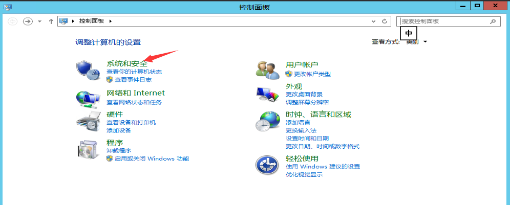
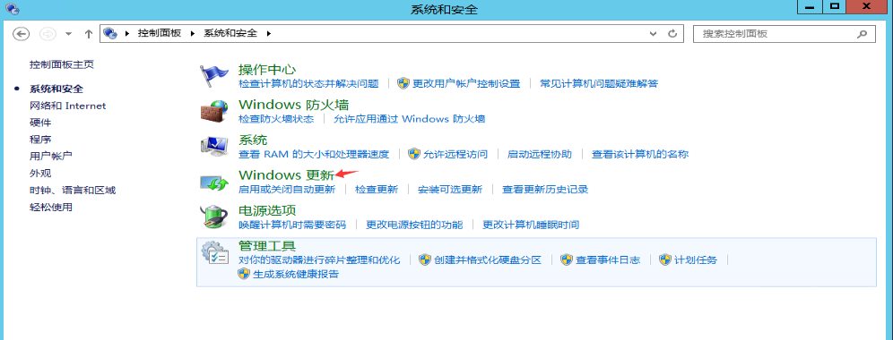
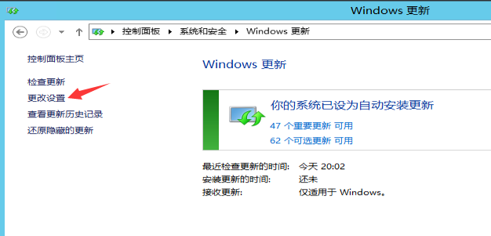
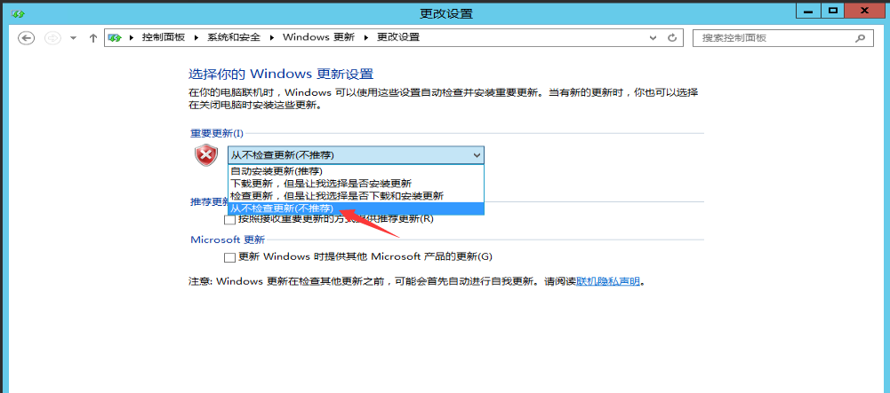
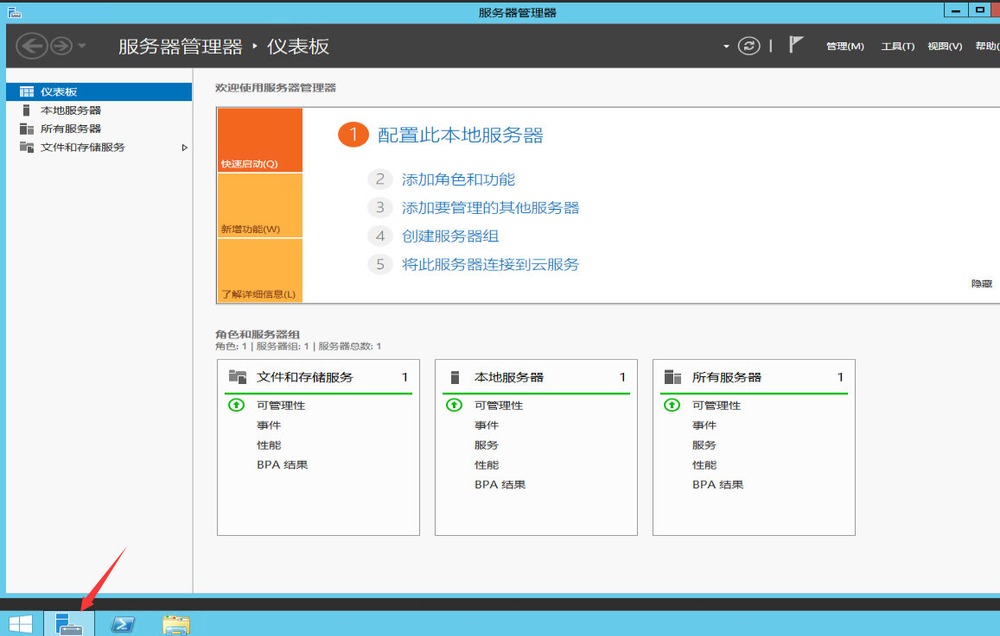
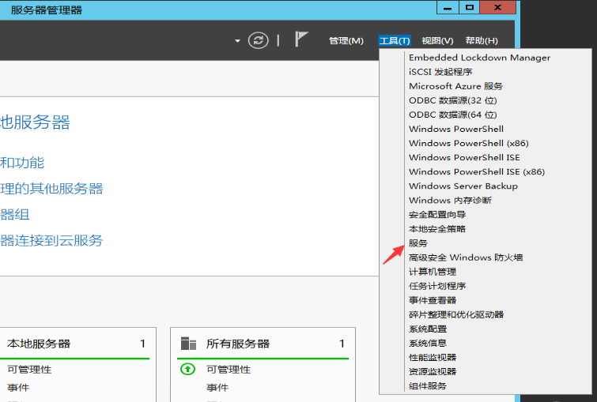
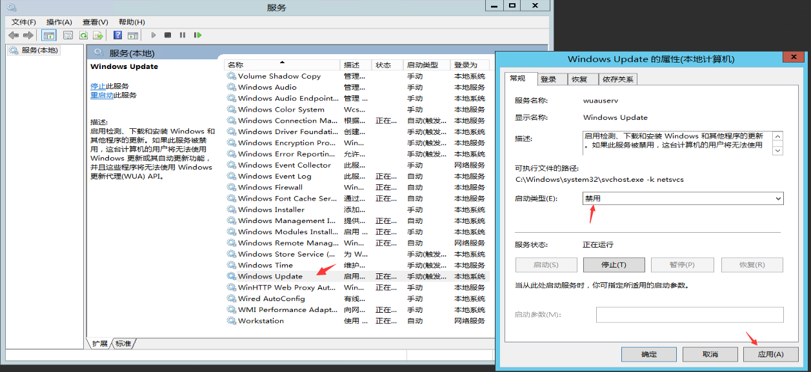

# Windows关闭系统自动更新

1.通过远程桌面远程到Windows实例

2.点击左下角开始，打开控制面板点击系统和安全

3.点击Windows更新

4.点击左侧列的“更改设置”

5.进入更改设置界面后，将“从不检查更新”选项选中

6.这样之后我们就成功关闭了windows系统的更新检测，但是系统还是默认windows update服务是开机自动启动的，所以我们还需要打"服务器管理器 "

7.打开上图所示窗口后，点击上端的“工具”，在弹出选项中点击“服务”

8.找到“Windows Update”右击，在弹出选项中点击“属性”。打开属性窗口后，将“启动类型”设置为“禁用”，然后点击“确定”即可

