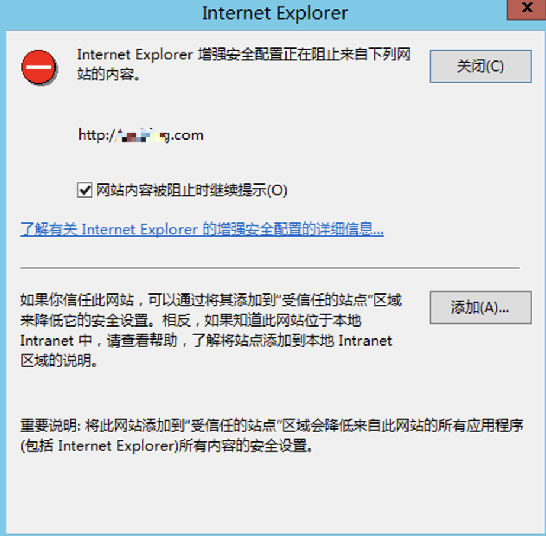
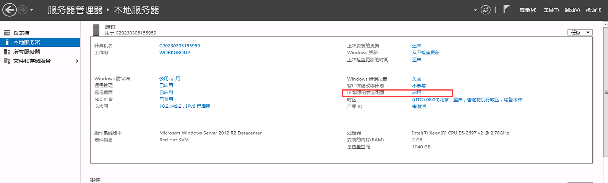
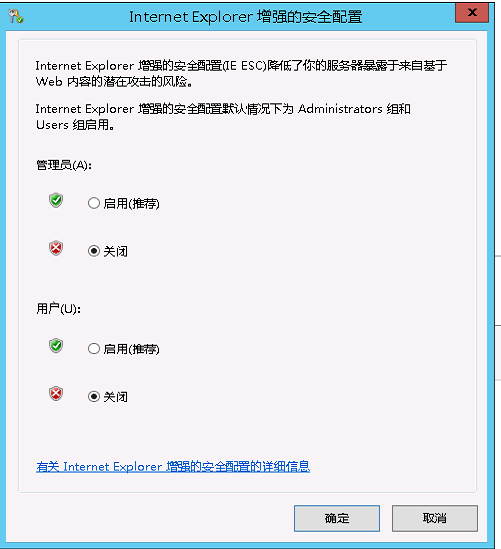

# Windows系统使用IE浏览器打开网站提示“增强安全配置正在阻止来自下列网站内容”如何处理

在Windows操作系统中，使用IE浏览器打开网站时，提示网站内容被阻止，需要添加信任站点。

为了保障Windows服务器的安全性，默认运行IE浏览器时会启用IE增强的安全配置。若不希望打开浏览器提示以上报错，可关闭IE增强的安全配置。

1.依次选择左下角开始 > 服务器管理器 > 本地服务器，然后单击IE 增强的安全配置右侧的启用。

2.在Internet Explore增强的安全配置页面，管理员选中关闭，用户选中关闭，然后单击确定保存配置。

3.使用IE浏览器重新打开网站，就不会再提示在阻止该网站内容。
