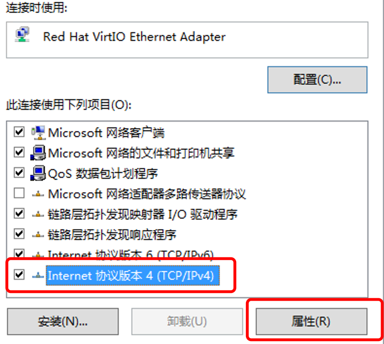
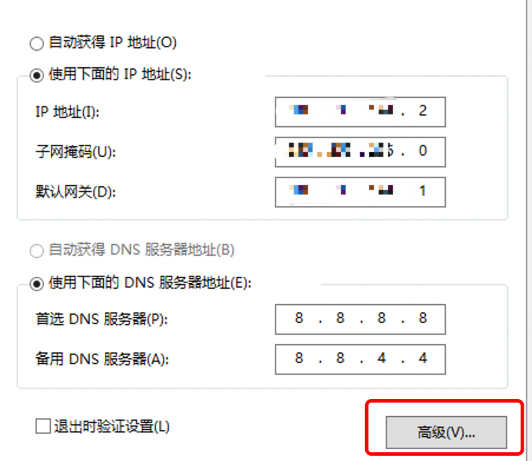
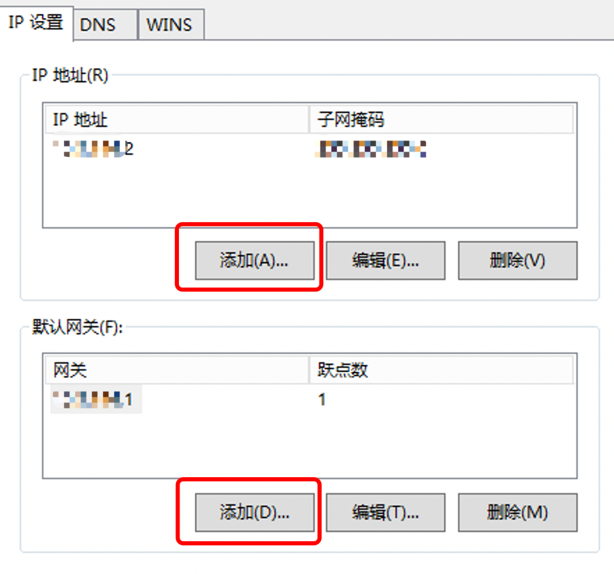

# Windows系统如何添加IP

方法一：可以使用 [系統工具](https://billing.raksmart.com/whmcs/index.php?rp=/knowledgebase/189/%E7%B3%BB%E7%B5%B1%E5%B7%A5%E5%85%B7.html) 该文档内的脚本，直接配置命令

连续添加IP

整段IP添加

 

方法二

如果添加的IP较少，也可以在网络连接里IPv4里的高级进行添加

 

 

方法三

在DOS窗口下直接用命令批量添加IP

for /l %i in (起始数字,1,结束数字) do netsh interface ip add address "本地连接" IP前缀.%i 子网掩码
（其中起始数字和结束数字为供应提供给您的IP最后一位，“本地连接”为网卡连接名称，此名称每台服务器可能不一样，在网上邻居属性进入可以看到。）

 

首先打开DOS窗口，开始 – 运行 - 输入cmd - 回车

 

例如：可用IP地址：174.139.111.82-174.139.111.86（共5个可用IP）
子网掩码(Netmask)：255.255.255.248
当前网卡连接名称：本地连接 1

然后输入命令：for /l %i in (82,1,86) do netsh interface ip add address "本地连接" 174.139.111.%i 255.255.255.248
（以上命令可以在本地电脑上修改好后，直接鼠标右键复制，然后在DOS窗口直接鼠标右键粘贴，避免输入错误并且比较省事）

输入完成后直接回车，就能看到在自动一条一条地添加IP了
