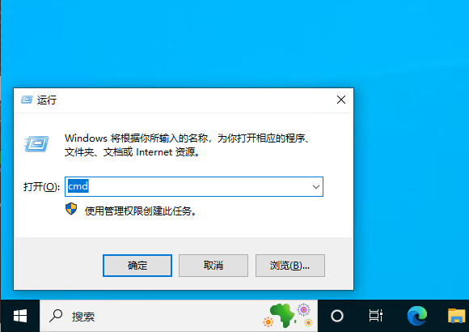
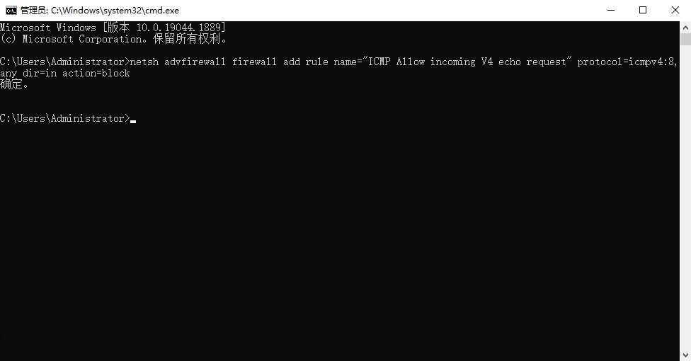

# Windows系统设置禁Ping

为了防止他人通过网络ping扫描找到并攻击机器，可以在本机禁止ping命令

1.在电脑桌面使用快捷键win+R弹出运行窗口，在搜索框中输入cmd，点击确定

2.在命令窗口输入命令：

- netsh advfirewall firewall add rule name="ICMP Allow incoming V4 echo request" protocol=icmpv4:8,any dir=in action=block

这条命令就是在原有规则基础上新加了一条规则，如果我们想恢复禁Ping直接删掉这条规则即可：

- netsh advfirewall firewall del rule name="ICMP Allow incoming V4 echo request"

3.这时我们再查看IP已经禁Ping了，如果这时我们再想测试IP连通性，我们可以对端口进行Ping测试，这里可以看到是可以连通的，如果我们想恢复禁Ping可直接启动上述的规则即可

