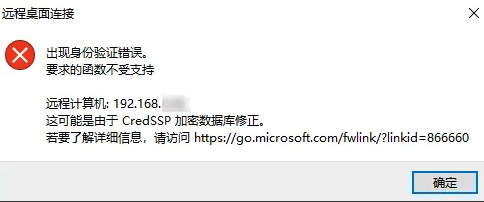
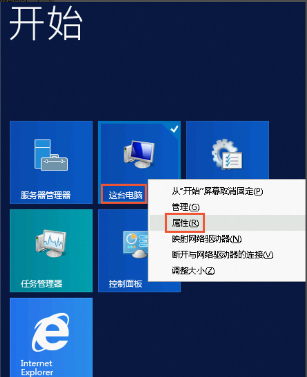
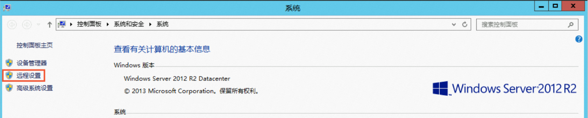
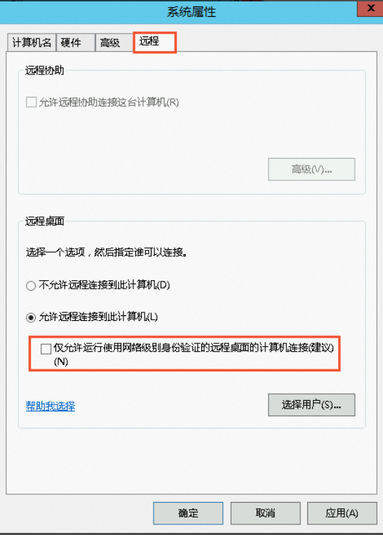
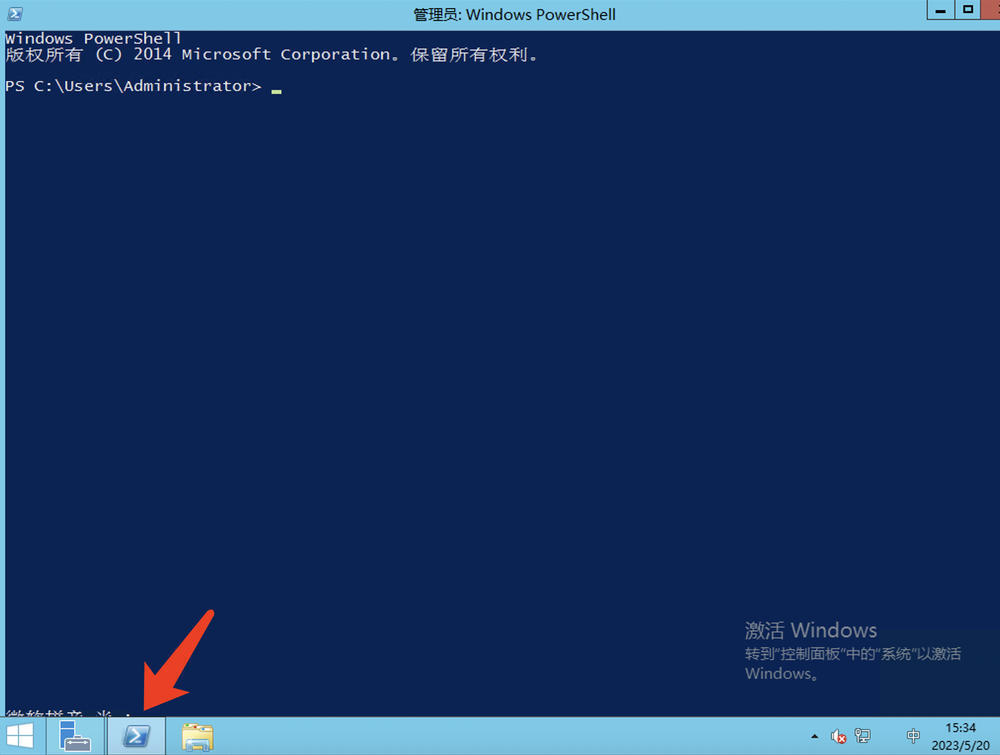

# Windows远程桌面出现CredSSP加密数据修正问题解决方案

问题现象：通过远程桌面连接Windows实例时，出现错误提示“出现身份验证错误，要求的函数不受支持”。

问题原因：

微软官方于2018年5月，更新了凭据安全支持提供程序协议（CredSSP）相关补丁和身份验证请求方式

默认情况下，安装此更新后，修补的本地电脑无法与未修补的实例进行通信

解决方案：

根据实际情况，参考以下三种解决方案：

方案一：在本地PC上运行以下命令

1.在本地PC上用管理员权限打开CMD窗口运行以下命令

reg add "HKLM\SOFTWARE\Microsoft\Windows\CurrentVersion\Policies\System\CredSSP\Parameters" /v AllowEncryptionOracle /t REG\_DWORD /d 2 /f

方案二：实例允许远程桌面连接

1.通过VNC连接进入Windows系统，点击开始菜单，右键单击这台电脑 - 属性

3. 2.在控制面板主页上，单击远程设置

4. 3.在远程页签下，取消勾选仅允许运行使用网络级别身份验证的远程桌面的计算机连接（建议），然后单击确定。

方案三：修改注册表

1.通过VNC连接进入Windows系统

2.单击右下角“Windows PowerShell”打开后执行如下命令，以管理员身份运行Windows PowerShell脚本

- New-Item -Path HKLM:\Software\Microsoft\Windows\CurrentVersion\Policies\System -Name CredSSP -Force

- New-Item -Path HKLM:\Software\Microsoft\Windows\CurrentVersion\Policies\System\CredSSP -Name Parameters -Force

- Get-Item -Path HKLM:\Software\Microsoft\Windows\CurrentVersion\Policies\System\CredSSP\Parameters | New-ItemProperty -Name AllowEncryptionOracle -Value 2 -PropertyType DWORD -Force

3.重启机器后生效
