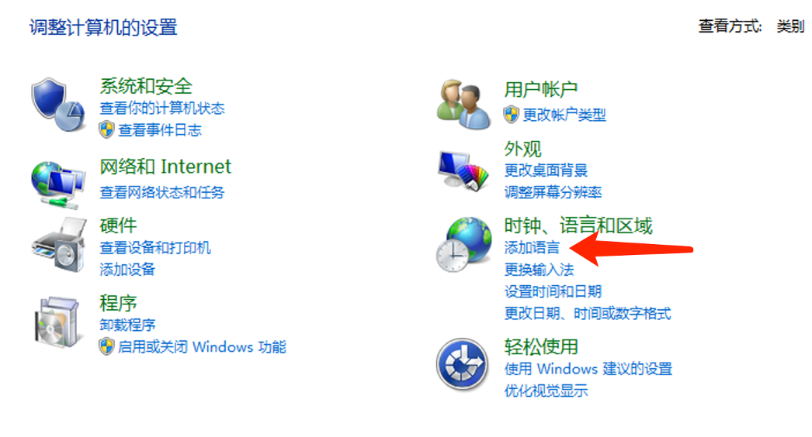
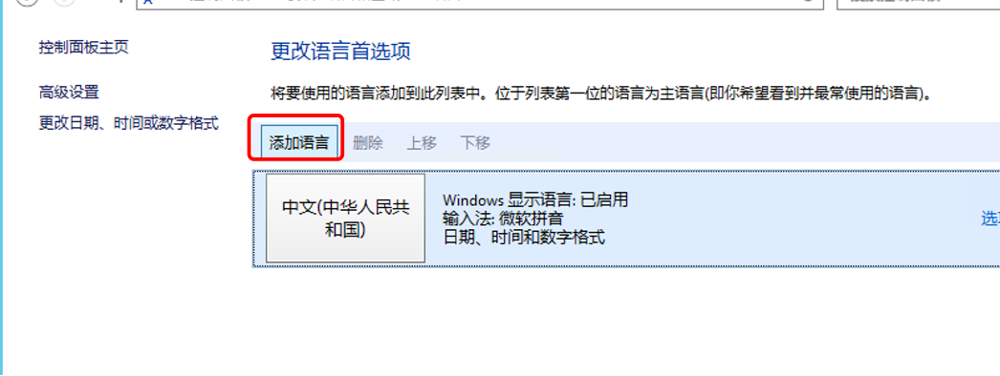
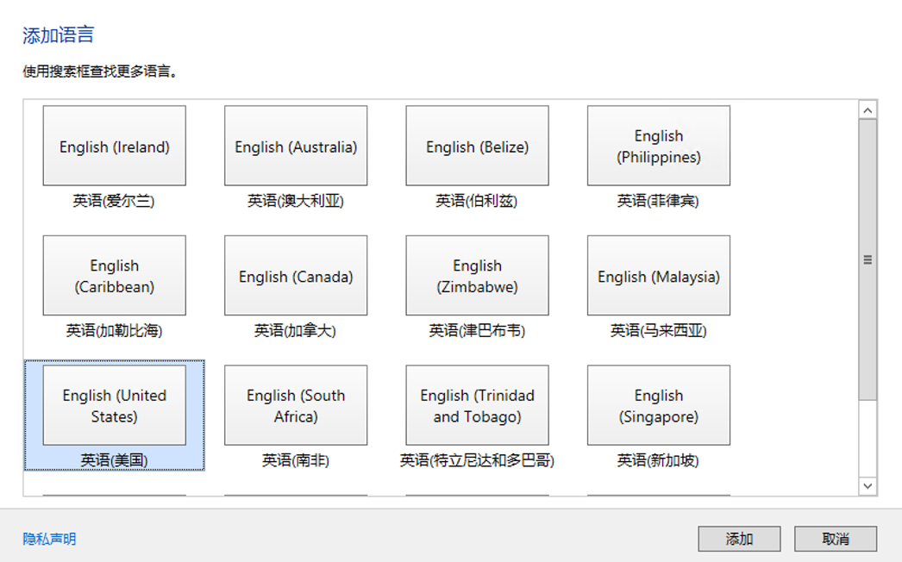
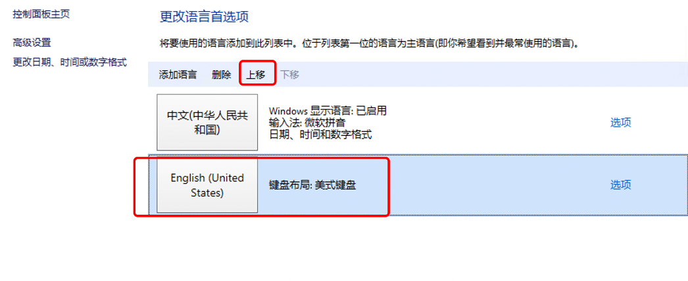
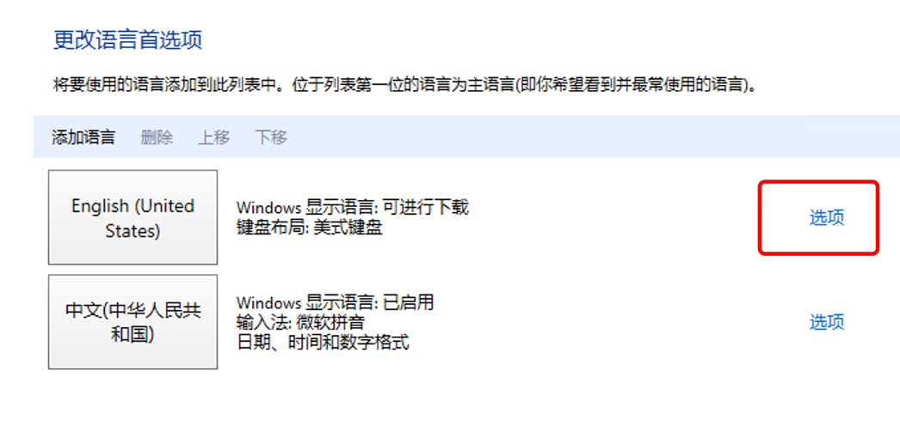
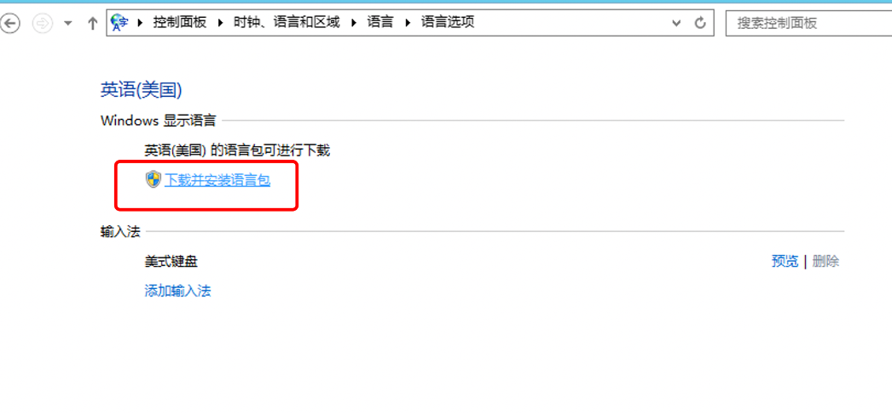
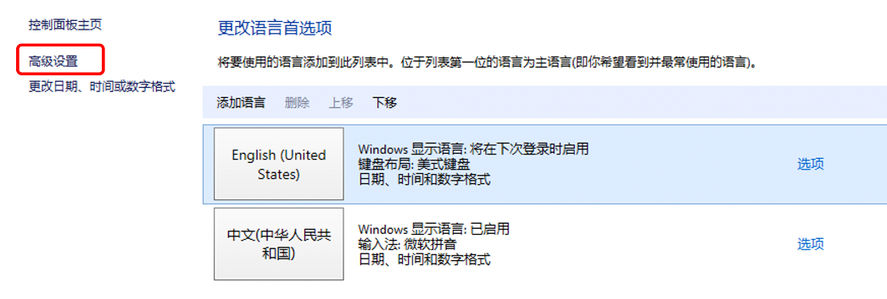
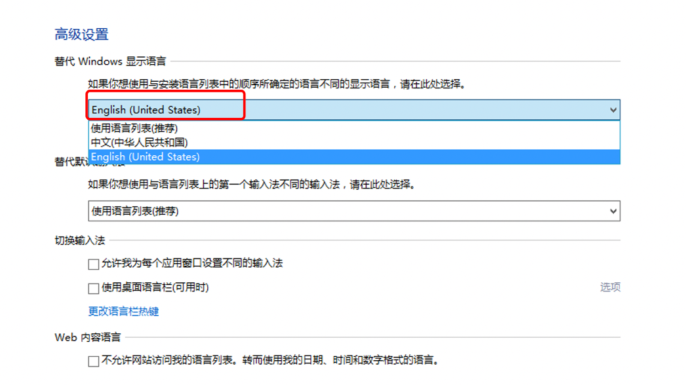

# windows系统如何更改语言

1.进入控制面板，选择 时间/语言和区域 - 添加语言

2.添加语言

3.选择需要添加的语言 - 打开 - 添加

4.将添加的语言上移到语言列表顶端

5.这样还是不能直接使用的，还未进行下载安装，点击右边的选项

6.下载并安装语言包

7.下载完成后，选择高级设置

8.切换到我们刚才下载的语言，在第一个选项下拉中选择，保存即可

9.完成步骤之后注销再远程连接就可以看到服务器已经切换成功
