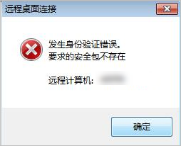
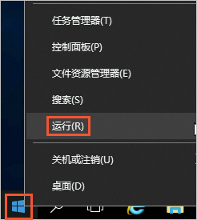
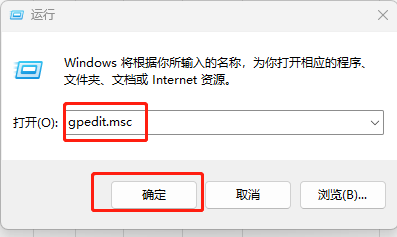
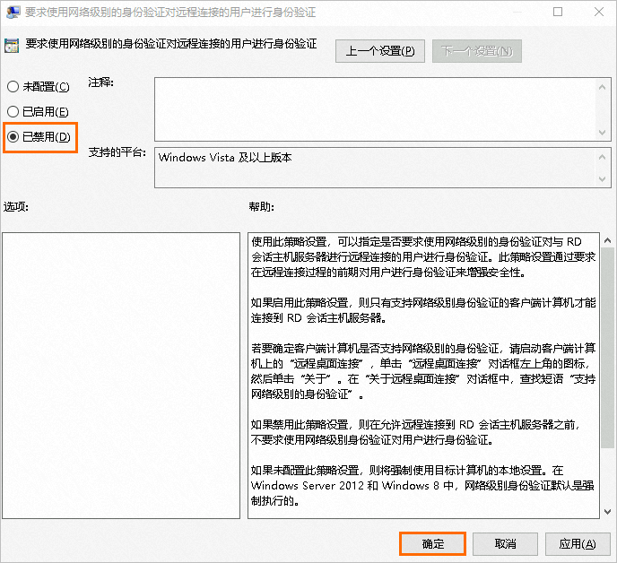

# windows远程连接提示“发生身份验证错误要求的安全包不存在” 解决方法

该错误是Windows系统内关于远程桌面连接实例时身份验证的安全包缺失导致的

 

解决方法如下：

1.通过后台VNC进入系统

2.右键单击win图标，然后单击运行

3.在运行中输入gpedit.msc 打开本地组策略编辑器 - 跳转到：计算机配置> 管理模板> Windows 组件> 远程桌面服务> 远程桌面会话主机> 安全。 在右侧窗格中，找到并双击“要求使用网络级别的身份验证对远程连接的用户进行身份验证”。

4.在要求使用网络级别的身份验证对远程连接用户进行身份验证窗口，选中已禁用，单击确定

