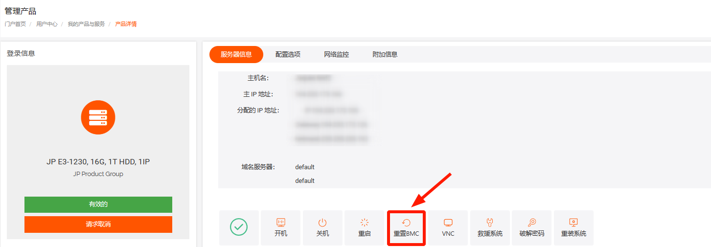
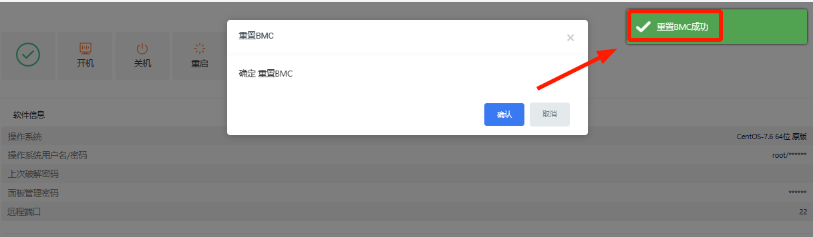
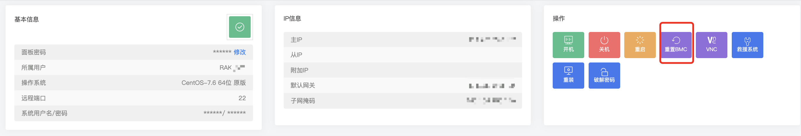

# 物理服务器BCM重置

介绍：服务器BMC (Baseboard Management Controller) 是一种嵌入式系统，通常被集成在服务器硬件中，提供远程管理和监控功能。BMC主要用于监测服务器的硬件状态、管理系统配置、执行远程控制和故障诊断等任务，使管理员能够远程管理服务器，而无需在现场进行物理干预

功能：

- 监控硬件状态：BMC可以监测服务器的温度、风扇速度、电源供应等硬件信息，并发出警报，以避免硬件故障引起的数据丢失和停机。
- 远程管理：BMC可以通过网路远程连接到服务器，进行开关机、重启、修改BIOS设置等远程管理任务，提高服务器的可靠性和可维护性。

- 系统配置：BMC提供了一个图形界面，可以进行系统配置，如IP地址、DNS设置、时间同步等。
- 日志记录：BMC记录服务器的运行日志，包括硬件故障、系统事件、安全事件等，以便管理员进行故障排查和安全审计。

例如：在后台无法打开VNC可尝试重置BMC试下

1. 忘记了BMC的登录凭证，无法登录BMC进行管理和配置。

2. BMC配置出现问题，无法进行远程管理和监控。

3. 出现了BMC的性能问题，如无法访问或响应缓慢。

4. 需要对BMC进行更新或升级。

在这些情况下，可以尝试重置BMC，以解决问题。重置BMC的方法可能因硬件平台而异

1.选择需要管理的物理服务机器 

登录平台，进入客户中心，下方\*\*“我的订单”\*\* 点击 \*\*“物理服务器”\*\*。或者在 \*\*“产品管理”\*\* 点击 \*\*“物理服务器”\*\*，根据机器所在地区和状态筛选。

2.找到对应机器后点击重置BMC

3.提示重置BMC成功，大概等5分钟左右即可连接

 

4.在控制面板里也可以进行BCM重置

