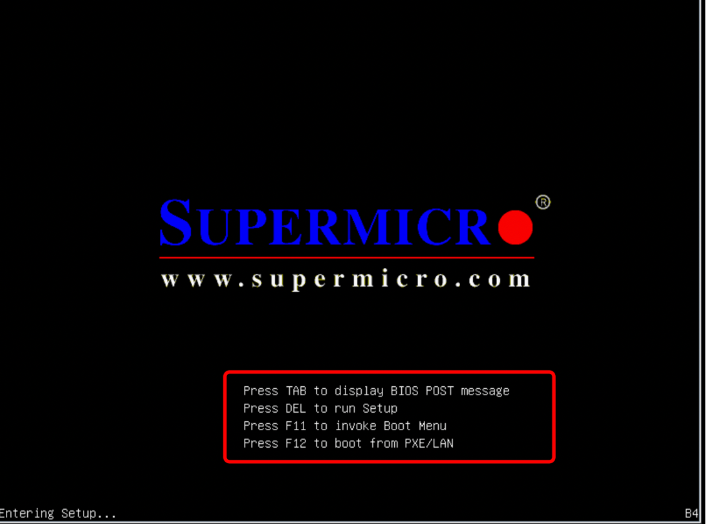
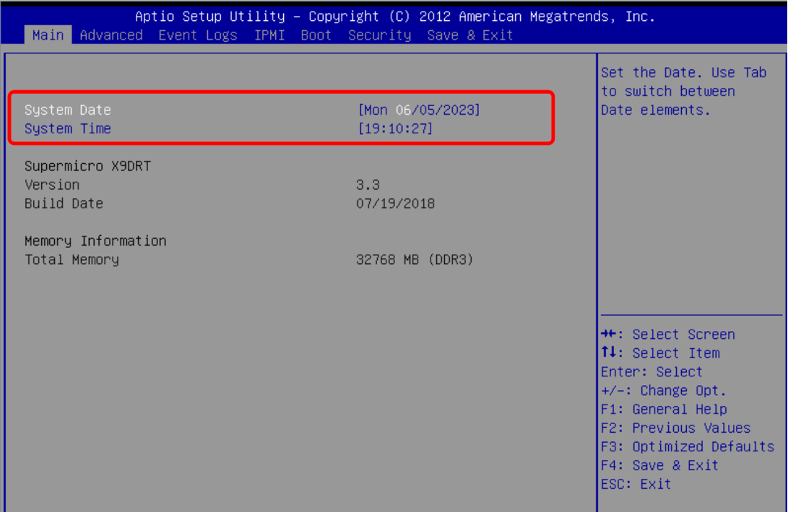
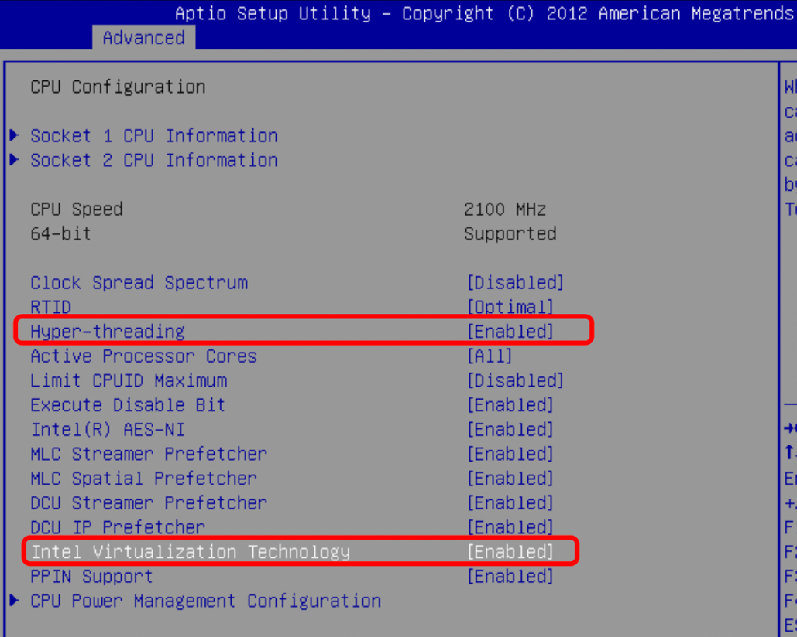
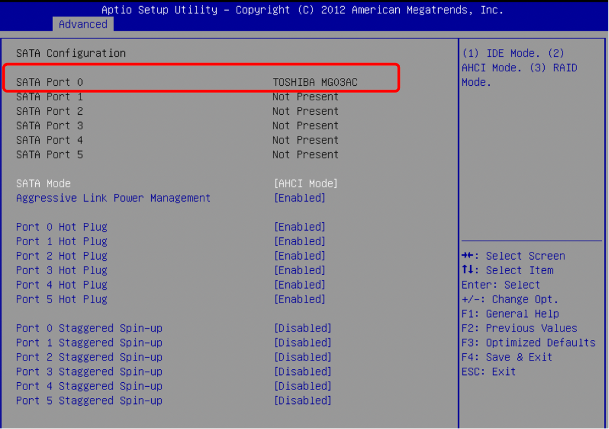
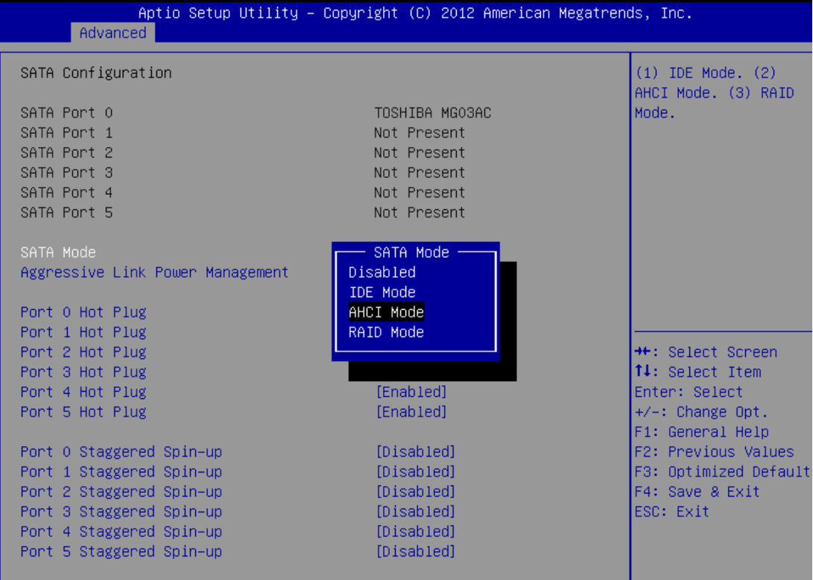
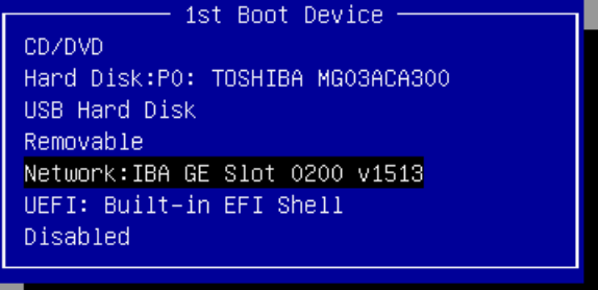
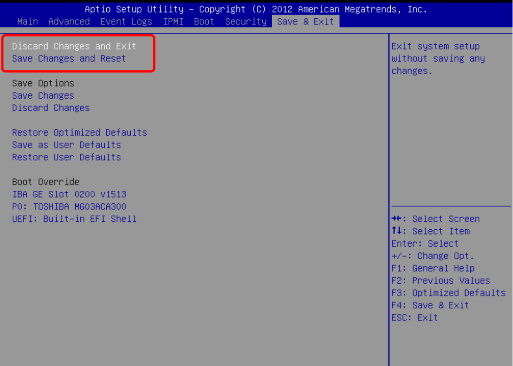

# 物理服务器BIOS说明介绍

在BOIS里可以查看和调整机器配置，如：CPU 内存 硬盘 虚拟化/超线程和启动项

1.重启机器，在重启界面中按照提示进入到bois里，图中该机器类型按DEL键进入到bois里（不同机型的机器进入bois的方式不一样，重启时注意看提示按照提示进入即可）

2.Main界面中可以修改日期和时间

3.Advanced：主要查看 CPU Configuration 和 SATA Configuration选项

CPU Configuration：查看cpu的数量

点击cpu进入查看具体的参数配置

Virtualzation Technology 虚拟化技术
Hyper-Threding Technology 超线程技术

**Disabled****禁用**
**Enabled****启用**

CPU配置参数项比较多，可以通过键盘上下方向键查找

SATA Configuration 查看硬盘

SATA MODE：调整硬盘模式

4.Boot：调整启动项

每个机器的型号和配置不同，所显示的启动项也会有所不同，按照该机器的配置进行调整即可

5.按esc进行保存退出，也可以在Save&Exit页面中保存退出

