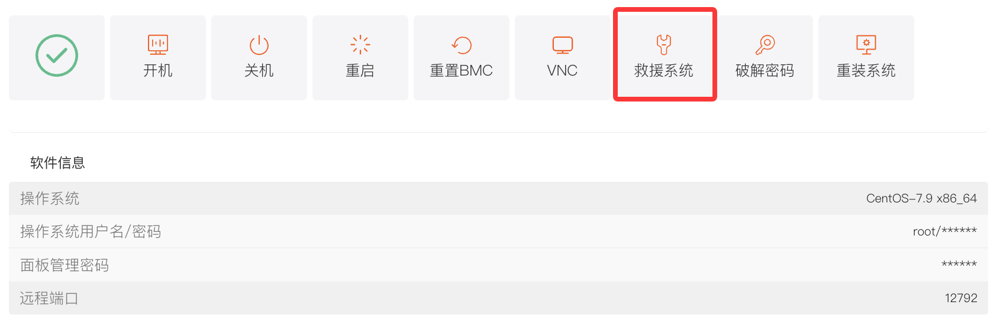
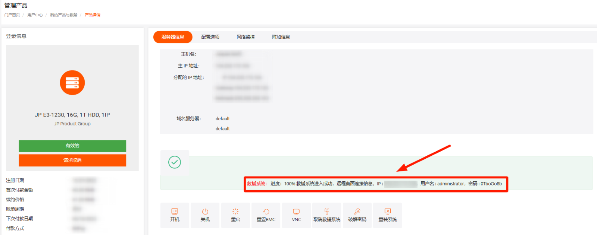

# 物理服务器救援模式操作

## 一、功能介绍

当服务器出现故障，如系统崩溃无法正常进入系统，但系统内有需要备份的数据时，可使用救援系统功能。救援系统支持 Linux 和 Windows 两种操作系统，能在系统异常时，将服务器启动到对应救援模式，以便用户备份重要数据。

## 二、操作入口

1. 登录平台，进入客户中心，下方\*\*“我的订单”\*\* 点击 \*\*“物理服务器”\*\*。或者在 \*\*“产品管理”\*\* 点击 \*\*“物理服务器”\*\*，根据机器所在地区和状态筛选。
2. 在产品列表中，找到目标服务器，点击进入 \*\*“产品详情”\*\* 页面。
3. 在 “服务器信息” 标签页下，找到并点击 \*\*“救援系统”\*\* 按钮，弹出 “救援系统” 操作窗口。

## 三、操作步骤

### （一）选择救援系统类型

在 “救援系统” 窗口中，根据服务器原本的操作系统类型，选择对应的救援系统：

- 若服务器为 Linux 系统，选择 \*\*“Linux”\*\*；
- 若服务器为 Windows 系统，选择 \*\*“Windows”\*\*。

### （二）数据备份操作（以 Linux 救援系统为例）

1. 进入 Linux 救援系统后，后台会自动显示用户和密码，可使用该信息进行远程登录。
2. 登录后，执行`lsblk`或`df -Th`命令，查看系统分区及是否挂载。
3. 若分区未挂载，需手动进行挂载操作（例如：`mount /dev/sda1 /mnt`，将`/dev/sda1`分区挂载到`/mnt`目录）。
4. 挂载完成后，查看对应分区是否有需要备份的数据。
5. 完成数据备份后，您可根据需求选择重装系统，以便继续使用服务器开展业务

