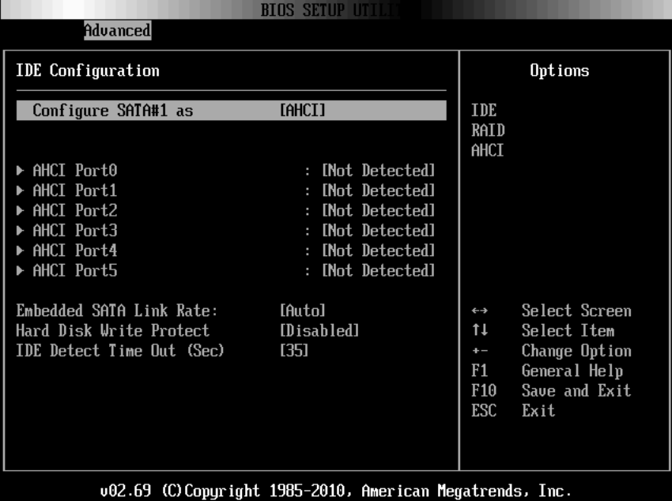
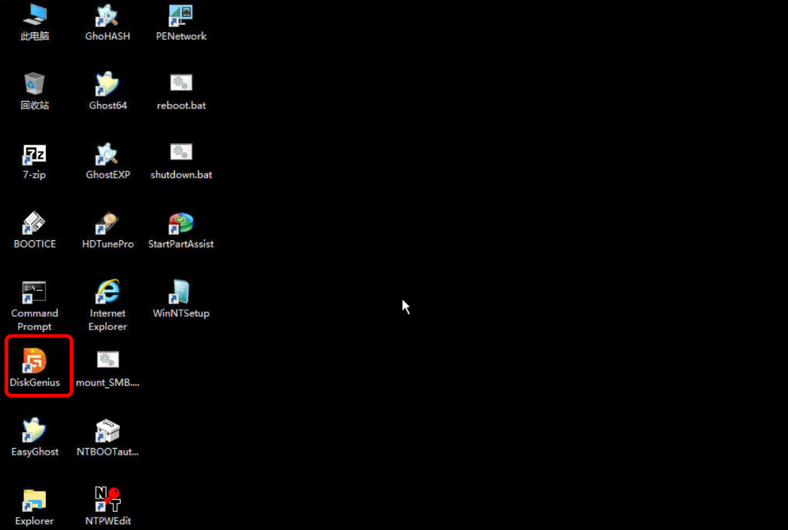

# 物理服务器无法正常启动，检测是否为无法识别到硬盘

1.机器无法正常启动到系统内时，可以通过VNC窗口查看具体的报错内容。

例如：如下图，系统没有识别到硬盘导致的无法进入系统。

2.如何确认硬盘状态

第一种：可以进入BOIS，查看是否可以正常识别到硬盘。如下图，查看bois里没有识别到硬盘

第二种：进入windows救援模式下，使用DiskGenius软件查看下是否可以识别到硬盘

检查也是无法识别到硬盘

3.以上机器如果无法正常识别到硬盘，可能是为掉盘或者磁盘损坏导致的，出现该问题可提交工单联系技术人员为您进一步解决相关问题。
