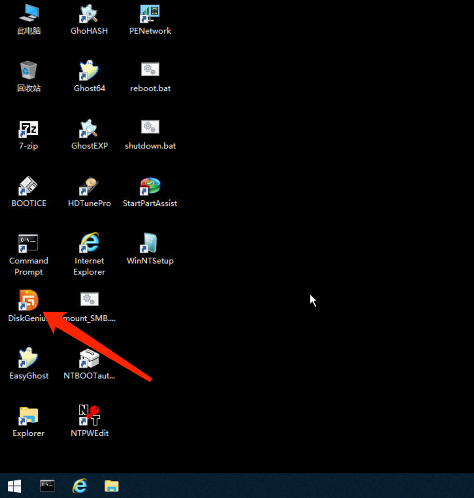

# 物理服务器格式化硬盘操作

1.通过进入救援模式格式化硬盘

进入救援模式方法请参考：[物理服务器救援模式操作](https://billing.raksmart.com/whmcs/index.php?rp=/knowledgebase/442/%E7%89%A9%E7%90%86%E6%9C%8D%E5%8A%A1%E5%99%A8%E6%95%91%E6%8F%B4%E6%A8%A1%E5%BC%8F%E6%93%8D%E4%BD%9C.html)

2.点击DiskGeniu软件

3.点击硬盘，右键选择删除分区，删除后右上角点击保存即可。

