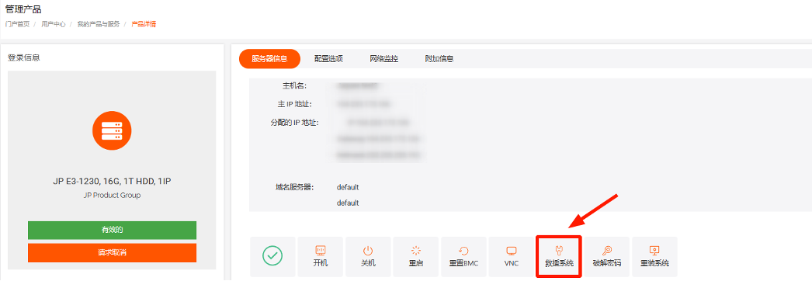
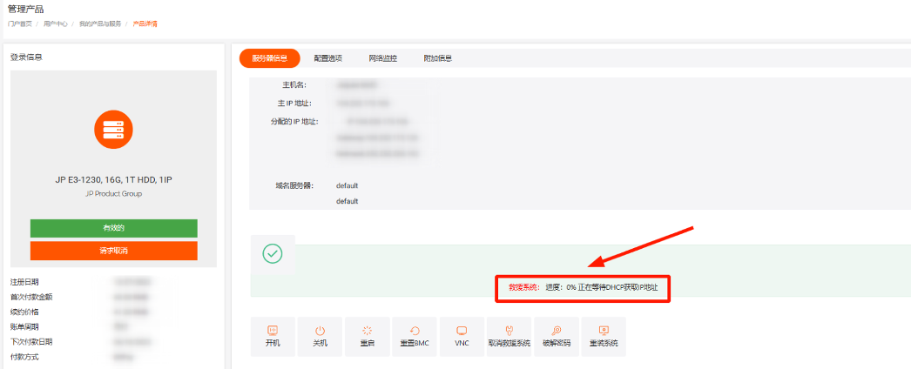
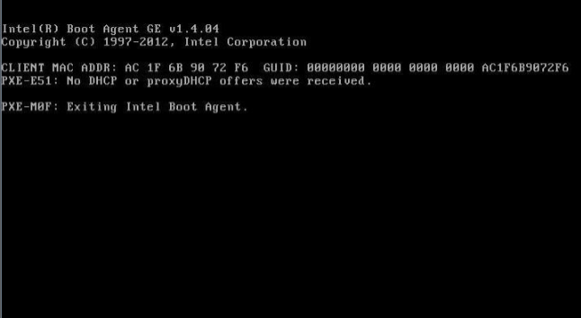

# 物理服务器进入救援模式无响应故障描述

1.找到对应机器后点击救援模式 

2.在当前界面可看到“救援系统： 进度” 

如果在进救援过程中一直卡在\*% 

可以尝试打开VNC看下具体进度 

VNC使用参考：[物理服务器打开VNC窗口](https://billing.raksmart.com/whmcs/index.php?rp=/knowledgebase/533/%E7%89%A9%E7%90%86%E6%9C%8D%E5%8A%A1%E5%99%A8%E6%89%93%E5%BC%80VNC%E7%AA%97%E5%8F%A3.html)

例如： 

1.可能是没走PXE启动导致，可尝试重启机器(按F12选择网卡启动，部分机型可能存在差异)再观察看下是否可以正常进入救援系统

2.如进救援系统蓝屏可尝试进入BIOS修改相关参数再试下(具体需看蓝屏代码) 

其他： 

如果无法正常进入救援模式，也可以在后台提交工单联系我们
