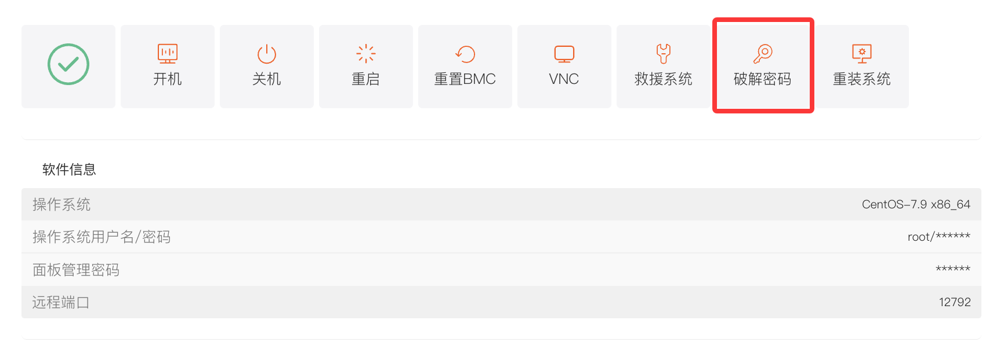
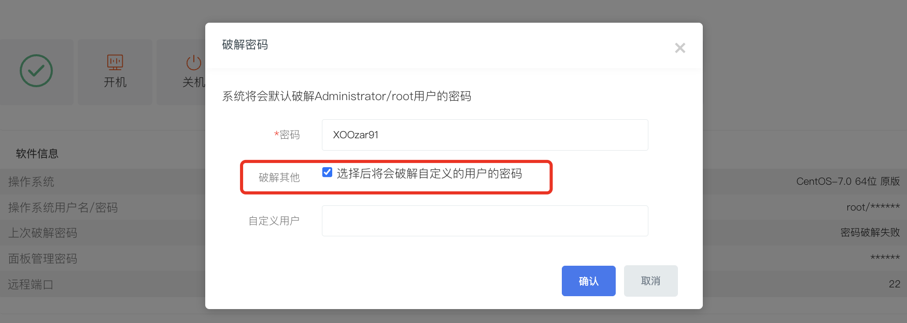
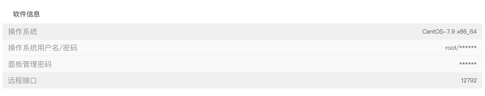

# 物理服务机器破解密码

当您在使用中遗忘服务器管理员（Administrator/root）密码，或需要重置密码以提升安全性时，可通过后台面板的 “破解密码” 功能，快速重置管理员密码。

## 一、操作入口

1. 登录平台，进入客户中心，下方\*\*“我的订单”\*\* 点击 **“物理服务器”**。或者在 **“产品管理”** 点击 **“物理服务器”**，根据机器所在地区和状态筛选。
2. 在产品列表中，找到目标服务器，点击进入 \*\*“产品详情”\*\* 页面。
3. 在 “服务器信息” 标签页下，找到并点击 \*\*“破解密码”\*\* 按钮，弹出 “破解密码” 操作窗口。

## 二、操作步骤

### （一）默认破解管理员密码

1. 弹出 “破解密码” 窗口后，系统默认会对服务器的`Administrator`（Windows 系统）或`root`（Linux 系统，如 Ubuntu、CentOS 等）用户密码进行破解重置。
2. 在 “密码” 输入框中，输入您想要设置的新密码（默认会生成随机密码）。

### （二）破解自定义用户密码（可选）

若您需要破解除管理员外的自定义用户密码，勾选 “破解其他” 区域的 \*\*“选择后将会破解自定义的用户的密码”\*\* 复选框，后续可进一步指定需破解的自定义用户。

### （三）确认破解

仔细核对要设置的新密码，确认无误后，点击窗口右下角的 \*\*“确认”\*\* 按钮，系统开始执行密码破解重置操作。

破解成功后可在“软件信息”里，点击“\*”查看最新的密码

