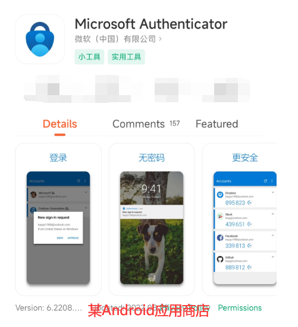
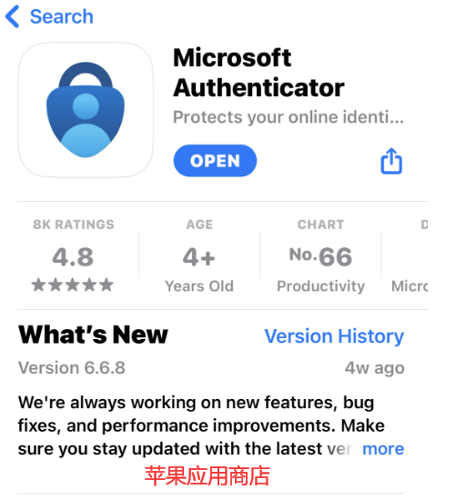
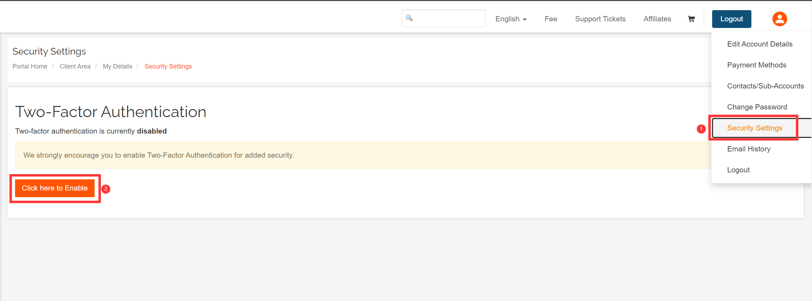
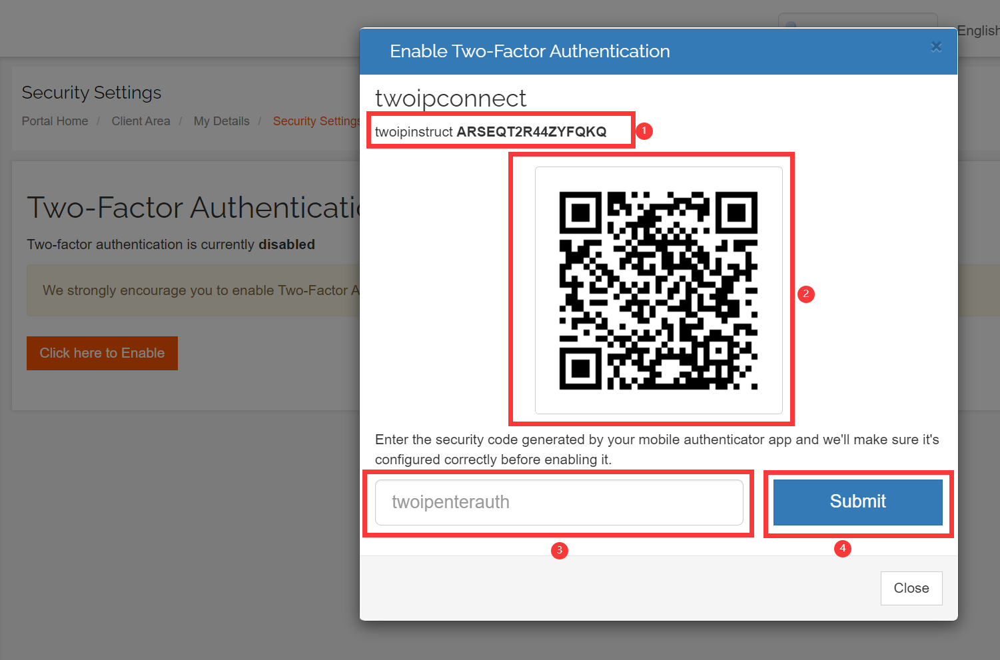
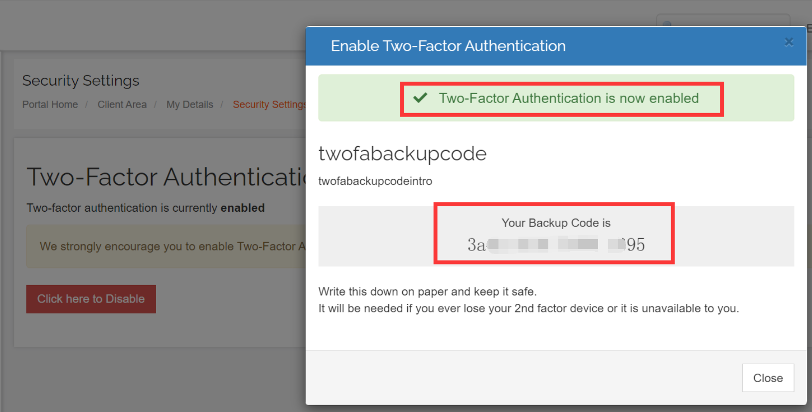
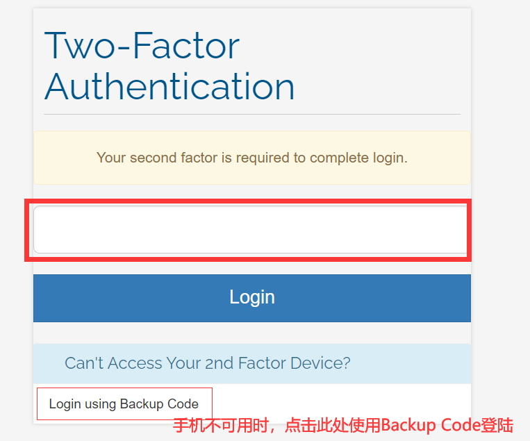

# 启用登陆Raksmart动态验证

为了保证用户的账户安全，Raksmart平台支持设置登陆动态口令验证。

如何启用Raksmart账户登陆动态口令验证，具体启用方法请参考：

1. 需要先在手机上下载好微软或谷歌的二次验证器，下载链接：[Microsoft Authenticator](https://www.microsoft.com/zh-cn/security/mobile-authenticator-app)，[Google Authenticator](https://play.google.com/store/apps/details?id=com.google.android.apps.authenticator2&hl=en&gl=US&pli=1)，也可以在各大应用商店搜索**Authenticator**，推荐使用微软的二次验证器。以下是微软验证器截图。

    
2. 登录到本平台，点击右上角头像--＞安全设置--＞点击这里启用
   
3. 点击Get Started，会弹出一个有二维码的页面
    
4. 在下载好的验证器上，微软依次点击右上角**+**号-->Other...；谷歌依次点击右下角**+**号-->Scan a QR Code，然后扫描上面的二维码，扫描后，手机上会有对应的账户及生成动态的验证码，将验证码填写到上图③的位置，点击Submit，提示如下图，说明已经启用登陆动态验证成功。如果扫码不可用，也可以手动输入①位置的密钥进行绑定。

   
   **请务必牢记 Backup Code，当手机不可用时，可以使用该码登陆，登陆后该Backup Code失效，会重新再生成一个！**
5. 启用成功后，后续登陆都会要求输入动态验证码，如果手机不可用，再使用Backup Code
   
6. 如果手机上动态验证码或Backup Code都不可用时，请使用注册邮箱向[support@raksmart.com](mailto:support@raksmart.com)发邮件请求管理员协助处理。
