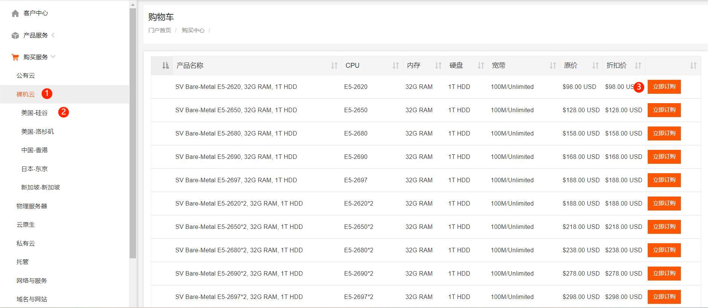
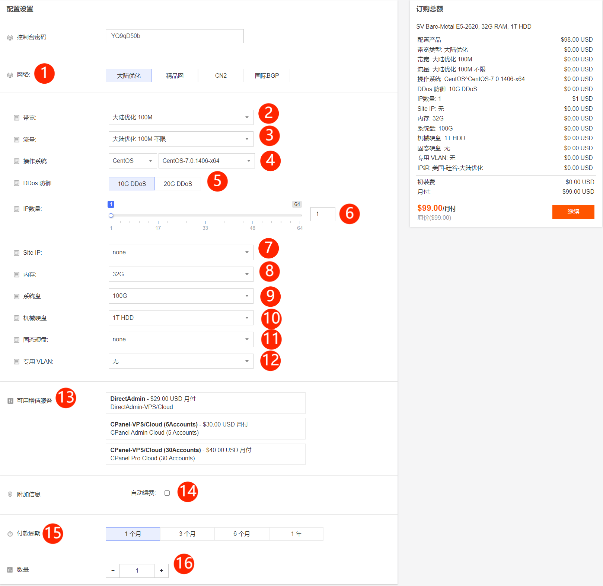

# 如何购买裸机云

1**.**如何选择产品

（1）选择裸机云产品

（2）选择国家-地区，选定裸机云产品是显示全部国家-地区，此处以美国-硅谷为例

（3）点击立即抢购

2**.**以美国-硅谷为例如何根据需求选择配置

（1）选择需要的网络，如果无法判断区别，可以工单或者查看线路介绍的文档

（2）不同地区以及不同的线路，最大带宽不同

（3）选择带宽后，会有流量等级划分选择

（4）可以根据自己的需求选择linux和windows系统

（5）选择防御，但不是所有地区都有防御

（6）普通IP，最多64个，默认是1个

（7）站群IP，可以在普通IP的基础上添加

（8）可选择大小

（9）系统盘大小不可以更改

（10）HDD数据盘，大小可选择

（11）SSD数据盘，大小可选择，HDD和SSD可以同时使用

（12）内网，相同地区可以组建内网

（13）面板服务

（14）自动续费需要账户有充足的余额，否则不会生效

（15）季度付款可以享受95折优惠，半年付是付5个月用6个月，年付是付10个月用12个月

（16）可以下单多台相同的配置

