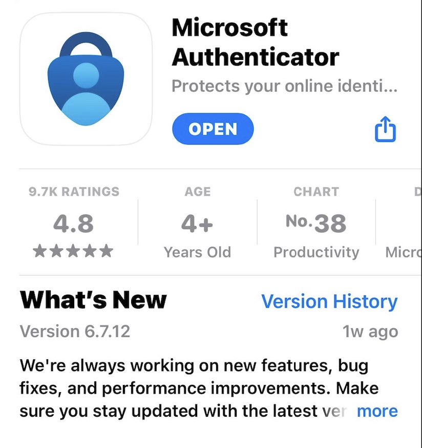

# Enable dynamic authentication for login Raksmart

RakSmart.com uses dynamic login password verification to enhance security.

Please take the following steps to enable dynamic login:

1. Download and install Two-Factor Authentication (2FA) generator from Microsoft or Google.

Download links: Microsoft Authenticator, Google Authenticator.

You can search “authenticator” in App Store as well.

Microsoft Authenticator is preferred. Microsoft Authenticator screenshot is attached below for your reference.

 

2. Log onto RakSmart.com. Click on the Avatar in the top right -> Security Settings -> click here to enable.  

Click on Get Started -> the QR code will pop up.

For the devices installed with Microsoft Authenticator, click on the + on the top right, and choose Other.

For Google Authenticator’s, click on the + on the bottom right, and choose Scan a QR Code.

1) Use your device to scan the QR code above.

2) A dynamic verification code will be generated for your account.

3) Fill the code in the field marked in position ③ in the above picture and click on Submit.

Please note that if you received a message like the one showed in the picture above after click on Submit, it means that your verification was successful. If the code is not available, please manually enter the key listed in the position ①.

Please save your Backup Code. When your mobile phone device isn’t working, you can use it to log in. The code will become invalid after login and a new one will be generated.

3. After activation, you will need to enter dynamic verification code to log in. If your phone device isn’t working, you can use Backup Code. Please click here to use Backup Code to log in.

4. If dynamic verification code or Backup Code is non-functional, please contact [support@raksmart.com](mailto:support@raksmart.com) for further help.
