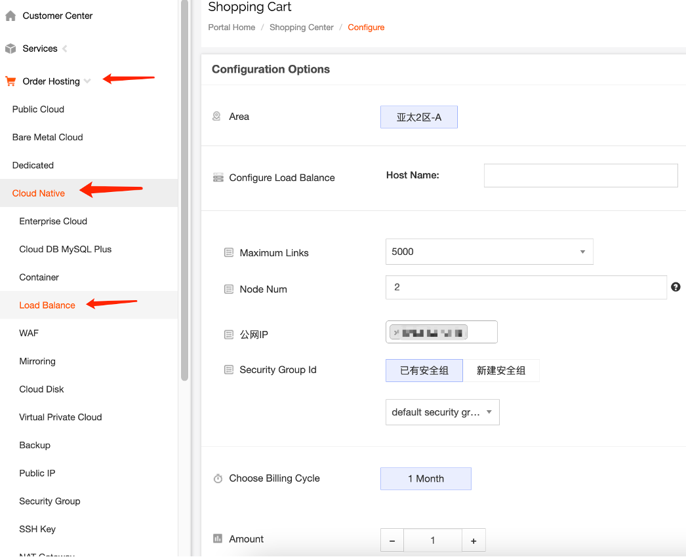
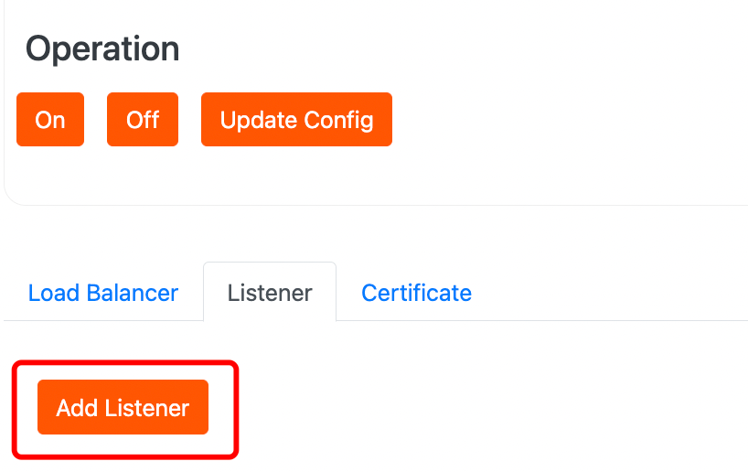
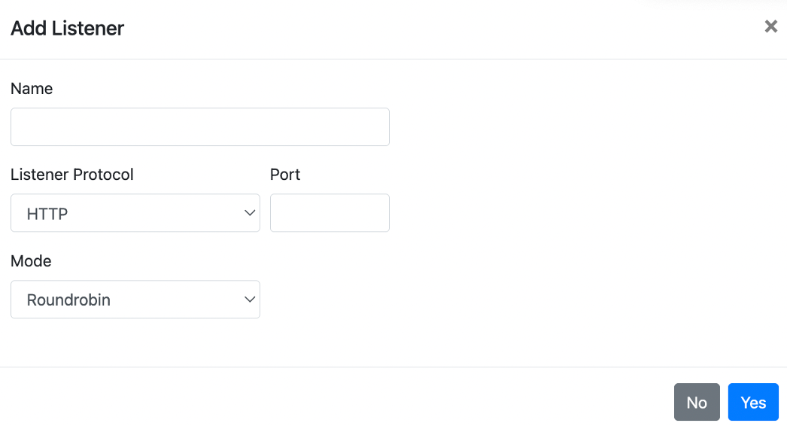
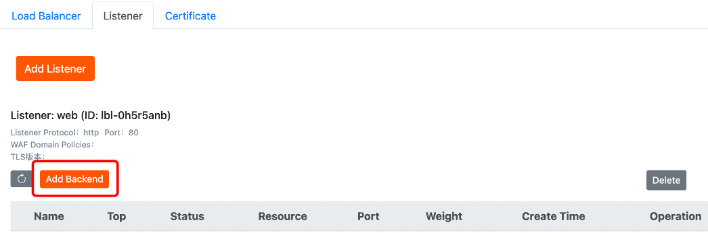
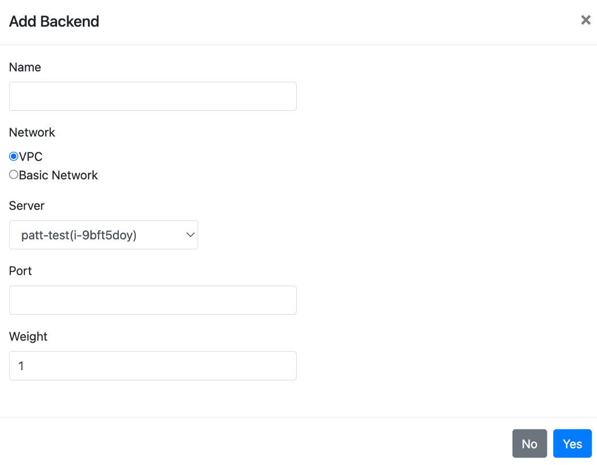

# Cloud Native Load Balancing

Load Balancer Instance is the entity that runs the load balancing service. To set up the load balancer service, you need to create a Load Balancer Instance first.

1.To purchase a Load Balancer, you need to acquire a public IP address first. If there are available unused public IP addresses, you can directly purchase them.

2.Listener

After creating the Load Balancer, you need to configure listeners for it. Listeners are responsible for listening to requests on the Load Balancer and distributing traffic to backend servers based on the load balancing strategy.

Listeners can listen to both Layer 4 and Layer 7 requests on the Load Balancer instance. You can choose the appropriate listening protocol based on the application scenario from the client to the Load Balancer.

The main difference between Layer 4 and Layer 7 load balancing lies in how user requests are load balanced, whether based on Layer 4 protocols or Layer 7 protocols for forwarding traffic.

- Layer 4 protocol: It is a transport layer protocol that primarily uses VIP + Port to accept requests and distribute traffic to backend servers. Examples include TCP, UDP, SSL, and other protocols.
- Layer 7 protocol: It is an application layer protocol that distributes traffic based on application layer information such as URL, HTTP headers, etc. Examples include HTTP, HTTPS, and other protocols.

3.Add backend servers.

After creating the listener, you need to add cloud servers as backend servers. The listener uses the protocol and port you configured to check the incoming connection requests from clients. It then forwards the requests to backend servers based on the distribution strategy you defined. The backend servers will handle these requests accordingly.

|  |  |
| --- | --- |
| **Parameters** | **Explanation** |
| Name | Backend Server Name |
| Network | Choose the network type of the cloud server. The options are Managed Private Network, Basic Network, and IP.    UDP listeners only support backend in the Managed Private Network. |
| Private Network / Basic Network | When choosing Managed Private Network, you need to select the private network to which the cloud server belongs. When choosing Basic Network, you need to select the basic network to which the cloud server belongs. |
| Cloud Server | Select the cloud server to be added. |
| Port | Set the service port of the cloud server. |
| Weight | The larger the weight, the more requests will be forwarded.  The default value is 1, and the valid range is [0 - 100]. When the weight is set to 0, the server will not accept new requests. |
