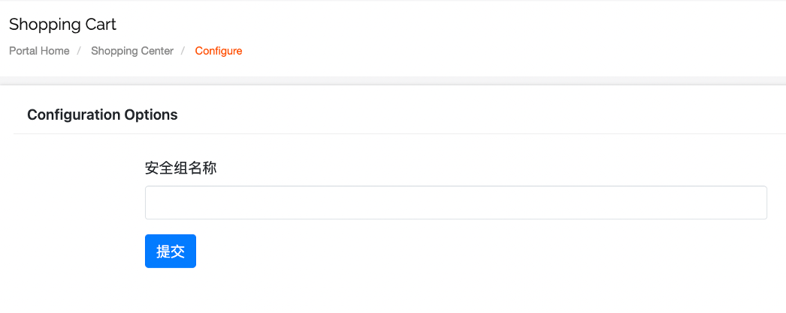
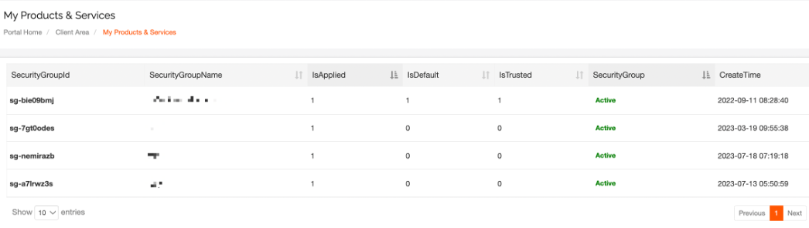
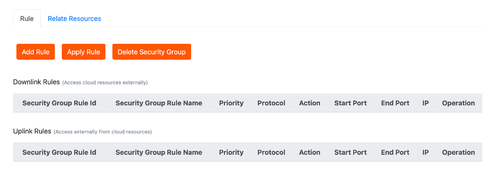
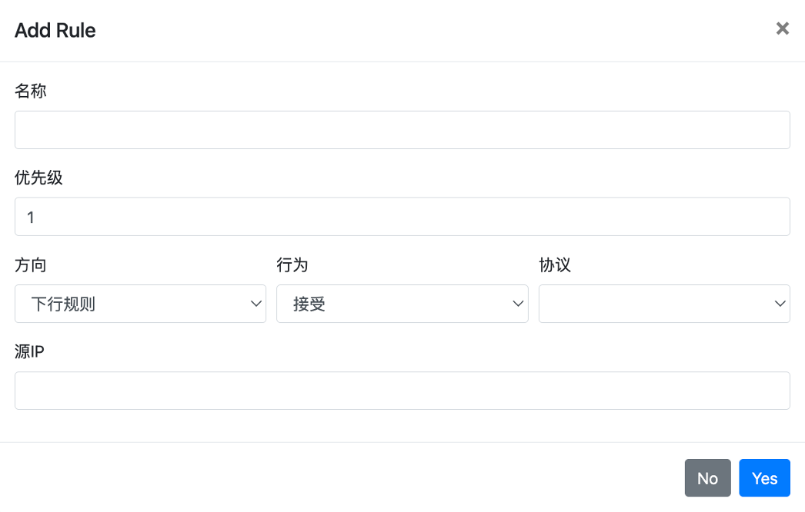
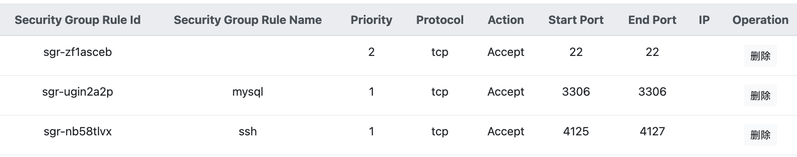
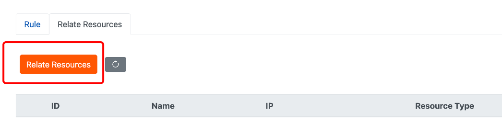

# Cloud Native Security Group Settings

Add Security Group Rules

After creating a security group, you need to add security group rules to make the security group effective. By adding security group rules, you can allow or deny access to the public or private network for cloud server instances within the security group.

The final effective security group rules are determined by the priority of dependencies between rules of the same type. When a cloud server is associated with multiple security groups, the rules from highest to lowest priority are matched in sequence. The final effective security group rules are as follows:

- If two security group rules have only different authorization policies, currently they are applied randomly.
- If two security group rules have only different priorities, the rule with the higher priority takes precedence and will be applied.

1. Before adding security groups, you need to go to "Purchase Services" - "Cloud Native" - click on "Security Groups" to add them.

2.After setting the name for the security group and clicking on "Submit," you can go to "Product Services" - "Cloud Native" - click on "Security Groups" to view the security group.

3.Clicking on it will allow you to set up security group rules.

4.Enter the relevant information for security group rules, as shown in the following table, including priority, protocol type, rule direction, etc.

|  |  |
| --- | --- |
| **Name** | **Description** |
| Name | Security Group Rule Name |
| Priority | The lower the priority value, the higher the priority. The value can range from 0 to 100. |
| Direction | **Outbound Rules:**  Outbound rules refer to the traffic from cloud resources accessing the external network. Outbound rules typically allow all traffic and ports by default. However, for security purposes, certain high-risk ports are restricted by default on Windows cloud server systems. The system has predefined rules that block access to these high-risk ports. For Windows cloud servers, the following outbound ports are restricted by default.   - Protocol TCP: Ports 3389, 1433, 445, 135, and 139. - Protocol UDP: Ports 1434, 445, 135, 137, and 138. - For Windows cloud servers to initiate Remote Desktop Protocol (RDP) connections externally, you need to allow an inbound TCP rule for port 3389 in the security group.   For Windows cloud servers to initiate SQL Server connections externally, you need to allow an inbound TCP rule for port 1433 in the security group.  **Outbound rules:**  They govern access to cloud resources from the outside. If outbound rules and ports are not configured, access will be denied by default.  TCP ports 445/5554/9996 are commonly used by the virus Wannacry and other malware, and they may be blocked by the Internet Data Center (IDC) to ensure resource security. To ensure normal access to resources, it is recommended to use alternative ports. |
| Action | **Allow:** Allows incoming access requests corresponding to the specified port.  **Deny:** Directly discards the packets without sending any response.  Explanation:  If two security group rules are the same in all aspects except for their actions, the deny action takes effect, and the allow action does not take effect. |
| Protocol | The protocol types include:   - ALL: Supports all protocol types. - TCP: Supports TCP protocol. - UDP: Supports UDP protocol. - ICMP: Supports ICMP protocol. - GRE: Supports GRE protocol. - ESP: Supports ESP protocol. - AH: Supports AH protocol. - IPIP: Supports IPIP protocol. - VRRP: Supports VRRP protocol. - \*IPV6: Supports ICP6 protocol. - IPV6-ICMP: Supports ICMP (IPV6) protocol only. - IPENCAP: Supports IPENCAP protocol. |
| Port Range | When the Protocol Type is set to Custom TCP or Custom UDP, you can manually set the Start Port and End Port for access. |
| IP | In the outbound rules, you need to fill in the Source IP, and in the inbound rules, you need to fill in the Destination IP, for example, 192.168.9.1/24 or fe80::5054:a8ff:fe81:a71e/64, etc. If not filled, it indicates all IP addresses. |

5.After configuring the security group rules, you can associate the required cloud servers with the security group.

