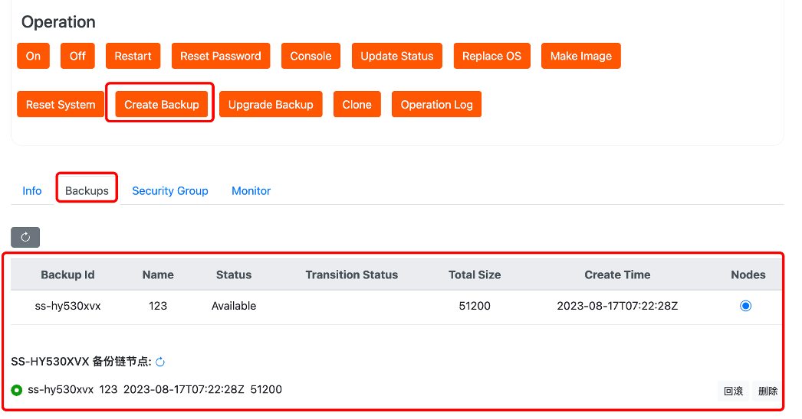
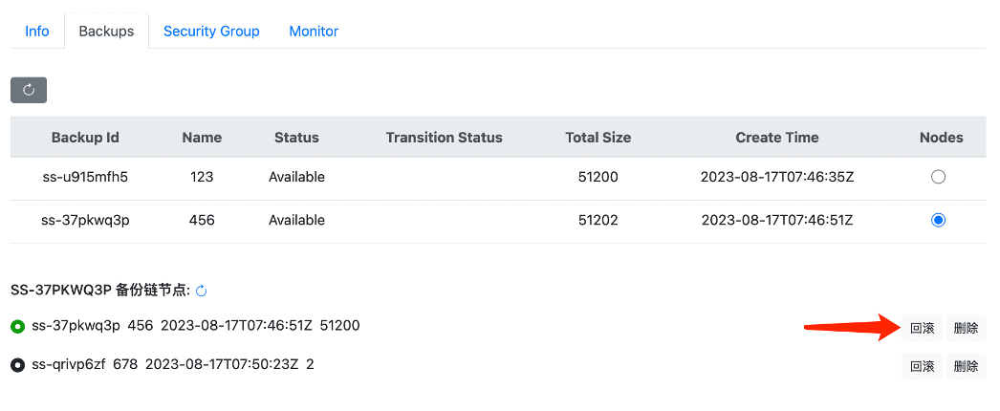
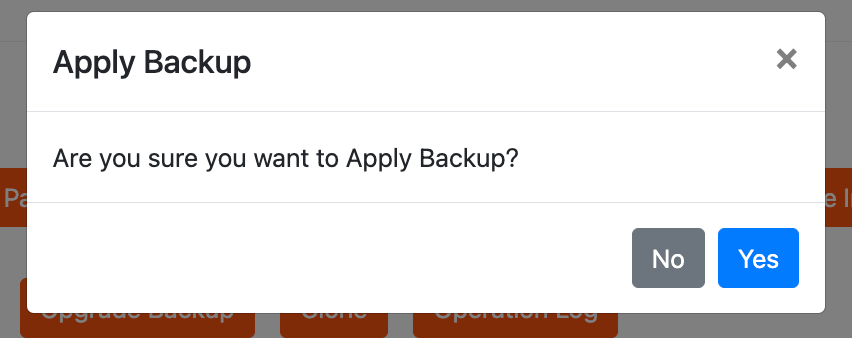
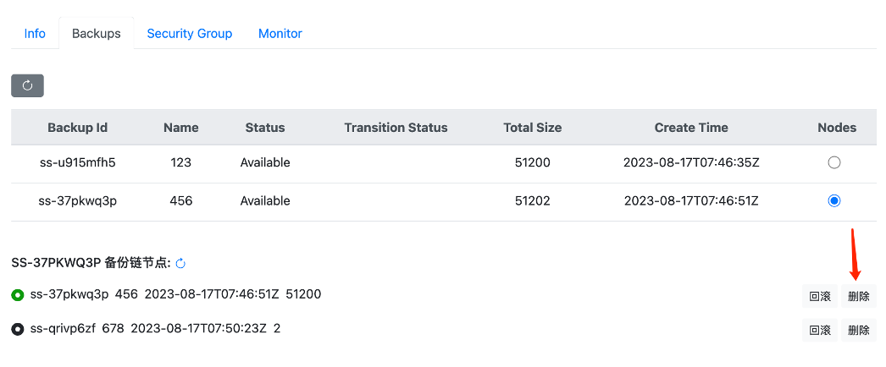
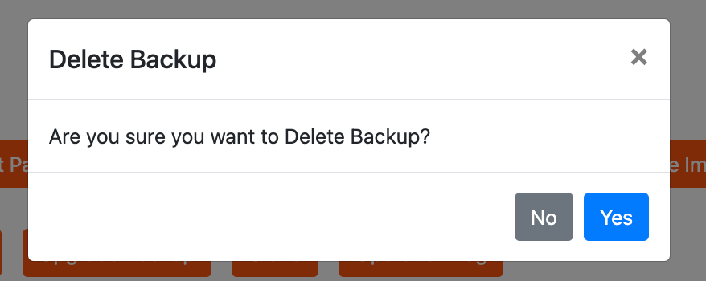
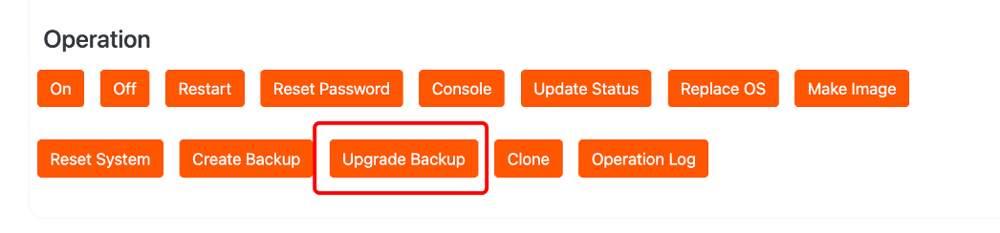
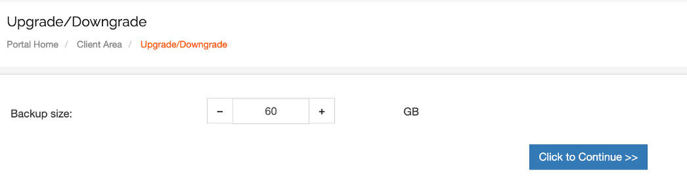

# Cloud-Native Backup Usage Instructions

Backup is used to capture the state of a hard drive at a specific moment, which can be restored to that state at any time in the future. In case of any operational mistakes or application bugs, you can restore data from historical backup points to avoid any data loss.

Backup Instructions

When performing online backups of an active cloud server or attached hard drive, it's important to note the following:

- Backups can only capture data that has been written to the disk at the start of the backup task. Data located in caches at that time is not included.
- To ensure data integrity, it's necessary to pause all file write operations before creating a backup, and wait until the backup enters the "capture completed" state. Alternatively, you can stop the cloud server or detach the hard drive for an offline backup.

If you are creating a backup for the first time, you need to purchase a backup service. When purchasing, you should select the corresponding server's specifications.

一．Create Backup

1.Enter the backup name, click submit to initiate the creation process. Once successfully created, a backup record will be generated, as shown in the following image. 

二．Backup Rollback

1.Select the backup point you want to roll back to, click confirm to initiate the rollback process and apply the backup. Wait for the rollback to complete.

三．Delete Backup

You can delete the entire backup chain or delete a specific backup point.

1.If you want to delete a full backup point.

Click confirm to delete the entire backup chain.

2.If you wish to delete an incremental backup point.

Click confirm to delete the incremental backup point along with all its child nodes (if any).

四.Upgrade Backup

If the backup capacity is insufficient, you can upgrade the backup capacity size. 

Upgrade the backup capacity size.

