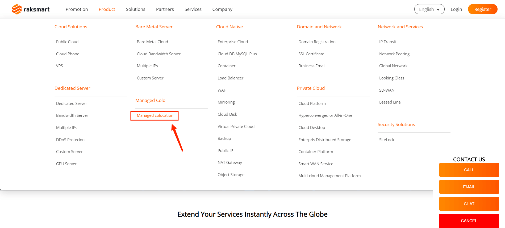
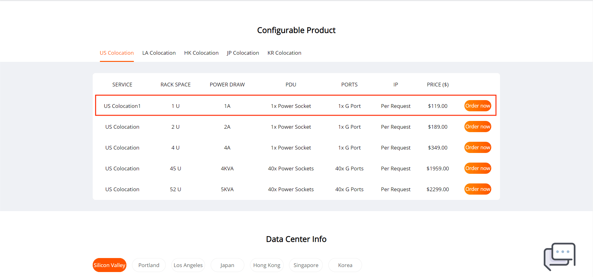
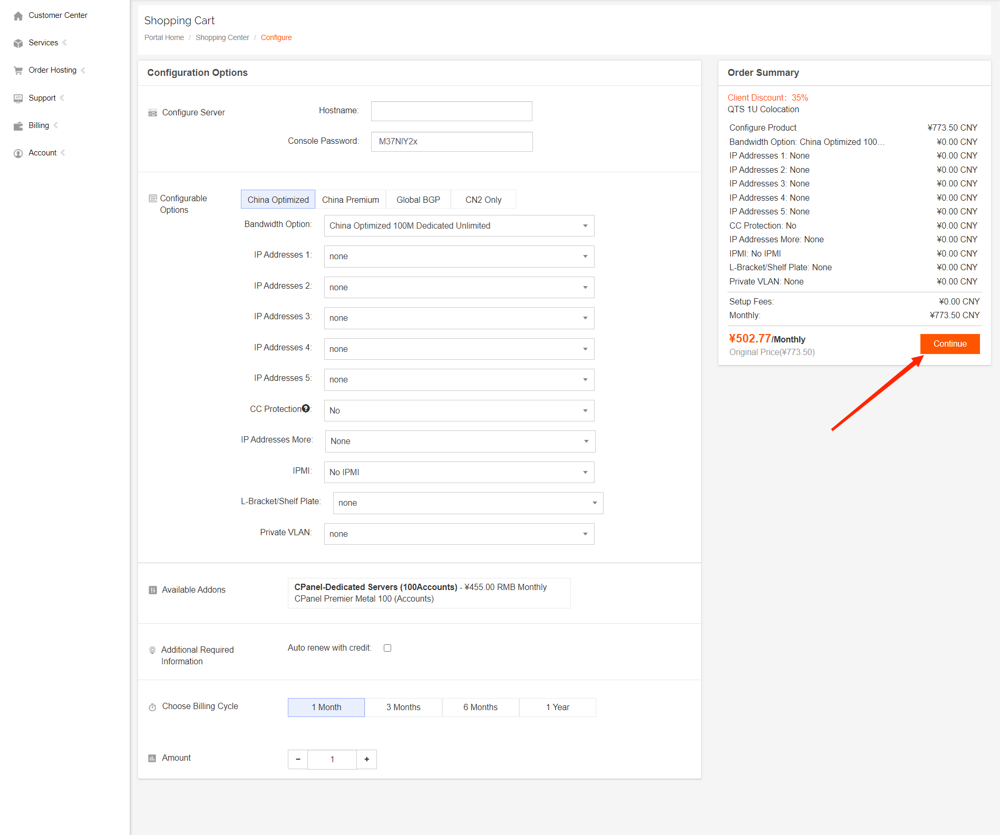

# How to Host Servers

RAKsmart is a professional US server operator, with its data center located in Silicon Valley, which is the closest location to mainland China. RAKsmart has many years of experience in data center management, server management, and user service management, and has a well-established management system. RAKsmart mainly provides services such as server rental, server hosting, and broadband rental. In the previous article, we introduced how to place an order, submit a ticket, and manage the user backend on the RAKsmart website. In this section, we will introduce how to host servers on the RAKsmart website and what projects need to be selected.

1.First, log in to the RAKsmart website (http://www.raksmart.com/). We can see bare metal cloud, cloud integration services, domain names, and hosting. Here, we take server hosting under hosting as an example.

2.On the server hosting page, we can see the configuration that needs to be hosted. Here, we take SV 1U hosting as an example.

3.Enter the configuration options page, select the corresponding configuration, and click continue after completing the selection.

4.After everything is selected and continue is clicked, the product is already in your shopping cart. You can choose to continue shopping, view the shopping cart, or checkout.
