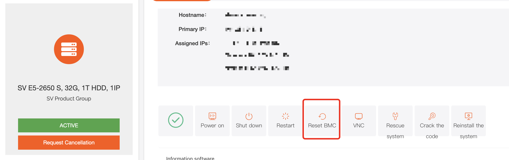
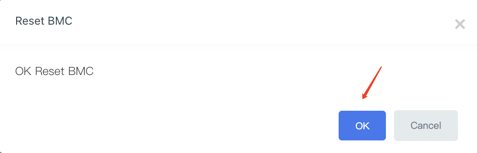
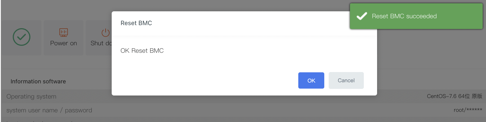
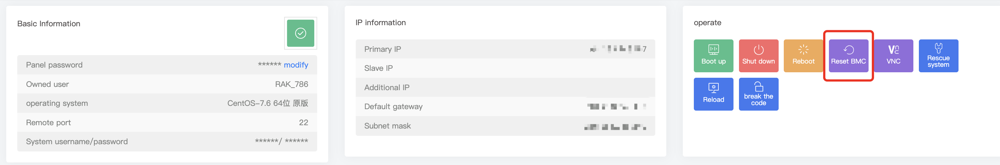

# BMC Reset on Dedicated Server

Introduction: Server BMC (Baseboard Management Controller) is an embedded system typically integrated into server hardware, providing remote management and monitoring capabilities. BMC is primarily used for monitoring the hardware status, managing system configurations, executing remote control, and performing fault diagnosis tasks on Dedicated Server. It enables administrators to remotely manage servers without being on-site.

Functionality:

Hardware Monitoring: BMC can monitor hardware information such as server temperature, fan speed, power supply, and issue alerts to prevent data loss and downtime caused by hardware failures.

Remote Management: BMC enables remote connectivity to servers over the network, allowing tasks such as power on/off, reboot, and modification of BIOS settings. This improves server reliability and maintainability.

System Configuration: BMC provides a graphical interface for system configuration, including IP address, DNS settings, time synchronization, and more.

Logging: BMC logs server operational details, including hardware failures, system events, and security incidents. This helps administrators with troubleshooting and security auditing.

For example:

If you are unable to open VNC in the background, you could try resetting the BMC.

If you have forgotten the login credentials for BMC and cannot access the management and configuration interface.

If there are issues with BMC configuration, preventing remote management and monitoring.

If you encounter performance problems with BMC, such as inability to access or slow responsiveness.

If you need to update or upgrade the BMC firmware.

In these situations, attempting to reset the BMC may help resolve the issues. The method for resetting the BMC varies depending on the hardware platform.

1. Select the physical server that you wish to manage.

Log in to the platform and enter the \*\*Customer Center\*\*. Click \*\*"My Orders"\*\* at the bottom, then select \*\*"Bare Metal Server"\*\*. Alternatively, go to \*\*"Product Management"\*\* and click \*\*"Bare Metal Server"\*\*, then filter by the region and status of your server.

2. After locating the corresponding physical server, click on "Reset BMC" to initiate the reset process.

3. You will receive a notification confirming the successful reset of BMC. It usually takes around 5 minutes before you can establish a connection.

 

4. You can also perform a BMC reset from the control panel.

