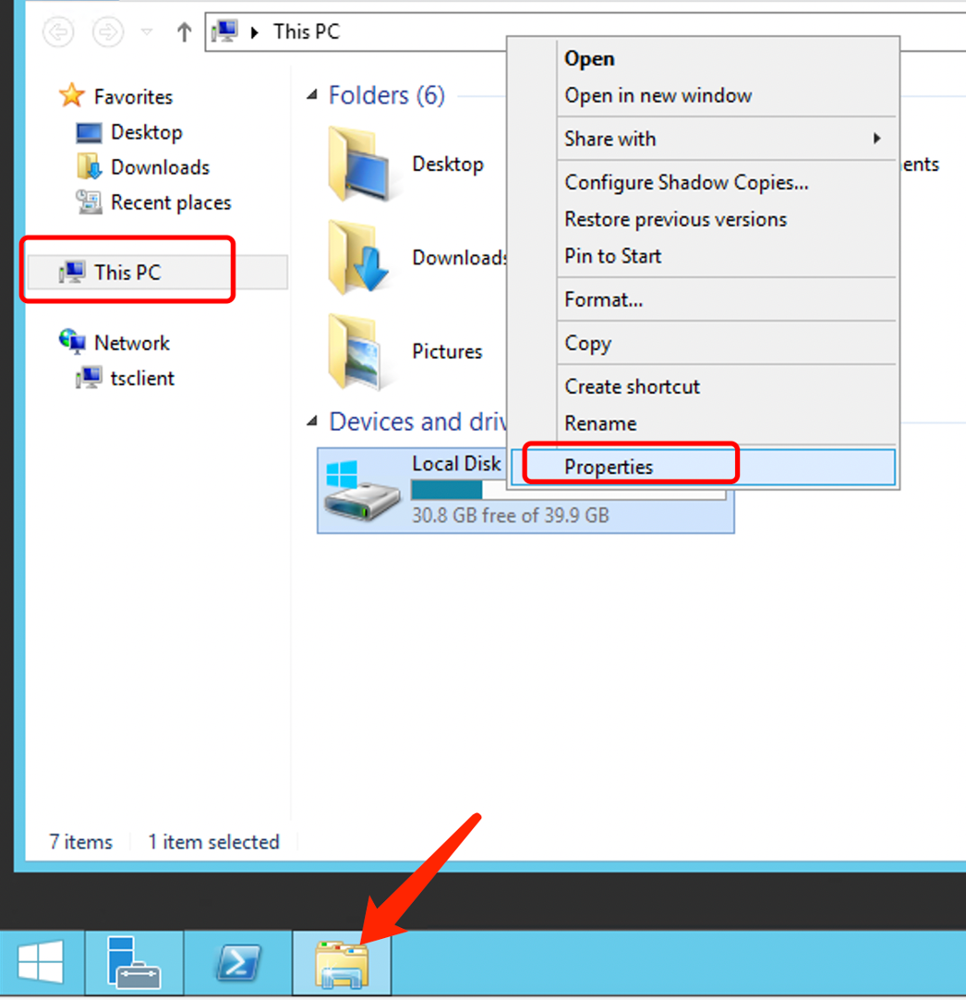
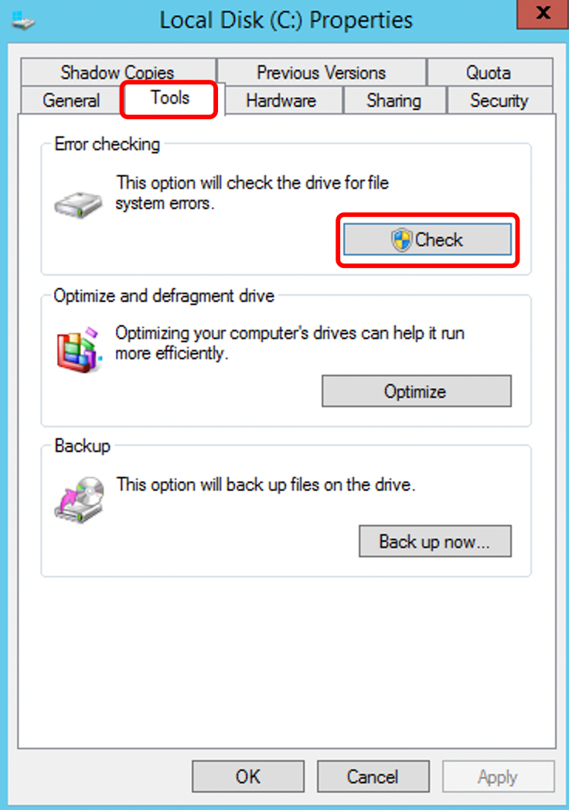

# Checking the health status of dedicated server disks

For Windows systems:

The Windows operating system comes with a built-in disk checking and repair tool called "Check Disk." It can scan and attempt to fix errors, bad sectors, and other issues in the file system.

 

Here are the steps to use the disk check tool:

 

1.  Open File Explorer (shortcut: Win + E).

 

2.  Select the disk you want to check, right-click on it, and choose "Properties."

3.In the Properties window, go to the "Tools" tab.

4. If the disk is currently in use, you will see a prompt asking if you want to schedule the disk check for the next system restart. If you want to check immediately, click on the "Scan drive" or "Check now" button. Otherwise, select "Schedule disk check" and choose the appropriate option.

 

5. The system will start scanning and repairing issues on the disk. Once completed, the scan results will be displayed.

 

In addition to the built-in disk check tool, there are also third-party disk diagnostic software available, such as CrystalDiskInfo, HD Tune, Victoria, and more. These software tools offer more advanced features and can provide additional disk status information and diagnostic reports.

 

Linux systems

In Linux, you can use command-line tools to check the disk health.

 

smartmontools: This is a command-line toolset that includes smartctl and smartd. smartctl can check the SMART attributes of the hard disk and report any issues, while smartd can run in the background and monitor the disk status.

 

For CentOS:

 

yum -y install smartmontools && smartctl --all /dev/nvme0n1  # Replace /dev/nvme0n1 with the specific device name, which you can find by running sudo fdisk -l.

 

For Ubuntu:

 

sudo apt install smartmontools && sudo smartctl --all /dev/nvme0n1  # Replace /dev/nvme0n1 with the specific device name, which you can find by running sudo fdisk -l.
