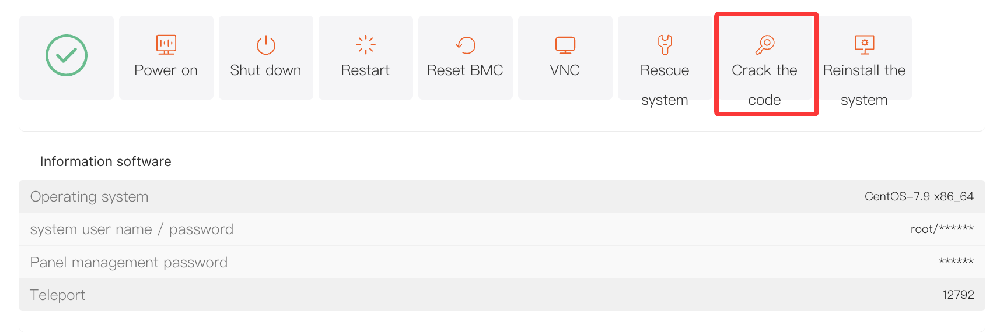

# Cracking the password of a dedicated server machine

When you forget the server administrator password (**Administrator/root**) or need to reset it to improve security, you can use the **"Crack the code"** feature in the control panel to quickly reset the password.

## I. Access Path

Log in to the platform and go to the **"Customer Center"**.

Under **"My Orders"**, click **"Dedicated"**.
Alternatively, go to **"Product Management"**, click **"Dedicated"**, and filter the server list by region and status.

In the product list, locate the target server and open the **"Product Details"** page.

Under the **"Server Information"** tab, find and click **"Crack the code"** to open the password reset window.

## II. Steps

### 1. Reset the Default Administrator Password

After the **"Crack the code"** window opens, the system will reset the password for the default administrator account by default:

- **Administrator** (Windows)
- **root** (Linux, such as Ubuntu and CentOS)

In the **"Password"** field, enter the new password you want to set (a random password may be generated by default).

### 2. Reset a Custom User Password (Optional)

If you need to reset the password for a user other than the administrator, select the option in the **"Crack Others"** section:

- **"After selecting, the system will reset the password for a custom user"**

Then specify the custom username to reset.

##

### 3. Confirm the Reset

Carefully check the new password. When ready, click **"Confirm"** in the lower-right corner of the window. The system will begin the password reset process.

After the reset is successful, go to **"Information software"** and click **"\*"** to view the updated password.

###
