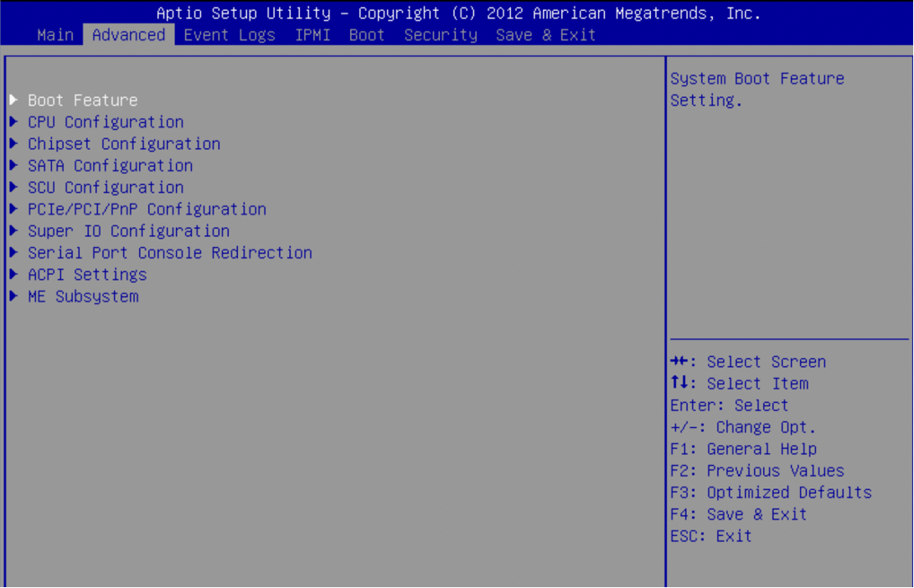
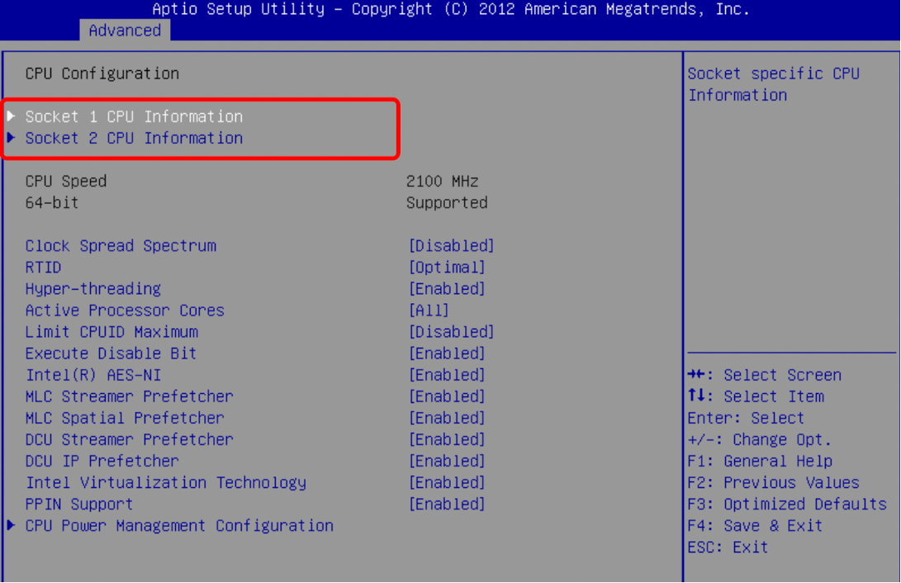
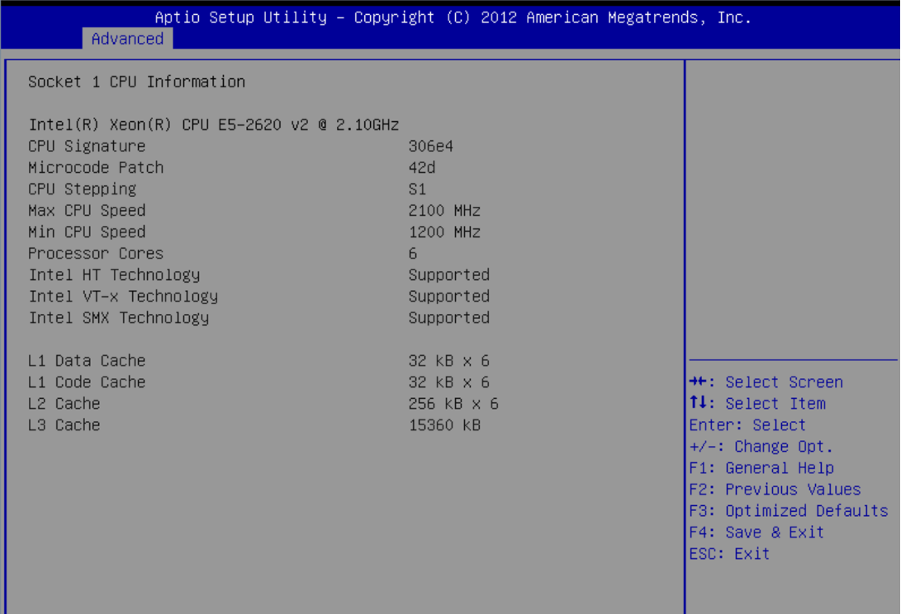
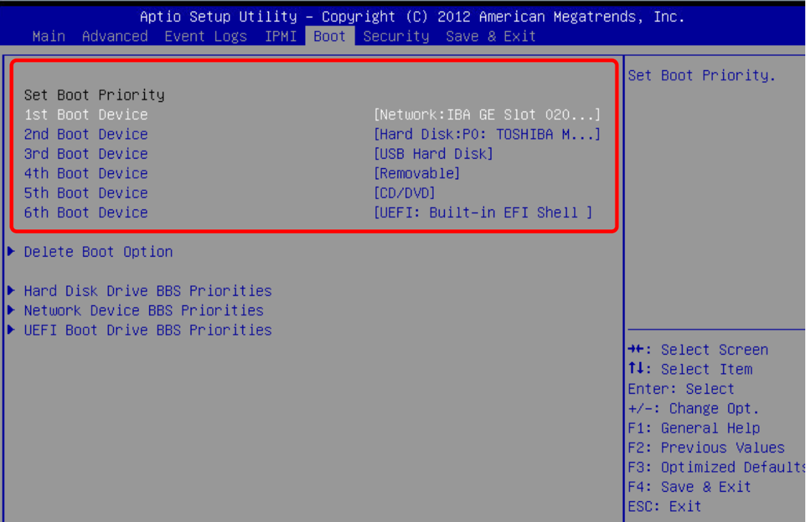

# Dedicated Server BIOS

View and adjust machine configurations such as CPU, memory, hard disk, virtualization/hyper-threading, and boot options in BIOS.

1. Restart the machine and look for the prompt to enter the BIOS. The key to enter the BIOS may vary depending on the machine type and manufacturer. Common keys include Del, F2, F10, or F12. In the example image, the machine type indicates that clicking the Del key will enter the BIOS (Please note that different machine models may have different key prompts to enter the BIOS).

2. In the Main interface, you can modify the date and time.

3. In the Advanced section, you can primarily view the CPU Configuration and SATA Configuration options.

In the CPU Configuration section, you can view the number of CPUs (Central Processing Units) installed in the server.

To view specific parameter configurations of the CPU, follow these general steps

Virtualzation Technology 
Hyper-Threding Technology 

**Disabled**
**Enabled**

There are many CPU configuration options, and you can use the up and down arrow keys on the keyboard to navigate and find them

SATA Configuration Check Hard Disk

SATA MODE: Adjusting Hard Disk Mode

4.Boot: Adjusting Boot Options

Since the model and configuration of each machine are different, the displayed boot options may also be different. Adjust according to the configuration of the machine.

5.Press "Esc" to save and exit, or you can also save and exit in the "Save & Exit" page.

