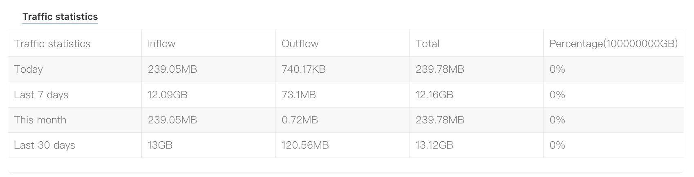

# Dedicated Server Traffic Statistics

## **I. Traffic Statistics**

In the client portal, you can view your server’s traffic usage over recent periods (such as the past month). The statistics clearly show inbound, outbound, and total traffic across different time ranges, including "Today", "Last 7 Days", "This Month", and "Last 30 Days". This helps you quickly understand and monitor your server’s traffic usage.

**1) Access Path:**
Log in to the platform and enter the **Client Center**. At the bottom, click **“My Orders” → “Dedicated Servers.”** Alternatively, go to **“Product Management” → “Dedicated Servers.”** On the **Product Details** page, find **“Traffic Statistics”** under the **“Server Information”** section.

## **II. Traffic Overuse Alerts and Handling**

When your server’s traffic quota is close to being used up, we will send you a notification via a support ticket. The ticket will include traffic-related details such as the hostname, dedicated IP, billing cycle, next billing date, bandwidth option, and the percentage of traffic already used.

If you do not upgrade your traffic quota after receiving the notification and the allocated traffic is fully consumed, the server will be automatically shut down at 12:00 AM (U.S. time). To avoid service interruptions caused by exceeding the traffic quota, we recommend upgrading to the next traffic tier in advance based on your actual usage needs.
