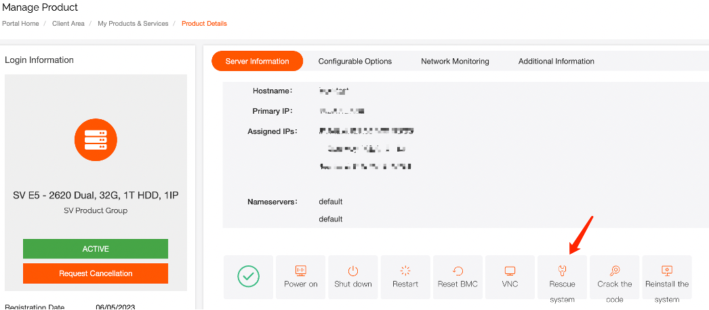
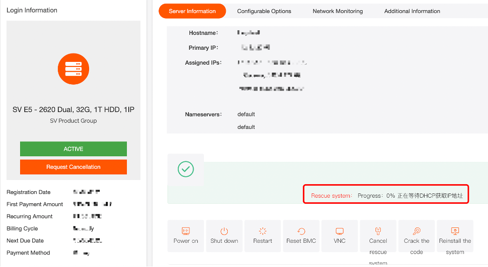
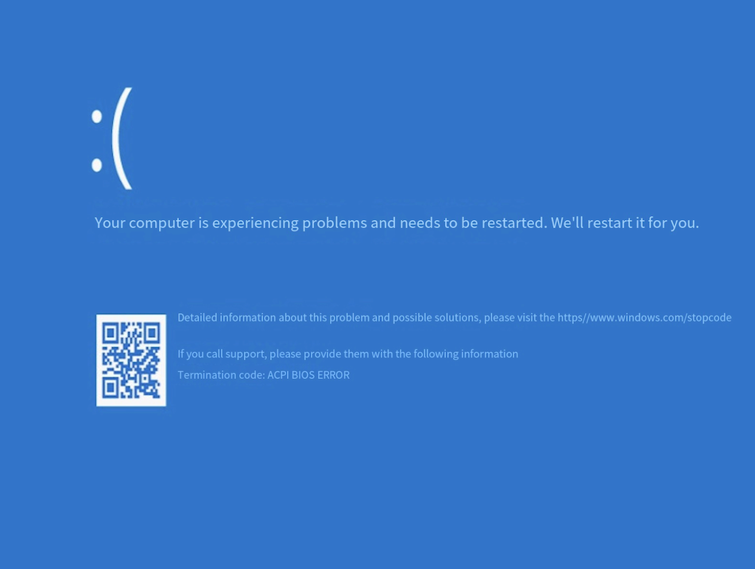

# Description of the issue: No response with rescue mode for physical server

1.After locating the corresponding server, click on 'Rescue Mode'. 

2.Find 'Rescue System: In Progress.' in the new window

If the rescue process gets stuck at \*%, you could open VNC to check the specific progress.

Reference for VNC Usage：[How to open a VNC window in a bare-metal cloud](https://billing.raksmart.com/whmcs/index.php?rp=/knowledgebase/516/How-to-open-a-VNC-window-in-a-bare-metal-cloud.html)

For example: 

1.Not booting through PXE. You could restart the server (press F12 to select network boot, there may be some variations depending on the model) and then observe if you can enter the rescue system.

2. If you encounter a blue screen when entering the rescue system, you could access the BIOS to modify relevant parameters and then try again (depends on the blue screen error code).

Other: 

If you cannot access rescue mode successfully, you could contact us through ticket for assistance.
