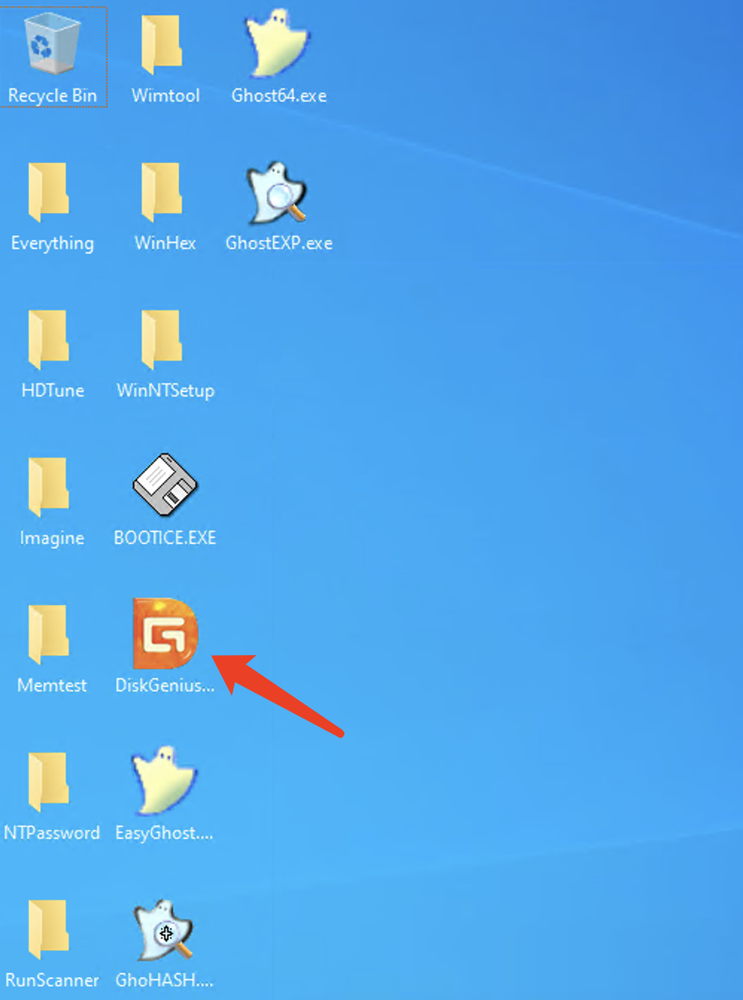
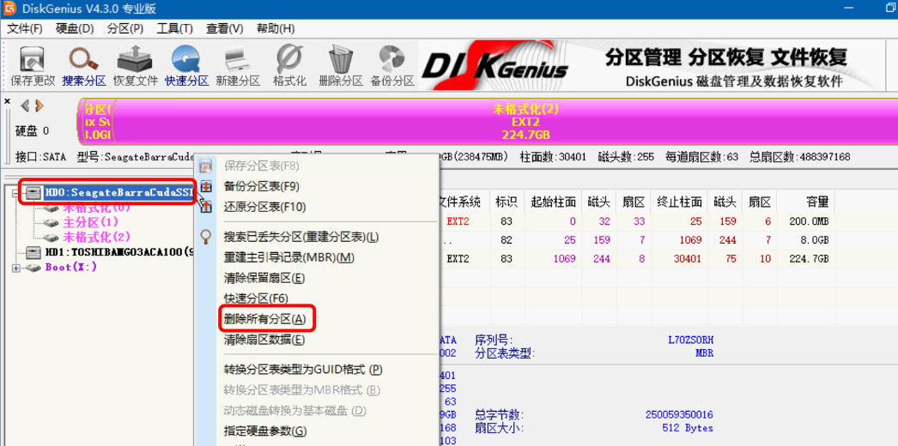

# Formatting a physical server hard drive

1.Formatting the hard drive by entering rescue mode.

Please refer to the method for entering rescue mode：[Rescue mode for Dedicated Server](https://billing.raksmart.com/whmcs/index.php?rp=/knowledgebase/442/Rescue-mode-for-Dedicated-Server.html)

2.Click on the DiskGenius software.

3.Click on the hard drive, right-click, and select 'Delete Partition.' After deletion, click 'Save' in the upper right corner.

