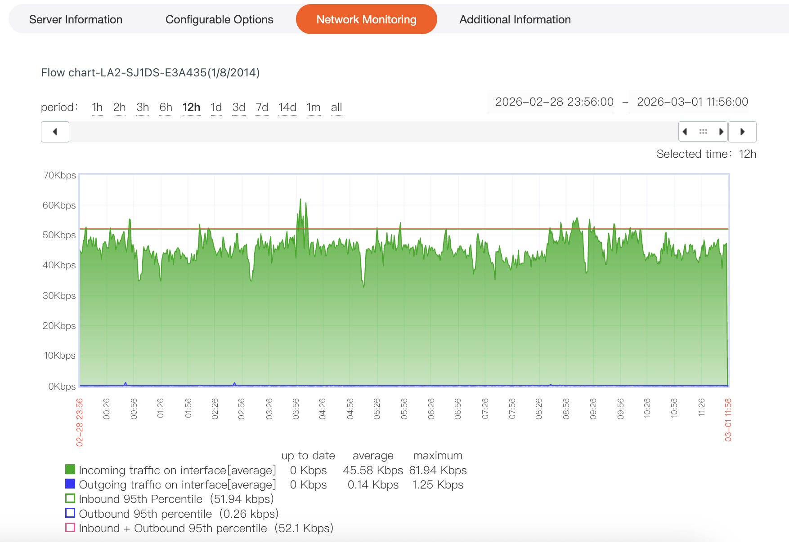

# How to Monitor Network Traffic on a Physical Server

## I. Overview

The network monitoring feature provides visualized monitoring of server network traffic. Through intuitive traffic graphs, you can clearly view incoming and outgoing traffic across different time periods. This helps you stay informed of the server’s network status and provides useful data for network resource planning, troubleshooting, and performance optimization.

---

## II. Access Path

Log in to the platform and go to the **"Customer Center"**. Under **"My Orders"**, click **"Physical Servers"**. Alternatively, go to **"Product Management"**, click **"Physical Servers"**, and filter the server list by region and status. In the product list, locate the target server and open the product details page. Then click the **"Network Monitoring"** tab at the top to enter the network monitoring interface.

## III. Interface and Function Description

### (A) Traffic Graph Area

- **Time Range Selection:** Above the traffic graph, the **"period"** options include **"1h"**, **"2h"**, **"3h"**, **"6h"**, **"12h"**, **"1d"**, **"3d"**, **"7d"**, **"14d"**, **"1m"**, and **"all"**. You can select different time ranges to view traffic data for a specific period. You can also define a custom time range on the right side to view traffic data for a particular time interval.
- **Traffic Trend Display:** The traffic graph displays network traffic trends using line charts. Different colored lines represent different traffic types:

  - **"Incoming traffic on interface [average]"** — average incoming traffic on the network interface.
  - **"Outgoing traffic on interface [average]"** — average outgoing traffic on the network interface.
  - **"Inbound 95th Percentile"** — 95th percentile of inbound traffic.
  - **"Outbound 95th percentile"** — 95th percentile of outbound traffic.
  - **"Inbound + Outbound 95th percentile"** — sum of inbound and outbound 95th percentile traffic.

### (B) Traffic Statistics Information

Below the traffic graph, key statistical data such as **"up to date"**, **"average"**, and **"maximum"** values are displayed for each traffic type. These indicators help you quickly understand the current network traffic status and usage patterns.

---

## IV. Usage Value

- **Network Resource Planning:** By analyzing long-term traffic monitoring data, you can identify traffic patterns and peak usage periods. This allows you to plan network resources appropriately and avoid service interruptions caused by insufficient bandwidth.
- **Troubleshooting:** When network anomalies occur (such as sudden spikes or drops in traffic), the network monitoring feature helps you quickly identify the affected time period and traffic type, providing useful insights for troubleshooting.
- **Performance Optimization:** Based on traffic monitoring data, you can optimize server network configurations and application deployments to improve overall network performance and service experience.
