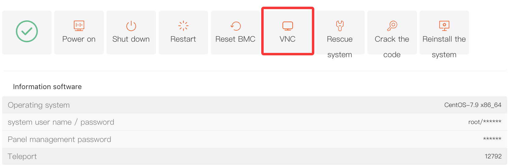
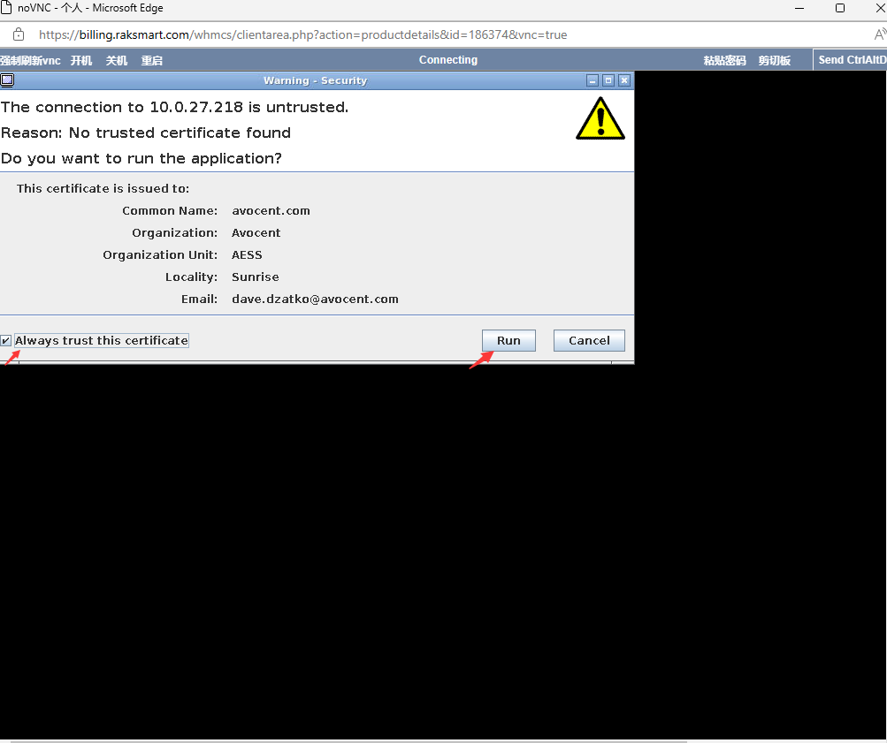

# How to Open the VNC Console for a Physical Server

## I. Overview

VNC allows you to remotely access your server through a web browser. If you do not have a remote login client installed, or if your remote connection is not working properly, you can use VNC to access the server console.

Through VNC, you can view the server’s real-time status and perform basic server management tasks using your server account, such as running commands or checking system logs.

## II. Access Path

1. Log in to the platform and go to the **Customer Center**. Under **My Orders**, click **Physical Servers**. Alternatively, go to **Product Management** and click **Physical Servers**, then filter the server list by region and status.
2. In the product list, locate the target server and click to open the **Product Details** page.
3. Under the **Server Information** tab, find and click the **VNC** button. This will start the VNC connection and open the VNC interface.

## III. VNC Interface Functions

### (A) Top Action Bar

**Force Refresh VNC**
If the VNC display is abnormal or frozen, click this button to refresh the screen and restore normal display.

**Power On / Shut Down / Restart**
You can power on, shut down, or restart the server directly from the VNC interface, making it easier to manage the server’s power status.

---

### (B) Shortcut Functions

**Clipboard:** If you need to enter text such as commands or passwords into the server console, first copy the text to your local clipboard. Then click “**Clipboard”** in the VNC interface, paste the text into the pop-up input box, and click “**OK”**. The text will be sent directly to the server console, which improves efficiency and avoids manual typing.

**Paste Password:** Click this button to automatically paste the server password stored in the management panel into the console input field, making it easier to log in quickly.

**Send CtrlAltDel:** This simulates pressing the “**Ctrl + Alt + Del”** key combination. In Windows, it can be used to bring up the login screen.

## IV. Important Notes

1. When managing a server through VNC, your actions have the same permissions as local operations. Please proceed carefully to avoid accidental actions that may cause service issues or data loss.
2. If the VNC connection fails or the screen remains black, try "Resetting the BMC" in the control panel, restart the server, or contact technical support.
