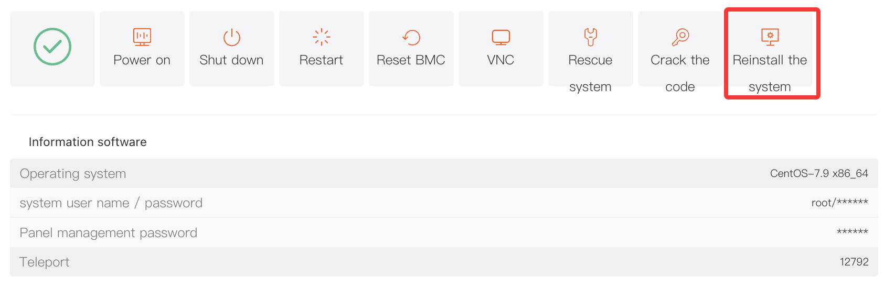
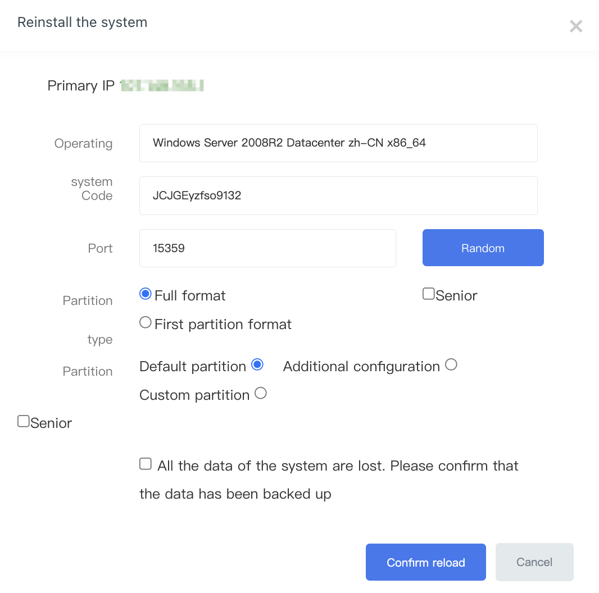

# How to Reinstall the Operating System on a Physical Server

During server usage, you may encounter situations where you need to change the operating system, troubleshoot system issues, or reconfigure disk partitions. The **"Reinstall the system"** feature in the control panel allows you to conveniently reinstall the server's operating system to meet different operational requirements.

## I.Access Path

1. Log in to the platform and go to the **"Customer Center"**. Under **"My Orders"**, click **"Physical Servers"**. Alternatively, go to **"Product Management"**, click **"Physical Servers"**, and filter the server list by region and status.
2. On the **"Manage Products"** page, you can view the server's basic information. Click the **"Server Information"** tab at the top, then locate and click the **"Reinstall the system"** button in the action button area.

## II.Procedure

### 1. Click the "Reinstall the system" Button

Clicking the **"Reinstall the system"** button will open the **"Reinstall the system"** window.

### 2. Configure Reinstallation Options

- **Select Operating System:** From the **"Operating system"** dropdown menu, select the appropriate OS version according to your requirements.
- **Set Password:** In the **"system Code"** field, set the login password for the operating system. You can also click the **"Random"** button to automatically generate a strong password.
- **Set Port:** In the **"Port"** field, set the port used for remote access to the server. You can also click the **"Random"** button to generate a random port.

### 3a. Select Partition Type (Windows)

- **Full format:** Selecting this option will format the entire disk of the server and erase all data. Please proceed with caution. This option is typically used when you need to completely clean server data or switch to a different operating system.
- **First partition format:** Only the first partition of the server will be formatted, while data on other partitions will remain. This is suitable when you only need to reinstall the operating system but want to retain data on other partitions.
- **Select Partition Method:**

  - **Default partition:** The system will partition the disk automatically using the default configuration.
  - **Custom partition:** If you have specific partition requirements, such as defining partition size or file system type, you can manually configure the disk partitions using this option.
- **Data Backup Notice:** Before proceeding, please carefully read the warning: "All data will be lost during reinstallation. Please confirm that you have backed up your data." If your important data has been backed up, check the confirmation box.

### 3b. Linux Partition Options

- Linux system reinstallation does **not support retaining existing data**. Confirming the reinstallation means the entire disk will be formatted and the data cannot be recovered. Please ensure that all important data has been backed up beforehand.
- Available partition options include:

  - **Default partition:** The system will automatically partition the disk using the default configuration.
  - **Additional configuration:** Provides additional partition configuration options to meet specific requirements.
  - **Custom partition:** Allows manual configuration of partition size and file system type.
- **Data Backup Notice:** Before proceeding, please carefully read the warning: "All data will be lost during reinstallation. Please confirm that you have backed up your data." If your important data has been backed up, check the confirmation box.

### 4. Confirm Reinstallation

After completing all configurations, click **"Confirm reload"**. The system will begin reinstalling the operating system. During this process, the server will be temporarily unavailable. You can monitor the installation status from the **"Product Details"** page and wait for the reinstallation to complete.

### 5. Login Information

After the reinstallation is complete, the new login information can be viewed under **"Information software"**. Click the **"\*"** icon to reveal the login password.

## III.Important Notes

1. **Data Backup:** Before performing a system reinstallation, make sure all important server data has been backed up to prevent permanent data loss.
2. **Waiting Time:** The time required for system reinstallation may vary depending on server performance, network conditions, and the operating system installation process. Please be patient while the installation completes.
