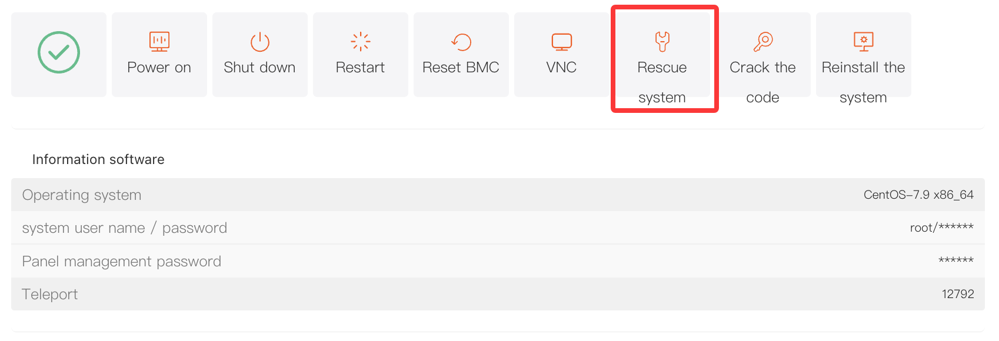
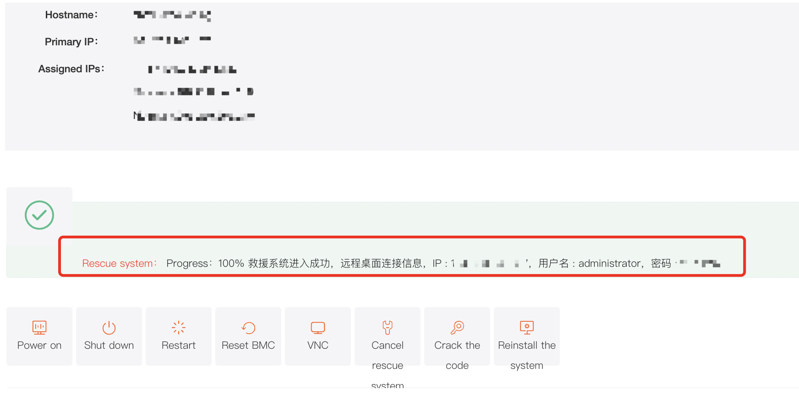

# How to Use Rescue Mode on a Dedicated Server

## I. Overview

When a server encounters a failure (for example, the operating system crashes and cannot boot normally) but there is still important data on the disk that needs to be backed up, you can use the **"Rescue system"** feature.

The rescue system supports both **Linux** and **Windows**. When the system becomes abnormal, the server can be booted into the corresponding rescue mode so you can back up important data.

## II. Access Path

Log in to the platform and go to the **"Customer Center"**.

Under **"My Orders"**, click **"Dedicated"**.
Alternatively, go to **"Product Management"**, click **"Dedicated"**, and filter the server list by region and status.

In the product list, locate the target server and open the **"Product Details"** page.

Under the **"Server Information"** tab, find and click **"Rescue system"** to open the rescue system window.

## III. Steps

### (1) Select the Rescue System Type

In the **"Rescue system"** window, select the rescue system type based on the operating system currently installed on the server:

- If the server is running Linux, select **"Linux"**.
- If the server is running Windows, select **"Windows"**.

### (2) Data Backup Operation (Example: Linux Rescue Mode)

1. After entering the Linux rescue system, the control panel will automatically display the username and password. Use this information for remote login.
2. After logging in, run `lsblk` or `df -Th` to check disk partitions and whether they are mounted.
3. If the partition is not mounted, mount it manually (for example: `mount /dev/sda1 /mnt`, which mounts the `/dev/sda1` partition to the `/mnt` directory).
4. After mounting, check the corresponding partition for any data that needs to be backed up.
5. After completing the data backup, you may choose to reinstall the operating system if needed, so you can continue using the server for your business.

