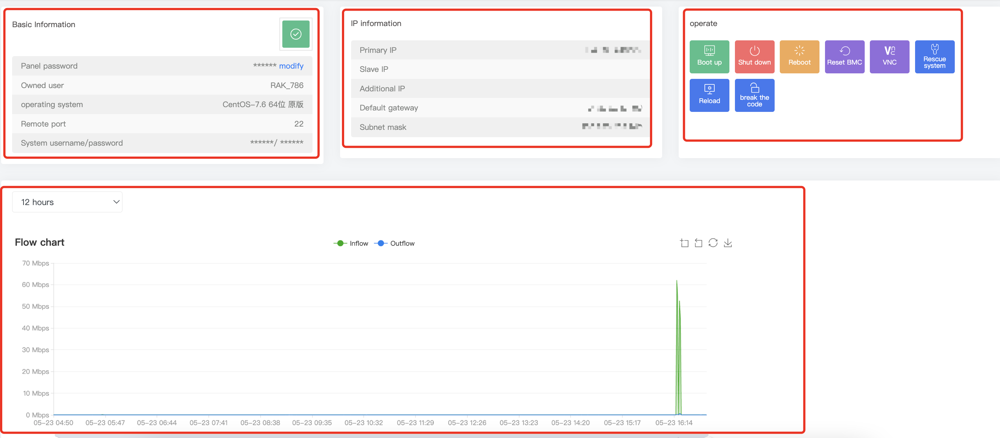
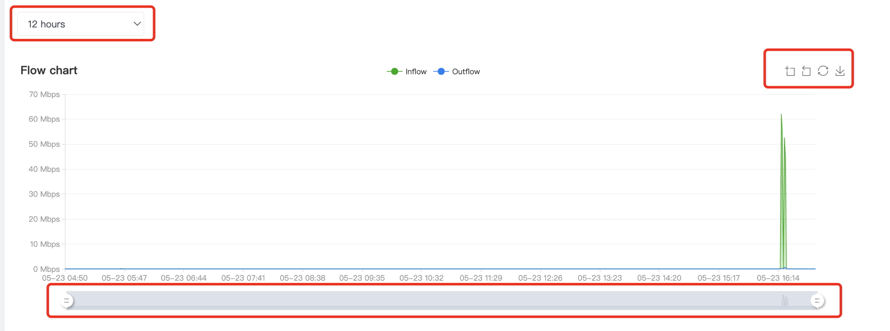
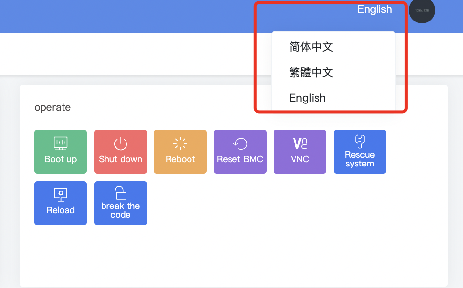
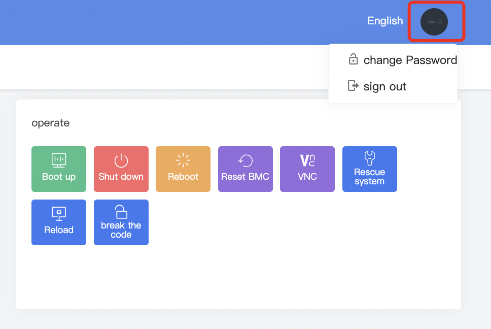

# Introduction to Management of Dedicated Server Control Panel

一、The panel management display information is divided into four sections.

****

1.Basic information section displays the machine status, panel password, operating system, remote port, system user and password (\*\*\* part can be displayed by clicking on it).

2.IP information section displays the main IP, secondary IP, additional IP, default gateway, and subnet mask.

3.Operations section allows you to power on, power off, restart, reset BMC, open VNC, use rescue system, reinstall, and reset passwords for the dedicated server

4.Traffic graph section displays traffic usage over a selected period. You can zoom in and out of the graph, restore it to its original state, download it, and adjust the period shown by using the mouse to drag left or right."

****

二、Language switch. 

Supported languages: Simplified Chinese, Traditional Chinese, English.

****

三、Log out

To log out, click on the button in the upper right corner and select the option to log out.

****

四、Google two-factor authentication is available to improve machine security for customer dashboard and single server login. This involves configuring a dynamic key for authentication to improve security for our customers.

Please refer to：[To enable Google two-factor authentication in the public cloud](https://billing.raksmart.com/whmcs/index.php?rp=/knowledgebase/312/To-enable-Google-two-factor-authentication-in-the-public-cloud.html)
