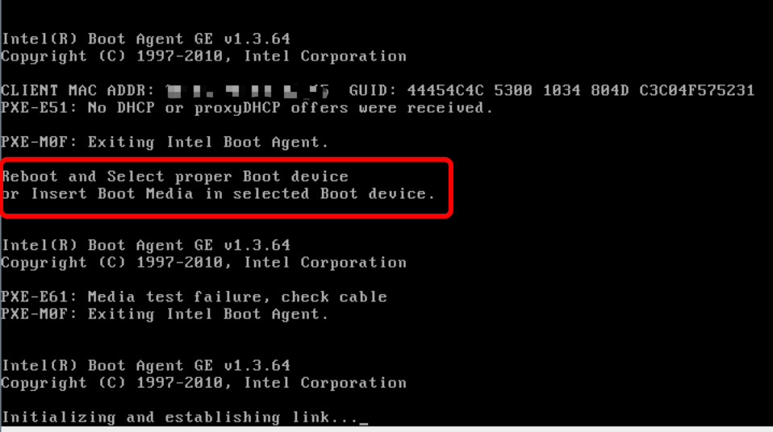
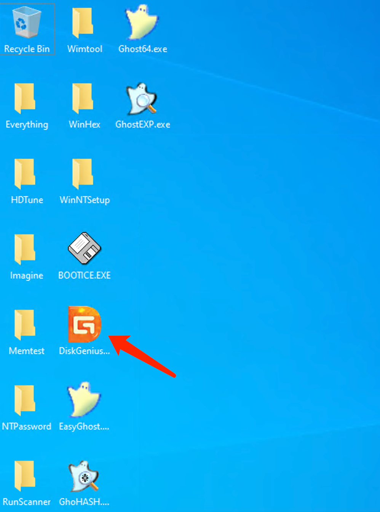
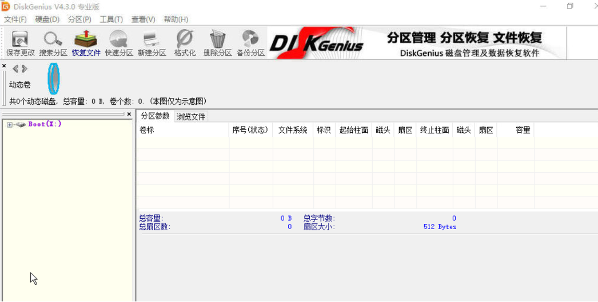

# "It is suspected that the physical server cannot boot properly due to the inability to recognize the hard drive.

1.When the server fails to boot into the operating system, you can view the specific error messages through the VNC window.

For example, as shown in the image below, the system is unable to start because it has not recognized the hard drive."

2.How to confirm the Hard Drive Status:

Option 1: You can access the BIOS and check if the hard drive is recognized correctly. As shown in the image below, check if the BIOS does not detect the hard drive.

Option 2: Enter Windows recovery mode and use DiskGenius software to check if the hard drive can be recognized.

Even after checking, the hard drive cannot be recognized.

3.If the server is unable to recognize the hard drive as mentioned above, it may be due to a disconnected drive or disk damage. Please submit a support ticket for further assistance.
